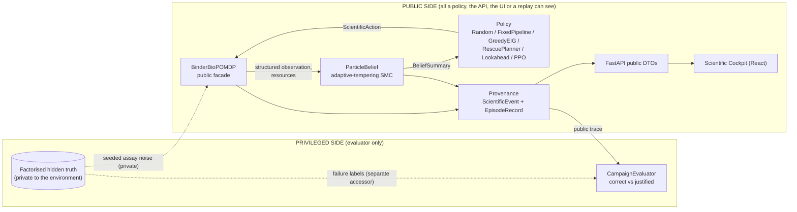
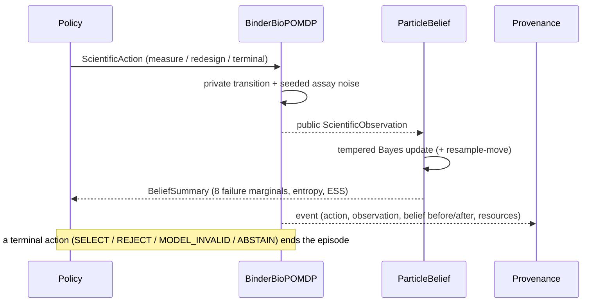

# MIRAGE

**An autonomous causal experimental-planning system for diagnosing and rescuing failed de novo
miniprotein binder campaigns.**

More precisely: MIRAGE is a **synthetic, semi-mechanistic benchmark and decision architecture** for testing
whether autonomous scientific agents can (1) diagnose *why* a de novo binder campaign failed, (2) choose
informative experiments under resource constraints, and (3) reach conclusions that the experiments they ran
actually justify.

- **Domain:** failed, soluble, de novo, extracellular receptor-binding miniproteins.
- **Showcase:** an EGFR-inspired extracellular receptor-binding campaign (narrative only; see
  [what is synthetic](#4-what-is-synthetic-and-what-we-do-not-claim)).
- **Built for** the Originator track, London AI x Science Hackathon.

> **Status in one paragraph.** The environment, belief engine, five policies, privileged evaluator, public API,
> provenance/replay, cockpit frontend and an RL (Gym + MaskablePPO) stack are implemented and tested. **Baseline V1**
> (Random, FixedPipeline, GreedyEIG on 250 held-out worlds) is frozen and published, and it did **not** show our
> preferred policy winning. The Lookahead planner exists but has **not been evaluated**; PPO has **no valid checkpoint
> and is NOT RUN**; the **V2 resource-constrained benchmark is preregistered but has no runner and no results**; and the
> adaptive-tempering posterior validation gate (**B4A**) has been **measured and is not met**. See
> [what remains unvalidated](#9-what-remains-unvalidated).

---

## 1. Why this problem is hard

A de novo binder that "fails" downstream (no function in the cell assay) leaves a **diagnostic tangle**. Several
mechanisms produce the same top-level symptom, and several can hold at once:

| Locus | Mechanisms | What it means |
|---|---|---|
| **MOLECULE** | folding · aggregation · affinity · kinetics (fast off-rate) · epitope · developability | the binder itself is defective, possibly in more than one way |
| **EXPERIMENT** | assay invalidity | the molecule may be fine; the readout is broken |
| **BIOLOGICAL MODEL** | model invalidity | molecule and assay are fine; the biological hypothesis is wrong |

Three things make rescue difficult, and all three are built into the simulator:

1. **Overlapping evidence.** Every assay is noisy and informs only part of the picture. Cheap proxies
   (stability, SEC, a developability liability score) can look healthy while the binder is functionally dead
   (the *misleading-proxy trap*).
2. **Compound failures.** Aggregation + a fast off-rate is a different rescue from either alone. A single
   "which of N causes" label cannot represent it, so the state is factorised and the belief is **non-exclusive**.
3. **Path dependence under a budget.** Running SPR on a badly aggregated sample returns degraded data *and* costs
   the instrument 0.28 health, which hurts every later kinetic measurement. The right order (SEC first, repair,
   then SPR) is not the order that looks most informative one step at a time.

## 2. The core idea: CORRECT ≠ JUSTIFIED

An agent can make the **correct terminal decision for the wrong reason**: a lucky `REJECT` of a binder it never
measured, an abstention that follows no real work, a `SELECT` that skips the assay-integrity control.

MIRAGE scores two things separately:

```text
correct    the terminal decision matches the privileged ground truth
justified  correct  AND  the public evidence the agent actually collected supports that decision
```

`justified` is computed by a **privileged evaluator** from the *public trace only* plus truth labels it alone
may read. For example, it checks that a `REJECT` rests on a failure that was both believed likely **and** directly
assayed, that a `SELECT` followed the five core assays plus a passing assay-integrity control, and that a
`MODEL_INVALID` was reached with a valid assay and direct or orthogonal target evidence. The rules are in
[docs/evaluation/METRICS.md](docs/evaluation/METRICS.md) and implemented in
[`evidence.py`](src/mirage/evaluation/campaign/evidence.py).

A policy that is **correct by elimination** (right answer, never measured the thing that was wrong) is counted as
*correct but unjustified*. Baseline V1 shows this is not hypothetical ([section 8](#8-baseline-v1-what-it-actually-found)).

## 3. How it works

### 3.1 System architecture



The dotted lines are the only places truth moves, and none of them reaches a policy. Details in
[docs/architecture/TRUST_BOUNDARY.md](docs/architecture/TRUST_BOUNDARY.md).

### 3.2 The experiment loop



### 3.3 The 14 public actions

| Group | Actions | Public readout |
|---|---|---|
| Measure (7) | `MEASURE_STABILITY` `MEASURE_SEC` `MEASURE_SPR` `MEASURE_EPITOPE` `MEASURE_DEVELOPABILITY` `VALIDATE_ASSAY` `ORTHOGONAL_FUNCTION` | `stability_proxy`, `monomer_fraction`, `log_kd` + `log_koff`, `epitope_signal`, `liability_proxy`, `control_signal`, `orthogonal_function_signal` |
| Redesign (3) | `REDESIGN_STABILITY` `REDESIGN_SOLUBILITY` `REDESIGN_INTERFACE` | a new candidate (child of the active one); no assay result |
| Terminal (4) | `SELECT` `REJECT` `MODEL_INVALID` `ABSTAIN` | ends the episode |

Default resources are budget 12.0, sample 8.0 and SPR health 1.0. Running every assay once (the *funnel*) costs
8.25 budget and 3.15 sample. Costs are in [ACTION_OBSERVATION_CONTRACT](docs/scientific-spec/ACTION_OBSERVATION_CONTRACT.md).

### 3.4 How the causal belief works

The hidden world is **factorised**: `stability`, `monomer_fraction`, `log_kd`, `log_koff`, `functional_epitope`,
`developability_liability`, `assay_valid`, `model_valid`. The agent keeps a **weighted particle cloud** over such worlds
(512 particles in the benchmark, 256 in the live demo and RL).

- Each public observation re-weights particles by a Gaussian likelihood from the **public predictive model**
  (σ = 0.08 nominal, 0.18 for a degraded SPR reading).
- The belief is summarised as **eight non-exclusive failure marginals**: `p_folding`, `p_aggregation`, `p_affinity`,
  `p_kinetic`, `p_epitope`, `p_developability`, `p_assay_invalid`, `p_model_invalid`. Each is the posterior mass of a
  threshold rule, so compound failure shows up as several being high at once. They do not sum to one.
- **Adaptive-tempering SMC (B4A, commit `97ac554`).** Baseline V1 used one-shot importance reweighting followed by
  resampling and MCMC moves. Sharp evidence made the particle set degenerate onto a few ancestors and gave unstable causal marginals.
  The current default introduces each observation as `p(y|z)^τ`, τ: 0→1, choosing every increment so that ESS ≥ 0.5 N,
  with resample-move MCMC between increments. **This is implemented, but the convergence gate it was built to meet
  has not been met** (see [section 9](#9-what-remains-unvalidated)).
- A derived **FailureLocalisation** view reports posterior mass on molecule / experiment / model failure, and a
  **JustificationCertificate** states what the agent's own belief says about whether a terminal decision is
  supported (competing explanations, assay resolved, model separable from assay, top-EIG experiment, missing
  evidence). *Both are implemented and tested in `mirage.belief`; neither is wired into the controller or the HTTP API,
  so the frontend shows them as NOT AVAILABLE.*

### 3.5 How experiment selection works

| Method | Rule |
|---|---|
| **GreedyEIG** | pick the assay with the largest one-step expected reduction in total marginal mechanism entropy; close with a fixed threshold rule when no assay promises ≥ 0.02 nats. Myopic by design. |
| **Lookahead** | closed-loop sparse-sampling expectimax (depth 2 by default, 3 supported) over the *same* public model; at each node it may stop, measure or redesign; values terminal utility, entropy removed, budget/sample/time and SPR instrument path dependence. |
| **PPO** | a campaign-level learned policy over the 14 actions (MaskablePPO) trained in a Gym wrapper of the same environment. No valid checkpoint yet. |

## 4. What is synthetic, and what we do not claim

Everything quantitative here is a **modelling assumption** of the benchmark, not a biological fact: the hidden-world
generator, assay means and noise, redesign effects, SPR damage, failure thresholds, the agent-side prior and the
evaluator's evidence rules. There is no sequence, no structure and no wet lab.

MIRAGE does **not** claim, and nothing in this repository supports:

- validated EGFR prediction, or any quantitative model of EGFR;
- therapeutic discovery or clinically useful binder prediction;
- a "digital twin" of any biology;
- wet-lab validation;
- real molecular sequence design.

"EGFR-inspired" means only that the narrative (an extracellular receptor, epitope-directed binding) motivated the
scenario names.

## 5. Policies

| Policy | Role | Implemented | Evaluated on the benchmark |
|---|---|---|---|
| `random` | control | yes | **Baseline V1** |
| `fixed_pipeline` | scripted characterisation baseline (all 7 assays in a fixed QC-before-SPR order, then a threshold rule; never redesigns) | yes | **Baseline V1** |
| `greedy_eig` | myopic one-step information-gain policy | yes | **Baseline V1** |
| `receptor_rescue_planner` | hand-authored domain strategy (SEC first; redesign solubility if SEC shows severe aggregation; then SPR) | yes (live demo, `h0_smoke.py`) | not run |
| `lookahead` | explicit model-based long-horizon planner | yes, unit-tested | **NOT RUN** |
| `ppo` | learned campaign-level planner | training stack + `PPOPolicy` adapter | **NOT RUN** (no valid checkpoint) |

**MIRAGE itself is not synonymous with PPO.** PPO is one swappable candidate planner; the contribution is the
benchmark, the trust boundary, the causal belief and the correct-vs-justified evaluator.

## 6. The five canonical scenarios

`SEMANTICS_V2` (commit `34a7fae`, tag `mirage-a5-scenarios`) makes each named scenario's *primary failure*
contractual. The default environment still uses `BASELINE_V1`, so V1 stays reproducible.

| Scenario | Primary failure (`SEMANTICS_V2`) | Secondary consequence (evaluator metadata) |
|---|---|---|
| `instability` | folding | reduced stability assay signal |
| `aggregation_kinetic_defect` | aggregation + kinetic | degraded SPR information; SPR health loss after premature SPR |
| `broken_assay` | assay invalid | functional readout is uninterpretable |
| `invalid_biological_model` | model invalid | molecular engagement does not establish expected function |
| `misleading_proxy_trap` | epitope + developability | favourable affinity proxy is non-diagnostic |

Primary failures are what the scenario is *about* and what the evaluator's truth labels must show. Secondary
consequences are downstream effects recorded as metadata; they are not counted as extra molecular failures.

Why this was needed (measured on the code in this repository, 300 seeds per scenario, `campaign-eval/1` label rules):
under `BASELINE_V1` the `aggregation_kinetic_defect` world also failed affinity and developability in 300/300 worlds,
and the `misleading_proxy_trap` world also failed aggregation in 300/300. Under `SEMANTICS_V2` each scenario's failure
set equals its primary mechanisms in 300/300 worlds. `tests/binder/test_scenario_semantics_v2.py` asserts the same against the environment's own truth accessor over 32 seeds per scenario.

## 7. Run it

Requires Python ≥ 3.11 and a current Node for the frontend. Python dependencies are pinned in `pyproject.toml`;
Gym/PPO needs the `rl` extra.

```bash
uv venv --python 3.11 .venv
uv pip install --python .venv/bin/python -e ".[dev]"          # use ".[dev,rl]" for Gym / PPO
.venv/bin/python -m pytest -q
```

```bash
# 1. deterministic integrated campaign (controller -> provenance -> evaluation -> replay), no server
PYTHONPATH=src .venv/bin/python scripts/h0_smoke.py
# prints: MEASURE_SEC -> REDESIGN_SOLUBILITY -> MEASURE_SPR -> REJECT
#         events=4 replay_frames=4
#         scenario=COMPOUND_FAILURE regime=path_dependent justified=True

# 2. public API (terminal 1) and cockpit (terminal 2)
PYTHONPATH=src .venv/bin/python scripts/serve_api.py --records .local/mirage-api
cd frontend && npm ci && VITE_MIRAGE_TRANSPORT=live npm run dev      # http://localhost:5173/?transport=live
```

The API registers `random`, `fixed_pipeline` and `rescue_planner`. `greedy_eig` is **not** served (`POST /episodes`
returns 422 `unknown policy`; the cockpit reports it as NOT RUN, and `VITE_MIRAGE_POLICIES` should list only served
policies). `--scenario SINGLE_FAILURE|COMPOUND_FAILURE|ASSAY_FAILURE|MODEL_FAILURE|MIXED` selects the backend world;
it is never sent to the browser. Aggregate `/benchmarks*` routes return 404 unless an evaluation store and token are
configured, which `serve_api.py` does not do.

Offline cockpit with mock data (watermarked DEV / MOCK, not results): `cd frontend && npm run dev:mock`.
Frontend gates: `npm run typecheck && npm run lint && npm test && npm run build`.

Growth benchmark views (Results, Episode, Lab, Method) in the same app: start the API with
`MIRAGE_EVAL_TOKEN=<token> PYTHONPATH=src .venv/bin/python scripts/serve_api.py --records .local/mirage-api --growth-results experiments/results`
and run the frontend with the same `MIRAGE_EVAL_TOKEN`. Recorded runs and the hidden-truth verdict are served only
under the token-gated `/benchmarks/growth/*` routes; the hands-on Lab uses public `/growth/sandbox/*` routes that
never return the hidden condition. Offline build with no server: `cd frontend && npm run build:static`.

### Reproduce the evaluation

| Goal | Command | Notes |
|---|---|---|
| Verify the frozen Baseline V1 numbers | `PYTHONPATH=src .venv/bin/python scripts/export_baseline_v1.py --out <new dir>` | read-only on the run: rebuilds aggregates from the 750 stored evaluations and refuses to write unless they equal the run's own. Never write into `results/baseline_v1/`. |
| Run a fresh benchmark | `PYTHONPATH=src .venv/bin/python scripts/run_binder_benchmark.py --per-archetype 50 --out <new dir>` | **not** a bit-for-bit reproduction of V1: V1 ran at commit `1c2ed6e` with the pre-tempering belief, and the current default is adaptive tempering. Check out tag `mirage-baseline-v1` to reproduce V1. |
| Posterior convergence audit | `PYTHONPATH=src .venv/bin/python scripts/belief_convergence_audit.py --out <file>` | output of the audited run: [`docs/validation/convergence_audit.json`](docs/validation/convergence_audit.json) |
| Replay a stored episode | `mirage.provenance.Replay` over `results/binder_campaign/public/*.jsonl` | calls no model, policy, RNG or environment |
| Legacy growth benchmark | [docs/mirage-bio/README.md](docs/mirage-bio/README.md) | earlier, separate environment |

## 8. Baseline V1: what it actually found

250 held-out worlds (5 scenarios × 50 seeds), every policy on every world, 750 episodes, 95% Wilson intervals.
Frozen at tag `mirage-baseline-v1` (`5c47262`). **Historical and immutable.** Data:
[`results/baseline_v1/`](results/baseline_v1/RESULTS.md). Analysis: [docs/evaluation/BASELINE_V1.md](docs/evaluation/BASELINE_V1.md).

| Policy | Correct | Justified | Correct but unjustified | Mean budget used |
|---|---|---|---|---|
| FixedPipeline | 76% [70-81] | **74% [68-79]** | 2% | 8.25 |
| GreedyEIG | 71% [65-76] | 64% [58-70] | 7% | 7.40 |
| Random | 27% [22-33] | 2% [1-5] | 25% | 3.12 |

What this does and does not say:

- **FixedPipeline beat GreedyEIG on the justified rate** (74% vs 64%). The information-gain policy did *not* win.
- GreedyEIG used somewhat fewer resources (about 10% less budget), at a cost in justification.
- Greedy was often **correct by elimination without directly measuring the responsible failure.** In all 13 of its
  correct-but-unjustified `instability` episodes it never ran `MEASURE_STABILITY` (typically SPR, assay control, SPR,
  then `REJECT`).
- Random is correct 27% of the time and justified 2%: the metric separates luck from evidence.
- With the default 12 / 8 resources FixedPipeline can afford every assay, so V1 **could not test** whether adaptive
  planning helps. That, together with unreliable posteriors at 512 particles and scenario labels that did not match the
  worlds ([section 6](#6-the-five-canonical-scenarios)), is what V1 exposed. **It does not prove that our preferred
  policy wins; it showed what had to be fixed.**

## 9. What remains unvalidated

| Item | Status at freeze |
|---|---|
| **B4A posterior convergence gate** | **Not met.** Audit (16 seeds, N = 256…4096): legacy SIR fails the declared gate at every N (76-204 of 216 trace prefixes); adaptive tempering also fails at every N (109 prefixes at N=256, 16 at 512, 1 at each of 1024/2048/4096). Two tests in `tests/belief/test_belief_convergence_gate.py` fail on the 512-particle seed-spread check. [Details](docs/validation/B4A_CONVERGENCE_RESULTS.md). |
| **Lookahead** | Implemented and unit-tested; **never evaluated** on any benchmark world. |
| **PPO** | Stack implemented (36 tests pass); **no frozen, scientifically valid checkpoint: NOT RUN.** Local runs collapsed toward `ABSTAIN` on the training utility, one is unfinished, and none was scored by the campaign evaluator. |
| **Binder Rescue V2** | Preregistered and hash-locked (`mirage-v2-prereg`, `51843d5`) with LOW/MEDIUM/HIGH resource strata. **No runner, no policy registry, no results.** The lock currently fails verification on this branch (below). |
| **FailureLocalisation / JustificationCertificate** | Implemented in `mirage.belief`; not exposed by the API or controller. |
| **Label/threshold consistency** | Benchmark labels (`campaign-eval/1`: monomer < 0.6, liability > 0.4) differ from `BinderBioPOMDP.evaluator_truth` (monomer < 0.8, liability > 0.5), which the H0 controller's own `evaluate()` uses. All thresholds are provisional benchmark-engineering parameters. |
| **Model mismatch** | The environment degrades SPR readings when instrument health < 0.70; the public likelihood allows "degraded" only for aggregated samples, and the trackers count and skip zero-likelihood updates. For aggregated samples the environment's degraded `log_kd` bias is about +0.72 (measured, 200 worlds) while the belief's model assumes +0.35. |
| **Agent prior** | The benchmark prior is a broad, disclosed assumption, not learned from data. |

**V2 lock integrity.** `test_committed_lock_matches_the_files_on_disk` in `tests/campaign/test_campaign_rescue_v2.py`
**fails** on this branch: A5 added two metadata fields to `FailureLabels` in `truth.py`, a file the V2 lock hashes. The
change does not alter scoring, but a preregistration is never edited in place, so it needs an explicit decision (issue a
V2.1 lock). No V2 policy has been run, so no result is contaminated. See
[docs/evaluation/BINDER_RESCUE_V2_STATUS.md](docs/evaluation/BINDER_RESCUE_V2_STATUS.md).

## 10. Preregistered V2: resource-constrained rescue

V1 could not discriminate planners because the default budget lets the fixed funnel run in full. V2 changes **only the
initial public resources**, fully crossed over the same worlds:

| Stratum | Budget | Sample | Initial SPR health | Meaning |
|---|---|---|---|---|
| LOW | U[2.5, 4.5] | U[1.0, 2.0] | U[0.60, 1.0] | the 7-assay funnel is infeasible in every draw |
| MEDIUM | U[6.0, 10.0] | U[2.5, 5.0] | U[0.80, 1.0] | funnel affordable in about 32% of draws |
| HIGH | U[10.0, 14.0] | U[5.0, 9.0] | 1.0 | funnel always affordable (brackets V1's 12 / 8) |

The strata were **frozen before any Lookahead or PPO behaviour was inspected** (the designer had seen V1 results,
which motivated them; this is disclosed in the preregistration). Primary endpoint: justified rate in LOW, paired
against FixedPipeline, with 97.5% two-sided bootstrap intervals for Lookahead and for PPO (mean over three training
seeds). **No V2 held-out results exist.** Held-out seeds 60000-60049 have not been used.

## 11. Repository map

```text
src/mirage/core/                  public contracts (actions, observations, resources, state)
src/mirage/environments/binder/   BinderBioPOMDP, scenarios (BASELINE_V1 / SEMANTICS_V2), public predictive model
src/mirage/belief/                ParticleBelief (adaptive tempering), EIG, localisation, certificate, predictive check
src/mirage/policies/              Random, FixedPipeline, GreedyEIG, Lookahead
src/mirage/integration/           CampaignController, ReceptorRescuePlanner, receptor-binder profile
src/mirage/provenance/            ScientificEvent, EpisodeRecord, JSONL store, model-free replay, leakage scanner
src/mirage/evaluation/campaign/   privileged evaluator, evidence rules, harness, aggregates, Baseline V1 export, V2 spec
src/mirage/api/                   FastAPI app + public DTOs
src/mirage/rl/                    Gym wrapper, reward, observation, PPOPolicy, training
frontend/                         Scientific Cockpit (React / TypeScript / Vite)
results/baseline_v1/              frozen Baseline V1 (immutable)
experiments/preregistration/binder_rescue_v2/   V2 lock, spec, seed manifest
docs/START_HERE.md                documentation index
src/mirage/{lab,assay,biology,agents,demo}, docs/mirage-bio/   legacy MIRAGE-Bio growth benchmark (retained)
```

## 12. Legacy: MIRAGE-Bio v0.1 (growth / OD benchmark)

The repository began as **MIRAGE-Bio**, a controlled OD600-style growth-plateau benchmark ("is late biomass what the
undiluted readings say, or higher?"). It is retained, still tested, and still has a published 30-episode Claude result
under `experiments/results/`, but it is a **different, earlier environment** with its own documentation. The Binder
system does not replace or rewrite it. See [docs/mirage-bio/README.md](docs/mirage-bio/README.md). The cockpit app
shows it under Results, Episode, Lab and Method (see §7).

## 13. Verification snapshot

At the documentation freeze, with the project virtualenvs (`PYTHONPATH=src`):

| Suite | Result |
|---|---|
| Python, excluding `tests/rl` | 1128 passed, 3 skipped, 1 xfailed, **4 failed**: 2 belief-convergence-gate tests (unmet B4A gate) and 2 V2 lock checks (A5 touched a locked file) |
| Python `tests/rl` (Gym/PPO environment) | 36 passed |
| Frontend | typecheck, lint and production build clean; 54 tests passed, 4 skipped (the real-backend suite needs a running server) |

## 14. Collaboration and secrets

Short-lived branches, focused PRs, and the commands run with their actual outcomes in each PR. Use `.local/` for
scratch runs and keep API keys in an ignored `.env`; never commit credentials.
