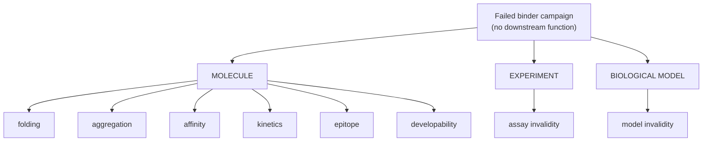

# MIRAGE: what it is and is not

| Field | Value |
|---|---|
| Scope | Project framing for the integrated Binder system. Checked against `d182a2c`. |
| Related | [Root README](../README.md) · [DIFFERENTIATION](DIFFERENTIATION.md) · [BENCHMARK_METHODOLOGY](BENCHMARK_METHODOLOGY.md) |

## 1. What MIRAGE is

MIRAGE is an **autonomous causal experimental-planning system for diagnosing and rescuing failed de novo miniprotein
binder campaigns**. More precisely it is a **synthetic, semi-mechanistic benchmark and decision architecture** for
testing whether autonomous scientific agents can:

1. diagnose a failed de novo binder campaign;
2. choose informative experiments under resource constraints; and
3. make evidence-justified conclusions.

**Domain:** failed soluble de novo extracellular receptor-binding miniproteins.
**Showcase:** an EGFR-inspired extracellular receptor-binding campaign. "EGFR-inspired" is narrative only.

## 2. The invariant: CORRECT ≠ JUSTIFIED

An agent does not receive credit merely for reaching the correct terminal decision. A correct decision reached
without the evidence that supports it (a lucky `REJECT`, a free `ABSTAIN`, a `SELECT` that skipped the assay-integrity
control) is **correct but unjustified**, and MIRAGE reports it as such.

```text
correct    terminal decision matches the privileged ground truth
justified  correct AND the public evidence the agent collected supports the decision
```

The evaluator computes `justified` from the public trace and the agent's own recorded beliefs, plus truth labels that
only it may read. There is no LLM judge, and training reward is never an input (ADR 0006).

## 3. The failure hierarchy

A failed campaign has a **locus**. The belief engine reports posterior mass on each, and the evaluator scores whether
the agent located the failure correctly.



| Locus | Failure mechanisms (the eight belief marginals) |
|---|---|
| MOLECULE | `p_folding_failure` · `p_aggregation_failure` · `p_affinity_failure` · `p_kinetic_failure` · `p_epitope_failure` · `p_developability_failure` |
| EXPERIMENT | `p_assay_invalid` |
| BIOLOGICAL MODEL | `p_model_invalid` |

The mechanisms are **not mutually exclusive**. Compound failures (for example aggregation plus a kinetic defect) are
valid by construction, and the marginals do not sum to one.

## 4. Primary failures versus secondary consequences

A named scenario has **primary failures**, which define what the world is about, and **secondary consequences**,
downstream effects that are metadata and are not counted as additional molecular failures. Under `SEMANTICS_V2`
(A5) the privileged truth labels must equal the primary mechanisms exactly; see
[BINDER_ENVIRONMENT](scientific-spec/BINDER_ENVIRONMENT.md).

## 5. The scientific loop

```text
failed campaign (public initial state)
   -> competing causal explanations remain
   -> the agent chooses an experiment, a redesign, or a terminal decision
   -> the environment executes it under a budget (private truth + seeded noise)
   -> a structured public observation updates the belief
   -> ... repeat while resources and expected information justify it ...
   -> terminal decision: SELECT / REJECT / MODEL_INVALID / ABSTAIN
   -> privileged evaluation: correct? justified?
```

## 6. What is implemented

The Binder environment, particle belief, policies, evaluator, provenance, API and cockpit are implemented
([status table](START_HERE.md#status-at-the-freeze)). Evaluation so far consists of **Baseline V1** only; it did not
show the information-gain policy beating the fixed pipeline ([BASELINE_V1](evaluation/BASELINE_V1.md)).

## 7. What MIRAGE is not

- Not validated EGFR prediction, and not a quantitative model of any receptor.
- Not therapeutic discovery or a clinically useful binder predictor.
- Not a "digital twin" of any biology; not a wet-lab replacement or substitute.
- Not real molecular sequence design (no sequences or structures exist anywhere in the system).
- Not a generic autonomous researcher, LLM orchestration framework or workflow engine.
- Not synonymous with PPO. PPO is one candidate planner among several, and has not been evaluated.
- Not a source of biological discoveries. All parameters are modelling assumptions.

## 8. Relationship to MIRAGE-Bio v0.1

The repository began with MIRAGE-Bio, a growth-plateau / OD600 benchmark built on the same "score the evidence, not
the answer" principle. It remains implemented, tested and documented in [mirage-bio/](mirage-bio/README.md) as the
first environment. The Binder system is a second, richer environment (multi-step, resource-constrained,
compound-failure) rather than a rewrite of the first.

## 9. Evidence maturity (philosophy only)

A MIRAGE-compatible agent should not represent a claim as having stronger evidential status than the experiments
behind it (hypothesis → computational support → replication → direct experiment → independent replication). This
ladder is a guiding principle, not a metric of the current benchmark.
