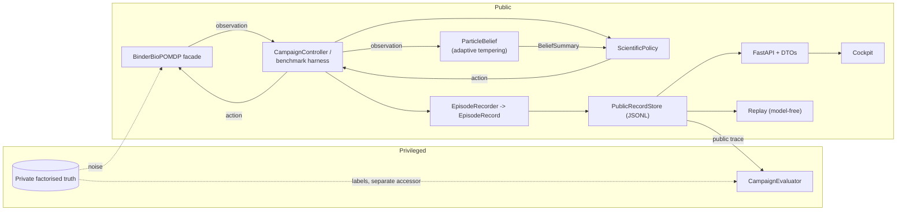

# MIRAGE architecture

Checked against `d182a2c` (`feat/mirage-integration`).

MIRAGE is a decision architecture around one scientific environment, the **Binder BioPOMDP**: a seeded, partially
observed, resource-constrained simulation of rescuing a failed de novo extracellular-receptor-binding miniprotein.
The environment keeps a private factorised world and exposes only structured public observations. Everything else
(belief, policies, controller, provenance, API, frontend) works from public data; a separate privileged evaluator
alone reads truth labels.

## Components

| Component | Code | Role |
|---|---|---|
| Public contracts | `mirage.core` | `ScientificAction`, `ScientificObservation`, `ResourceState`, `Candidate`, `AgentState`, `StepResult`; all frozen, `extra="forbid"` |
| Environment | `mirage.environments.binder` | `BinderBioPOMDP`, scenario generator (`BASELINE_V1`, `SEMANTICS_V2`), public `BinderPredictiveModel` |
| Belief | `mirage.belief` | `ParticleBelief` (adaptive-tempering SMC + resample-move), EIG, terminal semantics, `FailureLocalisation`, `JustificationCertificate`, predictive checks |
| Policies | `mirage.policies`, `mirage.integration`, `mirage.rl` | Random, FixedPipeline, GreedyEIG, Lookahead, ReceptorRescuePlanner, PPOPolicy |
| Controller | `mirage.integration.controller` | single reset/step loop; policies see only public inputs |
| Provenance | `mirage.provenance` | `ScientificEvent`, `EpisodeRecord`, JSONL store, `Replay`, validation, leakage scanner |
| Evaluator | `mirage.evaluation.campaign` | privileged correct-vs-justified scoring, harness, aggregates, adversarial suite, Baseline V1 export, V2 spec |
| API | `mirage.api` | FastAPI, public DTOs, leak guard, token-gated aggregates |
| RL | `mirage.rl` | Gymnasium wrapper, reward, observation, training, PPO policy adapter |
| Frontend | `frontend/` | Scientific Cockpit; never receives truth |

## Invariants

- Truth is factorised and private. Scenario names are generation and reporting labels, never policy-visible.
- Every policy-visible value, every stored record and every replay is public-only.
- Every stochastic path is seeded; the same seed and public action sequence reproduce the public trace.
- Training reward and privileged scientific evaluation are separate (ADR 0006).
- Every policy implements one contract: `choose_action(state, belief, available_actions)`.

## What the architecture does not yet connect

- `FailureLocalisation` and `JustificationCertificate` are computed by `mirage.belief` but are not produced by the
  controller or exposed by the API; the cockpit shows them as NOT AVAILABLE.
- The API serves three policies (`random`, `fixed_pipeline`, `rescue_planner`). GreedyEIG, Lookahead and PPO run only
  through the Python harness or the controller.
- Training is local; there is no Modal or cloud deployment in this repository.
