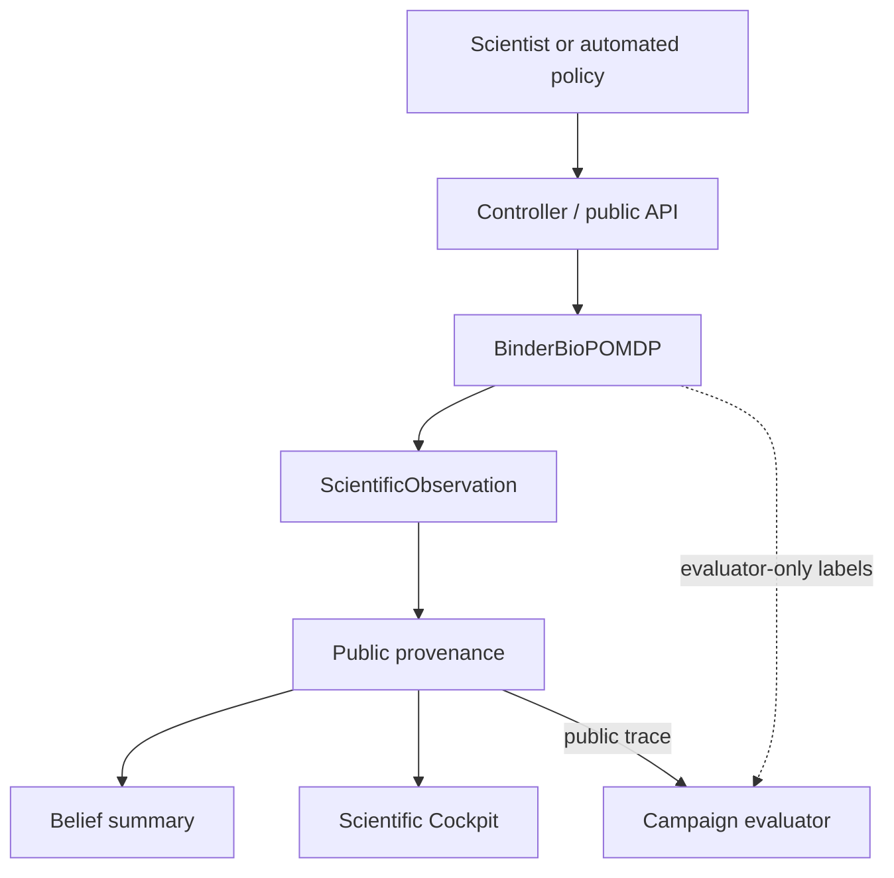

# System context

MIRAGE supports a scientist or policy choosing experiments inside a simulated laboratory, then making an
evidence-bounded terminal decision. The environment owns truth, resources, assay models, redesign transitions and
seeded randomness. The controller records public events; the belief engine consumes the public observations; the
frontend renders only the public record.

**Domain.** Failed soluble de novo extracellular receptor-binding miniproteins. The showcase is an EGFR-inspired
campaign; "EGFR-inspired" is narrative only.

**Environments in the repository.**

| Environment | Status |
|---|---|
| Binder BioPOMDP | primary; implemented; this documentation |
| MIRAGE-Bio growth/OD benchmark | legacy; implemented; separate code under `src/mirage/{lab,assay,biology,agents}`; see [mirage-bio/](../mirage-bio/README.md) |

A synthetic EGFR-inspired display is a narrative showcase, never evidence that benchmark binders are therapeutic or
experimentally validated.
