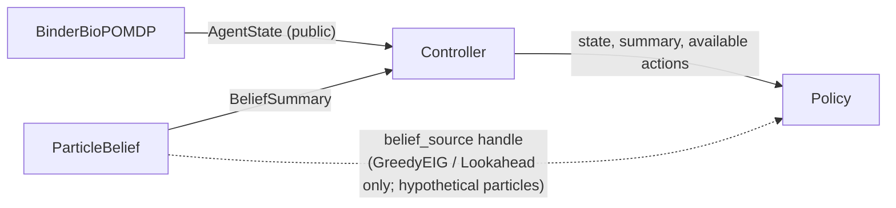

# Trust boundary

Hidden truth never reaches a policy, the belief engine, the API, the frontend, a stored record or a replay. This
document states what is public, what is privileged, and how that is enforced in the code at `d182a2c`.

## Public surface

Policies, LLM scientists, PPO, GreedyEIG, Lookahead, the API, the frontend and replay may receive only:
`ScientificAction`, `ScientificObservation`, `ResourceState`, `Candidate`, `AgentState`, `BeliefSummary` and public
provenance. A `Candidate` carries lineage metadata only (id, generation, parent). Observations carry named numeric
assay readouts and a quality label; there is no generic metadata field, because that would be a leak channel.

## Privileged surface

| Item | Where | Who may touch it |
|---|---|---|
| Factorised world per candidate (`stability`, `monomer_fraction`, `log_kd`, `log_koff`, `functional_epitope`, `developability_liability`, `assay_valid`, `model_valid`) | `BinderBioPOMDP._hidden_by_candidate` | the environment itself |
| Evaluator truth accessor | `BinderBioPOMDP.evaluator_truth(candidate_id)` | the evaluator (`BinderEvaluatorTruth`: failure labels, scenario name, class, regime, and under `SEMANTICS_V2` primary failures / secondary consequences) |
| Benchmark truth oracle | `evaluation/campaign/privileged_binder.py` (`BinderPrivilegedOracle`) | the benchmark evaluator; the **only** module in the evaluation stack that reads the private attribute |
| Training-side world configuration | `mirage.rl.binder_env` | the Gym wrapper's reward side; reaches `info` for logging, never the observation |

`evaluator_truth` is a method on the environment object. The separation holds because no policy, DTO, belief or replay
code is ever handed the environment object, and tests assert it; it is not enforced by the type system.

## What a policy actually gets

GreedyEIG and Lookahead additionally receive a handle to the controller-held `ParticleBelief`. Its particles are
*hypothetical worlds* drawn from the agent's own prior and re-weighted by public evidence; they are not the episode's
truth. `check_belief_in_sync` fails loudly if the handle and the public summary disagree.

## Enforcement

| Mechanism | Code |
|---|---|
| Public models are frozen and reject unknown fields | `mirage.core.contracts` (`ConfigDict(frozen=True, extra="forbid")`), `mirage.belief.summary`, `mirage.api.dto` |
| Key scanner for privileged-looking fields | `mirage.provenance.leakage` (`find_privileged_fields`, `assert_public_payload`) |
| Records validated on construction and storage | `mirage.provenance.events`, `validation` |
| API builds DTOs field by field; defence-in-depth middleware blocks any non-benchmark JSON body carrying a privileged key | `mirage.api.dto`, `mirage.api.app` |
| Aggregate benchmark routes are token-gated (`X-Mirage-Eval-Token`) and 404 when not configured | `mirage.api.app` |
| `correct` / `justified` keys are forbidden on every route except `/benchmarks*` | leak scanner pattern |
| Frontend rejects privileged-looking keys and drops unknown `environment_id` values | `frontend/src/lib/validate.ts` |
| Tests plant sentinel truth values and assert they never reach public payloads | `tests/campaign/test_campaign_binder_wiring.py` (import isolation of `privileged_binder`), `tests/belief/test_belief_trust_boundary.py`, `tests/api/test_api_leakage.py`, `tests/rl/test_rl_reward.py` (RL package never imports the evaluator), `tests/test_trust_boundary.py` (legacy growth benchmark) |

## Known limits of the boundary

- The docstring of `privileged_binder.py` refers to a test file named `test_campaign_trust_boundary.py`; the import-isolation check actually lives in `tests/campaign/test_campaign_binder_wiring.py`. The module is hash-locked by the V2 preregistration, so the comment has not been corrected.
- The scanner inspects **keys**, not free text. A truth channel hidden in a free-text note would not be caught by it,
  Observation notes are length-bounded (256 characters) and the Binder environment generates them from fixed strings, but that is a property of the current simulator, not of the scanner.
- The scenario archetype is a construction control used by the harness and the evaluator. The live API selects the
  backend scenario at server start and never returns it.
- The benchmark agent prior is a public modelling assumption. It is broad and is not conditioned on the episode's
  scenario.
