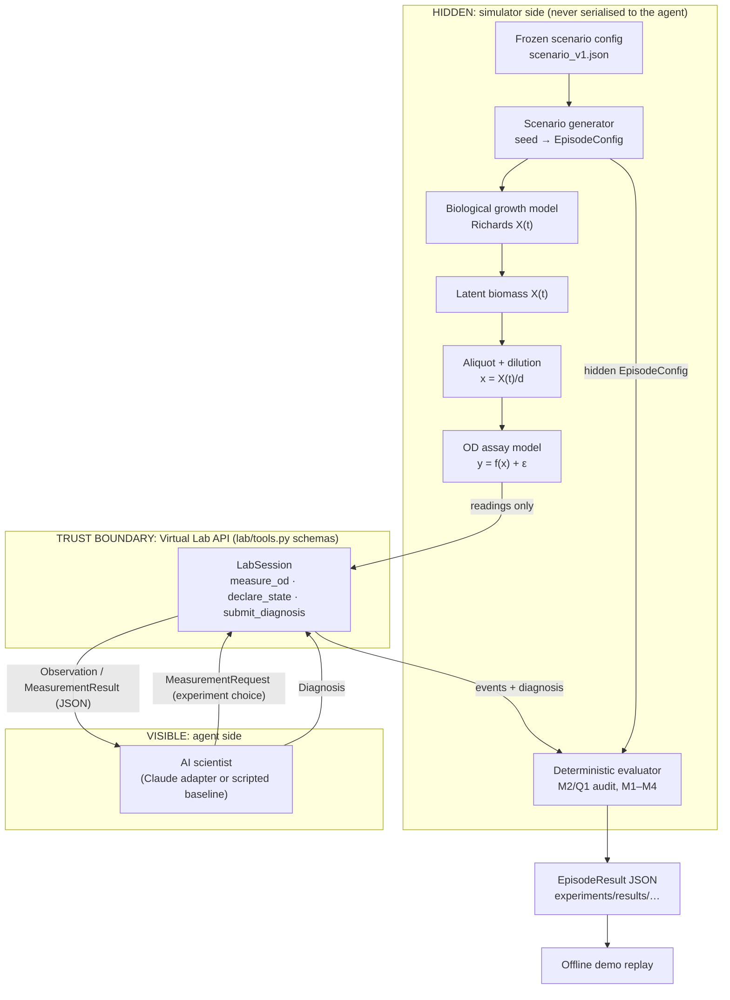

# MIRAGE-Bio — Design

| Field | Value |
|---|---|
| Status | Accepted for MVP (3 October 2026). Parameters are the `scenario-v1` candidate and are **frozen only when Gate 0 passes**. |
| Role | Authoritative implementation design: **how** |
| Requirements | [ANALYSIS.md](ANALYSIS.md) (requirement IDs FR-, NFR-, SVR-, A-, M-) |
| Related | [GATE0_SPEC](GATE0_SPEC.md) · [DEVELOPMENT_PLAN](DEVELOPMENT_PLAN.md) · [TEST_PLAN](TEST_PLAN.md) · [EXPERIMENT_PLAN](EXPERIMENT_PLAN.md) · [ADRs](ADR/) · project: [MIRAGE](../MIRAGE.md) |

Nothing described here is implemented yet. Design-time estimates quoted below come
from the pre-implementation reference calculation
[`experiments/reference/design_validation.py`](../../experiments/reference/design_validation.py)
(pure Python; [saved output](../../experiments/reference/design_validation_output.txt)).
They are **not** Gate 0 results and must be reproduced or superseded by
`scripts/gate0.py` ([GATE0_SPEC](GATE0_SPEC.md)).

---

## 1. Design principles

1. **Validate the science before integrating the LLM.** Gate 0
   ([GATE0_SPEC](GATE0_SPEC.md)) blocks all agent work from merging.
2. **Hidden state is structurally unreachable.** The agent sees serialised
   observations only. Agent code cannot import hidden modules (§12).
3. **Deterministic evaluator.** Scoring is a pure function of the episode record
   and the hidden configuration. No LLM judge ([ADR-005](ADR/ADR-005-no-llm-judge.md)).
4. **Minimum module count.** Thirteen source modules (§3). No framework, plugin system
   or registry.
5. **Reproducible experiments.** Seeded randomness with named streams, a hashed
   frozen configuration, and versions recorded in every record.
6. **Offline demo.** The demo replays saved JSON ([ADR-006](ADR/ADR-006-offline-demo-replay.md)).
7. **Every reported number can be recomputed from saved results** with one command.

## 2. Architecture overview



The same flow as a sequence:

```text
            HIDDEN                          │ BOUNDARY │          VISIBLE
Biological growth model                    │          │
        ↓                                  │          │
latent biological state X(t)               │          │
        ↓  (aliquot at t, dilute by d)     │          │
OD assay model  y = f(X(t)/d) + ε  ────────┼──► Virtual Lab API ──► AI scientist
                                           │          │                 ↓
                                           │          │ ◄── experiment choice (t, d, replicates)
                                           │          │ ──► new observation
                                           │          │ ◄── diagnosis
Deterministic evaluator ◄──────────────────┼── events + diagnosis
        ↓                                  │          │
EpisodeResult JSON (hidden config revealed only here, after the episode)
```

## 3. Repository architecture

The scaffold's existing `experiments/` directory holds configurations and results.
This replaces separate top-level `configs/` and `results/` directories.

```text
originator-science/
├── README.md
├── pyproject.toml                    # planned (DEV-001)
├── docs/                             # MIRAGE docs; this file is docs/mirage-bio/DESIGN.md
├── src/mirage/
│   ├── __init__.py
│   ├── config.py                     # HIDDEN: ScenarioPrior, GrowthConfig, AssayConfig,
│   │                                 #   EpisodeConfig, sampling, canonical hashing
│   ├── biology/
│   │   ├── growth.py                 # HIDDEN: Richards closed form
│   │   └── conditions.py             # HIDDEN: Condition enum, K from condition
│   ├── assay/
│   │   └── od_reader.py              # HIDDEN: f(x), K', x_lin, t95, noise, rounding
│   ├── lab/
│   │   ├── environment.py            # HIDDEN: LabEnvironment (state, budget, RNG, events)
│   │   └── tools.py                  # VISIBLE: request/result schemas, tool specs, limits
│   ├── agents/
│   │   ├── base.py                   # VISIBLE: Agent and LabSession protocols
│   │   ├── claude.py                 # VISIBLE: Anthropic tool-use loop
│   │   └── scripted.py               # VISIBLE: GoodScientist, PassiveBayesAgent
│   ├── evaluation/
│   │   ├── metrics.py                # HIDDEN: record schemas, M2/Q1 audit, scores, M1–M4 (+M5), Wilson
│   │   ├── passive.py                # HIDDEN-side reference classifier (uses prior only)
│   │   └── runner.py                 # orchestration, persistence, summarize CLI
│   └── demo/
│       └── replay.py                 # offline replay of EpisodeResult JSON
├── scripts/
│   └── gate0.py                      # Gate 0 (GATE0_SPEC.md)
├── experiments/
│   ├── configs/
│   │   ├── scenario_v1.json          # frozen at Gate 0
│   │   ├── eval_matrix_v1.json       # evaluation episodes (seed, condition)
│   │   └── demo_pair.json            # matched demo episodes (§20)
│   ├── reference/                    # design-time numerical reference (NOT Gate 0)
│   └── results/
│       ├── gate0/                    # required plots + summary.json (GATE0_SPEC §3)
│       └── <run_id>/                 # manifest.json, episodes/*.json, summary.json
├── tests/
└── .local/                           # git-ignored scratch runs
```

## 4. Component responsibilities

| Component | Responsibility | Inputs | Outputs | Depends on | Must NOT know | Failure behaviour |
|---|---|---|---|---|---|---|
| `config.py` | Define hidden schemas. Load and validate `scenario_v1.json`. Sample `EpisodeConfig` from (prior, seed, condition). Compute the canonical SHA-256. | JSON file, seed, condition | `ScenarioPrior`, `EpisodeConfig`, hash | `biology.conditions`, pydantic, numpy | Agent identity, results | Raise on schema violation or unknown version |
| `biology/growth.py` | Closed-form Richards biomass $X(t)$, vectorised | `GrowthConfig`, times | `ndarray` | numpy | Assay, condition, agent | Raise on non-positive parameters |
| `biology/conditions.py` | `Condition` enum. Map (condition, prior, $S$, $u$) → $K$ and ratio | prior, $S$, uniform draw | $K$, $\kappa$ or $\lambda$ | none | Assay internals, agent | Raise on unknown condition |
| `assay/od_reader.py` | $f(x)$, compression, $x_{\text{lin}}$, $K'$, $t_{95}$, noise, rounding, `read()` | `AssayConfig`, presented biomass, normal draws | readings | numpy | Condition, $K$, agent | Raise on negative biomass |
| `lab/environment.py` | Holds one `EpisodeConfig`. Generates the passive history. Validates requests, charges budget, draws noise from named streams, records events, enforces the turn limit. | `EpisodeConfig`, tool calls | `LabSession` facade, event log, final status | config, growth, assay, tools | Agent internals | Invalid call → error response, no charge; internal inconsistency → raise |
| `lab/tools.py` | **Visible** schemas (`MeasurementRequest`, `MeasurementResult`, `AgentState`, `Diagnosis`, `Observation`), tool specs for the LLM, limit constants | none | schemas, JSON tool definitions | pydantic | Anything hidden: must not import `config`, `biology`, `assay`, `evaluation`, `lab.environment` | n/a (declarative) |
| `agents/base.py` | `Agent` protocol (`run(session) -> None`) and `LabSession` protocol (`observation()`, `call(tool, args)`, `finished`) | none | protocols | `lab.tools` | Hidden modules | n/a |
| `agents/scripted.py` | `GoodScientist` (§16.1). `PassiveBayesAgent` wraps an injected classifier (§16.2). | `LabSession` | tool calls | `agents.base`, `lab.tools` | Hidden modules (the classifier is injected by the runner) | Propagate errors (bug = test failure) |
| `agents/claude.py` | Anthropic Messages API tool-use loop. Renders the prompt from `Observation`. Logs the full transcript. Maps stop reasons to statuses. | `LabSession`, model settings | tool calls, transcript | `agents.base`, `lab.tools`, anthropic | Hidden modules, condition names | API error after retries → `API_FAILURE`; refusal → `REFUSED` |
| `evaluation/metrics.py` | Record schemas (§13 RECORDS). Per-measurement audit (M2 diagnostic clauses against the frozen Gate 0 diagnostic set; Q1 reconstruction adequacy), per-episode scores, aggregation (M1–M4, O1, O2; M5 if implemented), Wilson intervals | `EpisodeConfig`, events, diagnosis | `MeasurementAudit[]`, `EpisodeScores`, summary | config, growth, assay | LLM clients | Raise on inconsistent record |
| `evaluation/passive.py` | `PassiveBayes` reference classifier: reference densities from the prior; classify a passive history | `ScenarioPrior`, passive readings | label, probability | config, growth, assay | Episode `EpisodeConfig` (uses the prior only) | Raise if reference not built |
| `evaluation/runner.py` | Build the environment per episode, run the agent, score, persist; `run` and `summarize` CLI | agent name, matrix file, output dir | run directory | all of the above | n/a | Per-episode failures recorded with a status; the run continues |
| `demo/replay.py` | Step-by-step terminal replay; optional figure | `EpisodeResult` JSON | stdout, PNG | `biology.growth`, `assay.od_reader` (post-hoc reveal only), matplotlib | Network, API key | Raise on schema-version mismatch |
| `scripts/gate0.py` | Run every [GATE0_SPEC](GATE0_SPEC.md) check; write the required plots and `summary.json`; record the freeze hash | `scenario_v1.json` | `experiments/results/gate0/*` | config, growth, assay, passive | LLM | Non-zero exit if any blocking check fails |

## 5. Mathematical design

### 5.1 Units

Latent biomass $X$ is in **OD-equivalent units (ODeq)**: the reading a perfectly
linear reference instrument would give (A-007). In the proportional range a reading
$y$ of a sample diluted $d$-fold therefore estimates $X$ as $d \cdot y$. Time is in
hours.

### 5.2 Growth model (Richards / generalised logistic)

$$\frac{dX}{dt} = r\,X\left[1 - \left(\frac{X}{K}\right)^{\nu}\right], \qquad X(0) = X_0 .$$

Closed form, written in the numerically convenient inverse-power form:

$$X(t)^{-\nu} = K^{-\nu} + \left(X_0^{-\nu} - K^{-\nu}\right)e^{-\nu r t}.$$

Equivalently $X(t) = K\left[1 + \left((K/X_0)^{\nu} - 1\right)e^{-\nu r t}\right]^{-1/\nu}$.

- The early phase is exponential with rate $r$ for every $\nu$.
- $\nu = 1$ is the logistic, $X(t) = K/[1 + (K/X_0 - 1)e^{-rt}]$, used in the analytic
  sanity test (T-002).
- $\nu = 8$ (MVP): per-capita growth stays above $0.83\,r$ until $X = 0.8K$, then
  falls rapidly. This represents a fairly abrupt entry into stationary phase on
  nutrient exhaustion (A-005, A-006).

### 5.3 Assay response

The noise-free reading of presented biomass $x$ (after dilution) is:

$$f(x) = x\left[1 + \left(\frac{x}{S}\right)^{n}\right]^{-1/n}, \qquad\text{equivalently}\qquad f(x)^{-n} = x^{-n} + S^{-n}.$$

Properties, for $n = 8$:

| Property | Value |
|---|---|
| Low density | $f(x) \approx x$. Compression $\le 0.05\,\%$ for $x \le 0.5S$ and $\le 1\,\%$ for $x \le 0.733S$. |
| Ceiling | $f(x) \to S$ as $x \to \infty$. $f(2S) = 0.9995\,S$, $f(3S) = 0.99998\,S$. |
| Compression | $c(x) = 1 - f(x)/x = 1 - [1 + (x/S)^n]^{-1/n}$ |
| Useful-region bound (5 % compression) | $x_{\text{lin}} = S\left[(1-\varepsilon)^{-n} - 1\right]^{1/n} = 0.9187\,S$; reading there $= 0.8727\,S$ |
| Inverse ($y < S$) | $x = y\left[1 - (y/S)^n\right]^{-1/n}$. Requires $S$, which the agent does not know. |
| Monotone, concave, smooth | yes. Limits: $n = 1$ is a hyperbolic (Michaelis–Menten-like) response; $n \to \infty$ is hard clipping $\min(x, S)$. |

This function is a controlled abstraction (A-008). It is not a calibrated model of
light scattering or of any real plate reader.

### 5.4 Passive-family equivalence (key result)

With $n = \nu$ (A-017), substituting the growth closed form into $f^{-n}$:

$$y(t)^{-\nu} = \underbrace{\left(K^{-\nu} + S^{-\nu}\right)}_{K'^{-\nu}} + \left(y_0^{-\nu} - K'^{-\nu}\right)e^{-\nu r t},
\qquad y_0^{-\nu} = X_0^{-\nu} + S^{-\nu}.$$

The noise-free **observed** curve is therefore *exactly* a Richards curve with the
same $r$ and $\nu$, initial value $y_0 \approx X_0$ (relative difference ≈ $(X_0/S)^8/8 < 10^{-12}$)
and apparent plateau

$$K' = \left(K^{-\nu} + S^{-\nu}\right)^{-1/\nu}.$$

So the passive data carry information about the condition **only through $K'$**.
Curve shape is identical in form across conditions. G0-E verifies this numerically
in the implementation (max relative deviation ≤ 10⁻⁹; design-time value 3 × 10⁻¹⁶).

Under `BIOLOGICAL_PLATEAU`, $K'/S = \kappa(1+\kappa^8)^{-1/8} \in [0.785, 0.861]$.
Under `MEASUREMENT_ARTIFACT`, $K'/S = \lambda(1+\lambda^8)^{-1/8} \ge 0.99998$. Since
$\log K' = \log S + \log(K'/S)$ and $\log S$ is uniform over a width of
$\ln 4 = 1.386$, the conditions' $\log K'$ distributions overlap except near their
edges. The Bayes-optimal (oracle) passive accuracy in the noise-free limit is
$\tfrac12 + \tfrac12\,\mathrm{TV}$, where TV is the total-variation distance between
the two $\log K'$ distributions. Design-time reference: analytic ceiling ≈ **0.58**
(0.577). Implemented classifiers are compared against this bound and are never
called optimal ([GATE0_SPEC §5](GATE0_SPEC.md#5-passive-baseline-strength)).

### 5.5 Plateau onset and the late-stage window

The time at which the noise-free observed curve reaches fraction $q$ of $K'$ follows
from §5.4:

$$t_q = \frac{1}{\nu r}\,\ln\!\left[\frac{y_0^{-\nu} - K'^{-\nu}}{(qK')^{-\nu} - K'^{-\nu}}\right].$$

Define $t_{95} = t_{0.95}$, the apparent plateau onset. It is used only for Gate 0
diagnostics, never for scoring.

The **late-stage diagnostic window** used by the evaluator is the fixed, visible
clock-time interval

$$W_{\text{late}} = [12, 18]\ \text{h} \quad\text{(A-021)}.$$

It depends on nothing hidden. Window validity is checked at Gate 0 (G0-C).
Design-time reference: $t_{95} \in [3.6, 9.9]$ h, so the apparent plateau begins at
least 2 h before the window opens in every episode ($\max t_{95} + 2 = 11.9$ h). In
`MEASUREMENT_ARTIFACT`, $X(12\ \text{h})/K' \ge 3.0$ (minimum 2.995), so every
in-window sample carries the hidden growth (SVR-007). Samples before 12 h are never
counted as diagnostic controls, even where they would have been informative. This is
a deliberately conservative, state-independent rule. The agent is not told the
window; it sees the plateau in the data.

### 5.6 Noise model

For noise-free reading $\mu = f(x)$, each replicate is

$$y = \operatorname{round}_{4}\!\left(\mu + \sigma(\mu)\,z\right), \qquad z \sim \mathcal N(0,1), \qquad \sigma(\mu) = 0.003 + 0.02\,\mu .$$

Replicates are independent (A-010). Readings are not clipped. About 1 % of $t = 0$
readings are slightly negative, as blank-subtracted readings can be.

### 5.7 Why this response and growth model

| Option | Rejected or accepted | Reason |
|---|---|---|
| $S\tanh(X/S)$ with $K_A = 2$ (earlier draft) | Rejected | Condition A was itself strongly compressed, which muddles the causal contrast (ANALYSIS §9.5). |
| Logistic growth ($\nu = 1$) with any trustworthy Condition A | Rejected | Logistic deceleration starts at $K/2$, while assay saturation produces an abrupt corner. The shapes differ: a 15-NN classifier on passive data reached 0.82–0.90 accuracy in design-time runs. |
| Piecewise linear + tanh knee | Not needed | Works for trustworthiness, but its knee shape does not match any closed-form growth curve, so ambiguity would rest on noise alone. |
| **Richards $\nu = 8$ + $f$ with $n = 8$** | **Accepted** | Exact passive-family equivalence (§5.4). Condition A compression ≤ 4.4 %. Closed forms throughout. One shape parameter shared by biology and assay. |
| Fixed, known $S$ | Rejected | Conditions become perfectly separable by plateau level (ceiling 1.00). An unknown, variable $S$ reflects A-003 ([ADR-007](ADR/ADR-007-matched-sharpness-unknown-saturation.md)). |

### 5.8 Frozen-candidate parameters (`scenario-v1`)

| Symbol | Meaning | Value / distribution | Shared across conditions |
|---|---|---|---|
| $S$ | Instrument saturation scale | $\log S \sim U[\log 0.5, \log 2.0]$ ODeq; sampled once per episode and fixed within it | yes (independent of condition) |
| $n$ | Assay sharpness | 8 | yes |
| $\sigma_{\text{abs}}, \sigma_{\text{rel}}$ | Noise | 0.003, 0.02 | yes |
| resolution | Reading resolution | 0.0001 | yes |
| $r$ | Growth rate | $U[0.6, 0.9]$ h⁻¹ | yes |
| $X_0$ | Inoculum | $\log X_0 \sim U[\log 0.005, \log 0.02]$ ODeq | yes |
| $\nu$ | Growth sharpness | 8 | yes |
| $\kappa$ | `BIOLOGICAL_PLATEAU`: $K = \kappa S$ | $U[0.80, 0.90]$ | **differs** |
| $\lambda$ | `MEASUREMENT_ARTIFACT`: $K = \lambda S$ | $U[3.0, 5.0]$ | **differs** |
| $\varepsilon_{\text{lin}}$ | Useful-region compression bound (Q1 reconstruction adequacy only; not M2) | 0.05 | yes |
| $y_{\text{LoQ}}$ | Lower useful bound: $10\,\sigma_{\text{abs}}$ (benchmark threshold; conventional limit-of-quantification construction; per-replicate relative SD 12 %; Q1 only) | 0.03 | yes |
| passive times | Passive schedule | $t = 0,1,\dots,18$ h, $d = 1$, 1 replicate | yes |
| budget | Replicate-readings | 6 | yes |
| $d$ range | Dilution factor | $[1, 100]$ | yes |
| replicates | Per request | 1–3 | yes |
| max turns | Agent API calls | 12 | yes |
| late window | Fixed visible late-stage window (benchmark threshold) | $t \in [12, 18]$ h | yes |
| $D_{\text{diag}}$ | Diagnostic dilution set for M2 (A-022) | $[d_{\min}, d_{\max}]$ frozen by Gate 0 (G0-H): AUROC ≥ 0.95, single replicate, worst time in window | yes (depends only on the visible action) |

## 6. Hidden conditions

| | `BIOLOGICAL_PLATEAU` | `MEASUREMENT_ARTIFACT` |
|---|---|---|
| Causal story | The culture exhausts its limiting nutrient inside the instrument's useful range. | The culture keeps growing well past the instrument's saturation scale. |
| $K$ | $\kappa S$, $\kappa \in [0.80, 0.90]$ | $\lambda S$, $\lambda \in [3, 5]$ |
| Compression at $K$ (noise-free) | 1.9–4.4 % | 50–100 % (readings pinned near $S$) |
| True biomass vs passive plateau | $K/K' \in [1.019, 1.046]$ | $K/K' \approx \lambda \in [3, 5]$ |
| Identical across conditions | $S$ distribution, $n$, noise, resolution, $r$, $X_0$, $\nu$, schedule, budget, tools, prompt | same |

Sampling order (FR-004, SVR-006): from the scenario stream (§18), draw
$u_S, u_r, u_{X_0}, u_K \sim U(0,1)$ in that order. Map $u_S \to S$, $u_r \to r$,
$u_{X_0} \to X_0$, then $u_K \to \kappa$ or $\lambda$ according to the condition.
The same seed therefore gives the same $S$, $r$, $X_0$ and the same quantile of $K$
in either condition.

## 7. Passive observation generation

1. Compute $X(t_i)$ for $t_i = 0, 1, \dots, 18$ (§5.2).
2. Presented biomass $x_i = X(t_i)$ ($d = 1$).
3. Draw 19 standard normals from the passive stream. Apply §5.6.
4. Wrap as 19 `MeasurementResult` objects with `source = "passive"` and cost 0.

**Matched demo pair.** Two `scenario-v1`-supported episodes with identical noise-free
passive curves (max difference 3 × 10⁻¹⁶). Both have $r = 0.75$ h⁻¹ and $X_0 = 0.01$.
- `BIOLOGICAL_PLATEAU`: $\kappa = 0.85$, $S = 1.2124$, $K = 1.0306$.
- `MEASUREMENT_ARTIFACT`: $\lambda = 4$, $S = 1.0$, $K = 4.0$.
- Both: $K' = 1.000$ and $t_{95} = 6.25$ h.

These are specified in `experiments/configs/demo_pair.json` (§20).

## 8. Dilution model

An aliquot withdrawn at time $t$ (whole hours, A-013) is diluted exactly by $d$ (A-012).
The culture is unaffected and nothing regrows:

$$x_{\text{presented}} = X(t)/d, \qquad y = f(x_{\text{presented}}) + \varepsilon.$$

**Back-correction.** $\hat X = d\,\bar y$, where $\bar y$ is the mean over replicates.

| Limit | Consequence |
|---|---|
| Presented biomass above $x_{\text{lin}}$ | $d\bar y$ underestimates $X$. In `MEASUREMENT_ARTIFACT` with $d = 2$, $\hat C/K \le 0.69$ (design-time maximum). The ratio $d\bar y/\hat P$ still clearly exceeds 1, which reveals non-proportionality (diagnostic, M2) but does not quantify $X$ (not reconstruction-adequate, Q1). |
| Reading near $y_{\text{LoQ}}$ | Relative noise $\approx 0.003/y + 0.02$ per replicate, multiplied by $d$ in absolute terms. |
| Inside the useful region | $d\bar y$ is within 5 % (bias) plus noise of $X$. |

**Reconstruction-adequate window (Q1)** for a late sample: $d \in [X/x_{\text{lin}},\ X/y_{\text{LoQ}}]$.
This window concerns quantitative reconstruction only. It is not the diagnostic
set used by M2. Over all of `scenario-v1`:
- `BIOLOGICAL_PLATEAU`: any $d > 1$ up to $\ge 13.3$.
- `MEASUREMENT_ARTIFACT`: from $\le 5.44$ up to $\ge 50$.
- Universal window: $[5.44, 13.3]$, so **1:10 is reconstruction-adequate in every
  episode**.
- Design-time estimates: $d = 5$ fails the region test in ≈ 20 % of
  `MEASUREMENT_ARTIFACT` episodes; $d = 20$ falls below the lower useful bound in
  ≈ 25 % of `BIOLOGICAL_PLATEAU` episodes.

**Discrimination versus quantification** (full sweep in
[GATE0_SPEC §6](GATE0_SPEC.md#6-intervention-diagnosticity-what-the-sweep-shows-design-time-reference)):
- *Too little dilution for reconstruction* ($d = 2$): **diagnostic**. It
  discriminates the conditions through the dilution-proportionality ratio
  (AUROC 1.00), so it counts toward M2 if Gate 0 places it in $D_{\text{diag}}$
  (expected). It is **not reconstruction-adequate**: MA recovers only ≈ 50 % of the
  hidden biomass (Q1 = no).
- *Adequate dilution* ($d = 10$): diagnostic and reconstruction-adequate.
- *Too much dilution* ($d = 100$): discrimination stays ≈ 0.99, so it is diagnostic if
  it lies in $D_{\text{diag}}$. Precision degrades (BP 95 % band ±50 %) and the
  reading falls below the lower useful bound (Q1 = no for most BP episodes).

No U-shaped discrimination optimum is claimed.

Matched demo pair (noise-free):

| | Raw late reading | $d = 2$: reading → corrected | $d = 10$: reading → corrected |
|---|---|---|---|
| `BIOLOGICAL_PLATEAU` | 1.000 | 0.515 → 1.03 | 0.103 → 1.03 |
| `MEASUREMENT_ARTIFACT` | 1.000 | 1.000 → 2.00 | 0.400 → 4.00 |

## 9. Agent tool API

Three tools. Descriptions are **neutral**: they never mention saturation, artefact,
linear range, plateau, ceiling, calibration or the intended solution. The
forbidden-term list is in §12.

### 9.1 Tool contracts

```text
measure_od(time_h: int, dilution_factor: float, replicates: int) -> MeasurementResult | error
declare_state(notes: str, p_growth_continued: float) -> ack            # optional; never prompted
submit_diagnosis(diagnosis: "GROWTH_STOPPED" | "GROWTH_CONTINUED",
                 p_growth_continued: float,
                 late_biomass_estimate_od: float | None,
                 rationale: str) -> ack   # ends the episode
```

`time_h` is an integer on the hourly grid rather than a float, because aliquots
were retained hourly (A-013). All three `measure_od` arguments are required in the
LLM schema. The scripted API may use defaults `dilution_factor = 1.0` and
`replicates = 1`.

| Tool | Cost | Validation (server side, Pydantic) | Effect |
|---|---|---|---|
| `measure_od` | 1 unit per replicate | `time_h ∈ {0..18}`; `1 ≤ dilution_factor ≤ 100`; `replicates ∈ {1,2,3}`; `replicates ≤ budget_remaining` | Readings of the diluted aliquot, as read (not back-corrected) |
| `declare_state` (optional) | 0 | notes ≤ 2,000 chars; $p \in [0,1]$ | Logged and shown in the demo; not scored |
| `submit_diagnosis` | 0 | label in enum; $p \in [0,1]$; estimate ≥ 0 or null; rationale ≤ 4,000 chars | Ends the episode |

Label mapping, applied **only** in `evaluation/metrics.py`: `GROWTH_STOPPED` →
`BIOLOGICAL_PLATEAU`; `GROWTH_CONTINUED` → `MEASUREMENT_ARTIFACT`.

### 9.2 Agent-facing tool definitions (Anthropic format, `prompt-v1`)

Numeric bounds are stated in descriptions and enforced server side. Strict tool
schemas do not support `minimum` or `maximum`.

```json
[
  {
    "name": "measure_od",
    "description": "Analyse a retained aliquot of the culture on the OD600 plate reader. Aliquots were withdrawn and retained every hour from 0 to 18 h; withdrawing them did not affect the culture. The aliquot from the requested hour is diluted in sterile medium by the given factor (1 = undiluted; 10 = 1 part aliquot + 9 parts medium) and read. Each replicate is an independent dilution and read, and costs 1 budget unit. Returns the blank-subtracted OD600 reading of each replicate exactly as read; no correction is applied.",
    "strict": true,
    "input_schema": {
      "type": "object",
      "properties": {
        "time_h": {"type": "integer", "description": "Hour at which the aliquot was withdrawn: an integer from 0 to 18."},
        "dilution_factor": {"type": "number", "description": "Total dilution factor applied before reading: from 1 (undiluted) to 100."},
        "replicates": {"type": "integer", "description": "Number of independent replicate reads: 1, 2 or 3."}
      },
      "required": ["time_h", "dilution_factor", "replicates"],
      "additionalProperties": false
    }
  },
  {
    "name": "declare_state",
    "description": "Optional. Record your current notes and your current probability that the culture's biomass continued to increase over the final hours. Free of charge; never required.",
    "strict": true,
    "input_schema": {
      "type": "object",
      "properties": {
        "notes": {"type": "string", "description": "Free-text notes on your current thinking."},
        "p_growth_continued": {"type": "number", "description": "Probability from 0 to 1."}
      },
      "required": ["notes", "p_growth_continued"],
      "additionalProperties": false
    }
  },
  {
    "name": "submit_diagnosis",
    "description": "Submit your conclusion. This ends the experiment; no further measurements are possible.",
    "strict": true,
    "input_schema": {
      "type": "object",
      "properties": {
        "diagnosis": {"type": "string", "enum": ["GROWTH_STOPPED", "GROWTH_CONTINUED"], "description": "Whether the culture's biomass stopped increasing or continued to increase over the final hours of the experiment."},
        "p_growth_continued": {"type": "number", "description": "Probability from 0 to 1 that biomass continued to increase."},
        "late_biomass_estimate_od": {"type": ["number", "null"], "description": "Your estimate of the culture's OD600 at 18 h, expressed as the reading an undiluted sample would give if the reader responded proportionally; null if you have no estimate."},
        "rationale": {"type": "string", "description": "Evidence-based justification."}
      },
      "required": ["diagnosis", "p_growth_continued", "late_biomass_estimate_od", "rationale"],
      "additionalProperties": false
    }
  }
]
```

> The phrase "if the reader responded proportionally" in `late_biomass_estimate_od`
> defines the unit of an optional estimate. It does not mention saturation or the
> intended control. The science lead must approve any wording change; any change
> bumps `prompt_version`.

### 9.3 System prompt (`prompt-v1`)

```text
You are an autonomous scientist working in a virtual microbiology laboratory.

A bacterial batch culture was inoculated at t = 0 h and incubated for 18 h. Its
optical density at 600 nm (OD600) was read every hour on a plate reader, and an
aliquot of the culture was withdrawn and retained every hour. The hourly readings
are provided in the first message.

Your task is to decide whether the culture's biomass stopped increasing, or
continued to increase, over the final hours of the experiment, and to support your
conclusion with evidence.

You may request additional measurements with measure_od; each replicate reading
costs 1 unit from a budget of 6 units. Finish by calling submit_diagnosis. You have
at most 12 turns.
```

**Minimal prompt policy (ANALYSIS FR-019, §11.1).**
- The scored prompt states the task, tools and budget only.
- It never asks the agent to list hypotheses, alternatives or explanations, and
  never requires `declare_state`.
- It never names the hidden conditions or hints at saturation or dilution strategy.

The prompt text and tool definitions are snapshot-tested (T-028). Any change bumps
`prompt_version`, and its SHA-256 is recorded in every record.

### 9.4 Claude adapter (`agents/claude.py`)

| Setting | Value | Reason |
|---|---|---|
| SDK | `anthropic` (Python), Messages API, manual tool-use loop | Full control of turn accounting and logging. No agent framework. |
| Model | `claude-opus-5-5` (configurable; recorded per record) | Default current model |
| `max_tokens` | 16,000 (non-streaming) | Avoids truncation; within non-streaming timeouts |
| Thinking | Parameter omitted (adaptive thinking is always on for this model and cannot be disabled) | API constraint |
| Effort | `output_config={"effort": "high"}`, set explicitly | The model's default is `medium`; fixed for comparability |
| Sampling | No `temperature` or `top_p` (rejected by this model) | LLM runs are **not seed-reproducible**. Reproducibility comes from saved transcripts ([ADR-006](ADR/ADR-006-offline-demo-replay.md)). |
| `tool_choice` | `{"type": "auto", "disable_parallel_tool_use": true}` | Forced tool choice is rejected by this model. One call per turn keeps the budget sequential. |
| Tools | §9.2, `strict: true` | Schema-valid arguments; ranges validated server side |
| History | Append each `response.content` unchanged; append-only | Thinking blocks must be preserved; never edit earlier turns |
| `end_turn` without a tool call | Append user message "Continue. Use the tools, and finish by calling submit_diagnosis." (counts as a turn) | `auto` does not guarantee a tool call |
| Refusal (`stop_reason == "refusal"`) | Status `REFUSED`; log `stop_details.category` | A safety decline on a benign task is recorded, not hidden |
| Server-side refusal fallback | **Not enabled** for scored runs | It would substitute a different model mid-episode. Each turn asserts `response.model` equals the configured model. |
| Retries | Client `max_retries=4`, `timeout=120` s; one episode-level re-run with the same seed on `API_FAILURE` | Transient errors |
| Logging | Per turn: request parameters (no credentials), `response.to_dict()`, `response._request_id`, `usage`, `stop_reason` | Replay and audit |
| Credentials | `ANTHROPIC_API_KEY` or an `ant auth login` profile, resolved by the SDK; never logged | Security |
| Cost | Computed from `usage` at the published Opus 5.5 rate ($4 in / $20 out per MTok; verify at run time). Estimate: ≈ $0.15–0.50 per episode, to be measured on two development episodes. | NFR-007 |

## 10. Agent observation schema

The first user message contains the `Observation` serialised as JSON (sorted keys,
4-dp readings). Example (values illustrative):

```json
{
  "budget": {"cost": "1 unit per replicate reading", "remaining_units": 6, "total_units": 6},
  "experiment": {
    "assay": "OD600 plate reader; blank-subtracted readings of undiluted culture",
    "culture": "bacterial batch culture inoculated at t = 0 h, incubated 18 h",
    "retained_aliquots_h": [0, 1, 2, 3, 4, 5, 6, 7, 8, 9, 10, 11, 12, 13, 14, 15, 16, 17, 18]
  },
  "limits": {"dilution_factor": "1 to 100", "max_turns": 12, "replicates": "1 to 3", "time_h": "integer 0 to 18"},
  "passive_readings": [
    {"dilution_factor": 1.0, "reading": 0.0101, "time_h": 0},
    {"dilution_factor": 1.0, "reading": 0.0213, "time_h": 1},
    "… 19 entries …",
    {"dilution_factor": 1.0, "reading": 0.9987, "time_h": 18}
  ]
}
```

A `measure_od` result returned as `tool_result` content:

```json
{"budget_remaining": 3, "dilution_factor": 10.0, "mean_reading": 0.401, "readings": [0.4012, 0.3987, 0.4031], "time_h": 18}
```

Errors are returned as `tool_result` with `is_error: true` and a one-line message,
for example `"replicates (4) exceeds remaining budget (2)"`.

## 11. Episode lifecycle

1. The runner loads `scenario_v1.json` (validating its hash against
   `experiments/results/gate0/summary.json`), the frozen diagnostic set
   $D_{\text{diag}}$ from that summary, the episode matrix, and the agent
   configuration.
2. For episode `(seed, condition)`, `config.sample_episode` produces the hidden
   `EpisodeConfig` (§6).
3. `LabEnvironment(config)` generates the passive history (§7) and opens the event log.
4. The runner obtains the visible `LabSession` facade and calls `agent.run(session)`.
5. The agent reads `session.observation()`. It may call `declare_state`, which is
   optional and never prompted.
6. The agent calls `measure_od`. The environment validates, checks budget, draws
   noise from stream `(seed, 2, i)` for the *i*-th accepted request, charges cost,
   and logs the event.
7. Step 6 repeats until `submit_diagnosis`, the turn limit (12), or an API
   failure or refusal.
8. The environment closes with status `DIAGNOSED`, `NO_DIAGNOSIS`, `API_FAILURE` or
   `REFUSED`.
9. The evaluator audits each `measure_od` event against the protocol clauses and
   the frozen $D_{\text{diag}}$ (M2), and against hidden ground truth (Q1,
   correctness) (§15). It then computes `EpisodeScores`.
10. The runner writes the `EpisodeResult` atomically to
    `experiments/results/<run_id>/episodes/<episode_id>.json`.
11. After all episodes, `summarize` recomputes `summary.json` from the episode
    files only.

## 12. Trust boundary

| Hidden (never crosses to the agent) | Visible |
|---|---|
| `Condition`, $K$, $\kappa$/$\lambda$, $S$, $r$, $X_0$, $\nu$, $n$, noise parameters, seed, noise-free values, $t_{95}$, the late-window rule, M2/Q1 audit flags, the scenario prior | Passive readings; `measure_od` results; budget; limits; tool descriptions; system prompt |

**Import restrictions (enforced by T-012, an AST scan):**
- `mirage.agents.*` and `mirage.lab.tools` may import only: the standard library,
  `numpy`, `pydantic`, `anthropic`, `mirage.lab.tools` and `mirage.agents.base`.
- They must not import `mirage.config`, `mirage.biology`, `mirage.assay`,
  `mirage.evaluation` or `mirage.lab.environment`.
- `mirage.evaluation.*` must not import `anthropic`.
- `PassiveBayesAgent` receives its classifier object by injection from the runner.

**Runtime facade.** Agents receive a `LabSession` exposing only `observation()`,
`call(tool, args)` and `finished`. The LLM's real boundary is that it receives only
serialised JSON. The facade and import scan guard scripted code against accidental
leakage.

**Prompt-leakage tests (T-012).** Render the system prompt, tool definitions and
initial observation for 200 episodes (both conditions). Assert, case-insensitively,
that none contains any of: `saturat`, `artefact`, `artifact`, `linear`, `plateau`,
`carrying capacity`, `ceiling`, `calibrat`, `detector`, `hidden`, `ground truth`,
`BIOLOGICAL_PLATEAU`, `MEASUREMENT_ARTIFACT`, `kappa`, `lambda`. The system prompt
and initial observation must additionally contain none of the scaffolding terms
`hypothes`, `alternative`, `competing`, `explanation` (T-028). Assert also that
the observation's key set equals the whitelist in §10, and that the observation is
byte-identical for two configurations that differ only in hidden fields but share
the same readings.

## 13. Data models

Pydantic v2 (`pydantic` is already a dependency of `anthropic`). All models are
frozen with `extra="forbid"`. JSON is serialised with sorted keys.

```python
# ---- HIDDEN: src/mirage/config.py and biology/conditions.py ----
class Frozen(BaseModel):
    model_config = ConfigDict(frozen=True, extra="forbid")

class Condition(str, Enum):
    BIOLOGICAL_PLATEAU = "BIOLOGICAL_PLATEAU"
    MEASUREMENT_ARTIFACT = "MEASUREMENT_ARTIFACT"

class GrowthConfig(Frozen):
    r_per_h: float = Field(gt=0)
    x0_odeq: float = Field(gt=0)
    k_odeq: float = Field(gt=0)
    nu: float = Field(gt=0)

class AssayConfig(Frozen):
    s_odeq: float = Field(gt=0)            # saturation scale
    n: float = Field(gt=0)                 # sharpness
    sigma_abs: float = Field(ge=0)
    sigma_rel: float = Field(ge=0)
    resolution: float = Field(gt=0)        # 1e-4
    eps_lin: float = Field(gt=0, lt=1)     # 0.05
    y_loq: float = Field(gt=0)             # 10 * sigma_abs = 0.03 (benchmark threshold)

class ScenarioPrior(Frozen):               # = experiments/configs/scenario_v1.json
    scenario_version: Literal["scenario-v1"]
    s_odeq_loguniform: tuple[float, float]     # (0.5, 2.0)
    r_per_h_uniform: tuple[float, float]       # (0.6, 0.9)
    x0_odeq_loguniform: tuple[float, float]    # (0.005, 0.02)
    kappa_uniform: tuple[float, float]         # (0.80, 0.90)  BIOLOGICAL_PLATEAU
    lambda_uniform: tuple[float, float]        # (3.0, 5.0)    MEASUREMENT_ARTIFACT
    nu: float                                  # 8
    n: float                                   # 8
    sigma_abs: float; sigma_rel: float; resolution: float
    eps_lin: float; y_loq: float
    passive_times_h: list[int]                 # 0..18
    max_time_h: int                            # 18
    dilution_range: tuple[float, float]        # (1, 100)
    max_replicates: int                        # 3
    budget_units: int                          # 6
    max_turns: int                             # 12
    plateau_fraction: float                    # 0.95 (t95; Gate 0 diagnostics only)
    late_window_h: tuple[int, int]             # (12, 18): fixed visible window

class EpisodeConfig(Frozen):
    episode_id: str                            # e.g. "s500004-BP"
    seed: int
    condition: Condition
    scenario_version: str
    scenario_sha256: str
    k_ratio: float                             # kappa or lambda
    growth: GrowthConfig
    assay: AssayConfig

# ---- VISIBLE: src/mirage/lab/tools.py ----
GrowthLabel = Literal["GROWTH_STOPPED", "GROWTH_CONTINUED"]

class MeasurementRequest(Frozen):
    time_h: int = Field(ge=0, le=MAX_TIME_H)
    dilution_factor: float = Field(default=1.0, ge=1.0, le=MAX_DILUTION)
    replicates: int = Field(default=1, ge=1, le=MAX_REPLICATES)

class MeasurementResult(Frozen):
    source: Literal["passive", "agent"]
    request_index: int | None                  # None for passive
    time_h: int
    dilution_factor: float
    readings: list[float]                      # as read, 4 dp, not back-corrected
    mean_reading: float
    cost_units: int
    budget_remaining: int

class AgentState(Frozen):                      # declare_state payload (optional tool)
    notes: str = Field(max_length=2000)
    p_growth_continued: float = Field(ge=0, le=1)

class Diagnosis(Frozen):                       # submit_diagnosis payload
    diagnosis: GrowthLabel
    p_growth_continued: float = Field(ge=0, le=1)
    late_biomass_estimate_od: float | None = Field(default=None, ge=0)
    rationale: str = Field(max_length=4000)

class Observation(Frozen):
    passive_readings: list[MeasurementResult]
    budget_total: int
    budget_remaining: int
    # rendered to the §10 JSON layout by tools.render_observation()

# ---- RECORDS: src/mirage/evaluation/ ----
EpisodeStatus = Literal["DIAGNOSED", "NO_DIAGNOSIS", "API_FAILURE", "REFUSED"]

class EventRecord(Frozen):
    index: int
    turn: int
    tool: str
    arguments: dict
    ok: bool
    result: dict | None
    error: str | None

class MeasurementAudit(Frozen):
    event_index: int
    request_index: int
    latent_biomass_odeq: float                 # X(t)
    presented_biomass_odeq: float              # X(t)/d
    noise_free_reading: float
    is_late: bool                              # time_h within the fixed late window
    is_diluted: bool                           # d > 1
    in_diagnostic_set: bool                    # d_min <= d <= d_max (frozen Gate 0 D_diag)
    before_diagnosis: bool
    diagnostic_control: bool                   # M2 clause set (no useful-region requirement)
    in_useful_region: bool                     # presented <= x_lin and reading >= y_loq
    reconstruction_adequate: bool              # Q1: late, diluted, pre-diagnosis, in useful region

class EpisodeScores(Frozen):
    correct: bool
    diagnostic_control: bool                   # M2
    justified: bool                            # M3 = correct and diagnostic_control
    reconstruction_adequate: bool              # Q1 (secondary, descriptive)
    cost_units: int
    measure_calls_before_diagnosis: int
    brier: float | None
    m5_diagnosticity: float | None             # stretch (§15); None if not computed

class AgentInfo(Frozen):
    name: str                                  # "claude" | "good_scientist" | "passive_bayes"
    kind: Literal["llm", "scripted"]
    model: str | None
    effort: str | None
    prompt_version: str | None
    prompt_sha256: str | None                  # system prompt + tool definitions
    sdk_version: str | None

class DiagnosticActionSet(Frozen):             # frozen Gate 0 output (summary.json, G0-H)
    scenario_sha256: str
    late_window_h: tuple[int, int]             # (12, 18)
    d_min: float
    d_max: float
    auroc_threshold: float                     # 0.95
    evaluated_replicates: int                  # 1 (least favourable)

class EpisodeResult(Frozen):
    schema_version: Literal["episode-result-v1"]
    episode: EpisodeConfig                     # revealed only in the record
    agent: AgentInfo
    passive: list[MeasurementResult]
    events: list[EventRecord]
    diagnosis: Diagnosis | None
    status: EpisodeStatus
    audit: list[MeasurementAudit]
    scores: EpisodeScores
    llm_transcript: list[dict] | None
    versions: dict[str, str]                   # mirage, python, numpy, pydantic, anthropic
    run_meta: dict                             # wall-clock, host; excluded from determinism checks
```

`lab/tools.py` defines the limit constants (`MAX_TIME_H = 18`, `MAX_DILUTION = 100.0`,
`MAX_REPLICATES = 3`, `BUDGET_UNITS = 6`, `MAX_TURNS = 12`) without importing hidden
modules. `config.py` raises at load time if `scenario_v1.json` disagrees with them.

## 14. Budget

Six replicate-readings per episode, 1 unit per replicate, with the passive history
free.

- **Enough:** one adequate dilution in triplicate (the `GoodScientist` protocol,
  3 units) plus a confirmatory measurement at a second dilution or time.
- **Not enough** for brute-force scanning: at most six distinct
  (time, dilution) probes at single replicate, with no replication.
- Over-budget requests are rejected without charge. The episode continues so the
  agent can still diagnose.

## 15. Evaluation

For an episode with hidden `EpisodeConfig` and accepted agent measurements
$m = 1..M$ (time $t_m$, dilution $d_m$, event index $e_m$), and diagnosis event
index $e_D$ ($+\infty$ if none):

$$x_m = X(t_m)/d_m, \qquad \mu_m = f(x_m),$$

Diagnostic sufficiency (M2) and quantitative reconstruction (Q1) are separate
properties:

$$\text{diag}_m = [e_m < e_D] \wedge [t_m \in W_{\text{late}}] \wedge [d_m > 1] \wedge [d_{\min} \le d_m \le d_{\max}],$$

$$\text{recon}_m = [e_m < e_D] \wedge [t_m \in W_{\text{late}}] \wedge [d_m > 1] \wedge [x_m \le x_{\text{lin}}(S)] \wedge [\mu_m \ge y_{\text{LoQ}}].$$

Here:
- $W_{\text{late}} = [12, 18]$ h is fixed and visible.
- $D_{\text{diag}} = [d_{\min}, d_{\max}]$ is the diagnostic dilution set frozen by
  Gate 0 (G0-H; A-022). It is read from `experiments/results/gate0/summary.json`.
- $x_{\text{lin}}(S)$ and $y_{\text{LoQ}} = 10\,\sigma_{\text{abs}}$ form the
  simulator's useful-measurement criterion (benchmark thresholds).
- Only accepted measurements are listed.

$\text{diag}_m$ depends only on the visible action and the frozen Gate 0 result, so
the same action counts identically in both conditions. It never requires accurate
biomass reconstruction. $\text{recon}_m$ uses the episode's single $S$ and noise-free
values, so it does not depend on noise draws.

| Score | Definition |
|---|---|
| `correct` | `diagnosis` is present and `map(diagnosis.diagnosis) == condition` |
| `diagnostic_control` | $\exists m: \text{diag}_m$ |
| `justified` | `correct ∧ diagnostic_control` |
| `reconstruction_adequate` | $\exists m: \text{recon}_m$ |
| `cost_units` | $\sum$ replicates over accepted `measure_od` events |
| `brier` | $(p - \mathbb 1[\text{MEASUREMENT\_ARTIFACT}])^2$ from the diagnosis, else `None` |

Aggregates over the $N$ episodes in the primary denominator:

- M1 = $\frac1N\sum \text{correct}$
- M2 = $\frac1N\sum \text{diagnostic\_control}$
- M3 = $\frac1N\sum \text{justified}$
- M4 = $\frac1N\sum \text{cost\_units}$ (also report median and maximum)
- Q1 (secondary, descriptive) = $\frac1N\sum \text{reconstruction\_adequate}$, reported per
  condition. It is not part of M3.
- O1 = mean Brier over diagnosed episodes
- O2 = mean `measure_calls_before_diagnosis`
- M5 (stretch, non-blocking) = mean over episodes of $\max_m D(a_m)$ over
  pre-diagnosis measurements, with $D$ the matched-twin single-outcome AUROC of
  [BENCHMARK_METHODOLOGY §3](../BENCHMARK_METHODOLOGY.md#3-experiment-diagnosticity),
  computed in closed form from noise-free readings in the episode world and its
  matched twin. Episodes with no measurement get 0.5. The MVP ships with M1–M4;
  M5 must not block any milestone.

Each is reported overall and per condition, with Wilson 95 % intervals for M1–M3
([EXPERIMENT_PLAN §8](EXPERIMENT_PLAN.md#8-statistical-reporting)).

**Denominators.**
- Primary: episodes with status `DIAGNOSED` or `NO_DIAGNOSIS`. `NO_DIAGNOSIS` counts
  as incorrect.
- `API_FAILURE` and `REFUSED` are reported separately, plus an intention-to-treat
  variant that counts them as incorrect.

**Notes.**
- A diagnostic control is **not** merely "observed OD < threshold". An early
  (before 12 h), undiluted or post-diagnosis measurement never qualifies (SVR-007),
  and neither does a dilution factor outside $D_{\text{diag}}$.
- The late-stage clause depends only on the requested clock time, never on hidden
  state (T-027).
- M2 is symmetric across conditions: a given $(t, d)$ is diagnostic or not
  regardless of the hidden world.
- Q1 is asymmetric by nature. In `BIOLOGICAL_PLATEAU` almost any late dilution up to
  ≈ 13× is reconstruction-adequate. In `MEASUREMENT_ARTIFACT` it needs $d \gtrsim 5.4$.
  Q1 must therefore be reported per condition.
- Example: a late 1:2 dilution is diagnostic (M2, and M3 if the diagnosis is
  correct) but not reconstruction-adequate in `MEASUREMENT_ARTIFACT` (Q1).
- The audit stores each failed clause, for both M2 and Q1, so that the reasons can
  be reported.

## 16. Baselines

### 16.1 `GoodScientist` (scripted; demonstrates solvability)

1. `declare_state(notes="Passive data alone cannot separate a real stop from readings
   that no longer track biomass.", p_growth_continued=0.5)`. This is a scripted
   baseline, so it may name hypotheses; the scored prompt never asks for them.
2. $\hat P$ = mean of passive readings at $t = 15, 16, 17, 18$.
3. `measure_od(time_h=18, dilution_factor=10, replicates=3)` (3 units).
4. $\hat C = 10\cdot\bar y$ and $R = \hat C/\hat P$.
5. If $R \ge \tau = 1.5$, submit `GROWTH_CONTINUED` with $p = 0.99$; otherwise
   `GROWTH_STOPPED` with $p = 0.01$. Set `late_biomass_estimate_od` to $\hat C$.

**Threshold rationale.**
- Noise-free $R$ is $K/K' \le 1.046$ in `BIOLOGICAL_PLATEAU` and $\approx \lambda \ge 3$
  in `MEASUREMENT_ARTIFACT`. $\tau = 1.5$ is close to their geometric midpoint
  ($\sqrt{1.046 \times 3} = 1.77$) and leaves wide noise margins.
- Design-time reference ($n = 5{,}000$ per condition): $R_{\text{BP}}$ median 1.03,
  99th percentile 1.12, maximum 1.23; $R_{\text{MA}}$ minimum 2.87, 1st percentile
  2.98, median 4.0.
- Accuracy 1.000.
- Its 1:10 measurement is reconstruction-adequate (Q1) in 100 % of episodes. The
  reference output labels this quantity "valid-control rate", which is earlier
  terminology.
- 1:10 is diagnostic (AUROC 1.00), so M2 = M3 = 1.000 is expected once G0-H
  freezes $D_{\text{diag}}$.

This rule replaces the earlier `corrected/raw > 2.5` rule. That rule is not used.

`GoodScientist` uses a fixed protocol known to be adequate across `scenario-v1`
(§8). It shows that the task is solvable within budget. It is not adaptive and is
not a claim about general competence.

### 16.2 `PassiveBayes` (scripted; strongest implemented passive baseline)

Uses passive data only and full knowledge of the **scenario prior** (which no LLM
has). It does not use the episode's `EpisodeConfig`.

1. Statistic: $s = \log \hat P_6$, where $\hat P_6$ is the mean of passive readings
   at $t = 13..18$, all of which lie past $t_{95}$.
2. Reference densities: simulate 200,000 passive histories per condition (seed block
   `passive_reference`, §18). Histogram $s$ in 200 equal bins over the pooled range,
   with add-one smoothing.
3. Classify by the larger density. Report $p = h_{\text{MA}}/(h_{\text{BP}} + h_{\text{MA}})$.
4. No measurements (M2 = M3 = M4 = 0).

**Why this is strong.** By §5.4 the passive likelihood depends on the condition only
through $K'$, and $\hat P_6$ is a near-sufficient estimate of it (relative standard
error ≈ 1 %). The classifier should therefore approach the analytic Bayes ceiling,
but it is described as the *strongest implemented passive baseline*, never as
optimal. Gate 0 additionally checks a model-free full-trajectory classifier (15-NN)
so that this argument does not rest on the reduction alone. Design-time reference:
plug-in 0.57, 15-NN 0.55, analytic ceiling 0.58.

## 17. Gate 0

**Mandatory and blocking.** The single authoritative specification is
[GATE0_SPEC.md](GATE0_SPEC.md): purpose, generative process, parameter visibility
table, required plots, acceptance criteria G0-A to G0-G, passive-baseline wording,
the intervention sweep, the `summary.json` schema, the freeze rule and failure
handling.

No LLM-integration PR is merged until `scripts/gate0.py` exits 0 and its outputs in
`experiments/results/gate0/` are committed. This section intentionally holds no
criteria, to avoid duplication.

## 18. Reproducibility

- **RNG.** `numpy.random.default_rng(numpy.random.SeedSequence(key))` with keys:
  - `[seed, 0]`: scenario sampling (§6);
  - `[seed, 1]`: passive noise;
  - `[seed, 2, i]`: noise for the *i*-th accepted agent measurement (0-based).

  Rejected requests consume no stream. The same seed and the same accepted request
  sequence give identical readings regardless of agent.
- **Seed blocks** (committed in the matrix and Gate 0 files):

  | Block | Seeds |
  |---|---|
  | `dev` | 0–9,999 |
  | `eval` | 500,000–500,029 |
  | `gate0` | 900,000–929,999 |
  | `passive_reference` | 1,000,000–1,199,999 |

  Development and evaluation blocks are disjoint (ER-002).
- **Hashes.** Every record stores `scenario_sha256`. Run manifests store the matrix
  file hash and `prompt_version`.
- **Versions.** Every record stores the versions of `mirage` and its dependencies.
  Bit-identical determinism is guaranteed for identical versions only.
- **Serialisation.** `json.dumps(obj, sort_keys=True, indent=2, ensure_ascii=False)`.
  Writes are atomic (temporary file, then `os.replace`). `run_meta` holds all
  wall-clock fields.
- **Run layout.** `experiments/results/<YYYYMMDD-HHMM>_<agent>_<matrix>/` containing
  `manifest.json`, `episodes/<episode_id>.json` and `summary.json`. Scratch runs go
  to `.local/runs/`, which is git-ignored.
- **Environment reproducibility.** Fully seeded and deterministic: same
  configuration, seed and accepted request sequence give identical readings, audit
  and scores.
- **Agent reproducibility.** The external LLM may remain stochastic and accepts no
  sampling controls (§9.4). It is **not** described as seed-deterministic. Each
  record stores what is needed to audit the run:
  - model identifier and `response.model` per turn, effort, SDK version;
  - `prompt_version` and `prompt_sha256`;
  - every tool call and result;
  - the full transcript;
  - timestamps and configuration (in `run_meta`).

  Re-scoring a saved record is deterministic.
- **Refusals and failures** are recorded as `REFUSED` or `API_FAILURE`. No other
  model is ever substituted during a scored run (§9.4).

## 19. Error handling

| Situation | Behaviour | Recorded as |
|---|---|---|
| Invalid tool arguments (schema or range) | `tool_result` with `is_error`; no charge; counts as a turn | `EventRecord(ok=False, error=…)` |
| Over-budget request | Error; no charge; episode continues | as above |
| Unknown tool name | Error; counts as a turn | as above |
| `end_turn` with no tool call | One reminder message (counts as a turn) | Transcript |
| Turn limit reached without diagnosis | Episode ends | `NO_DIAGNOSIS` (scored incorrect) |
| API error after SDK retries | Episode ends; one re-run with the same seed; the second failure is kept | `API_FAILURE` (reported separately) |
| `stop_reason == "refusal"` | Episode ends | `REFUSED` (reported separately) |
| `response.model` ≠ configured model | Abort episode | `API_FAILURE` with reason |
| Scenario hash mismatch | Runner refuses to start | Exit non-zero |
| Invalid configuration or record | Raise (NFR-009) | Test or CI failure |
| Exception inside a scripted agent | Raise: a bug, never silently scored | Test failure |

## 20. Demo replay design

- **Input.** `EpisodeResult` JSON only. No network, no API key, no simulator state
  beyond the record (NFR-006, [ADR-006](ADR/ADR-006-offline-demo-replay.md)).
- **Command (planned).**
  `python -m mirage.demo.replay <episode.json> [--pace SECONDS] [--figure out.png]`
- **Terminal sequence** (DR-002):
  1. passive readings (compact table and sparkline);
  2. the agent's `declare_state` notes, if it used the tool;
  3. each `measure_od` request and its readings;
  4. the agent's diagnosis and rationale excerpt;
  5. **reveal**: true condition, $K$, $S$, back-corrected value against true biomass,
     M2/Q1 audit, score.
- **Figure.**
  - passive readings (points);
  - agent measurements, plotted back-corrected (distinct markers);
  - after the reveal, the latent curve $X(t)$ (dashed), recomputed from the record's
    `EpisodeConfig` with `biology.growth`.
- **Demo episodes.** Claude runs on the matched pair in
  `experiments/configs/demo_pair.json`.
  - Each is run **once** after the prompt freeze and shown as-is.
  - Re-runs are allowed only for `API_FAILURE`.
  - Demo episodes are not part of the evaluation matrix. The quantitative claim
    comes from the results table, never from the demo.
- **Backup.** Pre-rendered PNGs and the terminal output, committed under
  `experiments/results/demo/`.

## 21. Performance constraints

| Operation | Budget |
|---|---|
| Simulate and score one scripted episode | < 5 ms |
| 1,000 scripted episodes (simulate, score, write) | < 60 s |
| Gate 0 end to end | < 5 min on a laptop (vectorised numpy) |
| One Claude episode | ≤ 3 min wall-clock (≤ 12 turns) |
| 30-episode Claude matrix | ≤ 60 min sequential. Optional thread pool of ≤ 4 if rate limits allow. No Modal or remote compute. |

## 22. Technical debt accepted for the MVP

- JSON files instead of a database. CLI instead of UI.
- Synchronous API calls. Concurrency at most via a simple thread pool.
- M2 uses the fixed late window (12–18 h) and the Gate-0-frozen diagnostic set
  (AUROC ≥ 0.95). Q1 uses fixed reconstruction thresholds
  ($\varepsilon_{\text{lin}} = 5\,\%$, $y_{\text{LoQ}} = 10\,\sigma_{\text{abs}} = 0.03$).
  These are benchmark design decisions, not instrument facts.
- One prompt version, not optimised. One model.
- `PassiveBayes` uses a histogram density, not an exact marginal likelihood.
- No packaging or release process beyond an editable install.
- Minimal plotting style.

## 23. Stretch items (only after the evaluation freeze)

Stretch work happens only after MS4 is frozen, and must not change any frozen
artefact:
- an additional agent configuration (DEVELOPMENT_PLAN §9);
- a calibration plot for O1;
- run-to-run variability of Claude on 3 seeds × 3 repeats;
- M5 experiment diagnosticity (§15) in the summary, if not already computed.

Everything else in [DEVELOPMENT_PLAN §9](DEVELOPMENT_PLAN.md#9-expansion-plan) is Phase 2.
