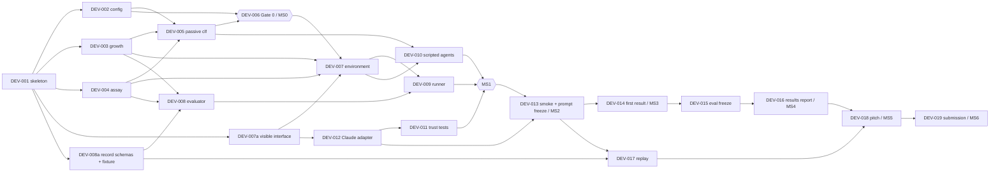

# MIRAGE-Bio — Development Plan

| Field | Value |
|---|---|
| Status | Accepted for MVP (3 October 2026) |
| Role | Roadmap: **when** and **in what order** |
| Deadline | **Sunday 4 October 2026, 14:45 BST** (submission) |
| Related | [ANALYSIS](ANALYSIS.md) · [DESIGN](DESIGN.md) · [GATE0_SPEC](GATE0_SPEC.md) · [TEST_PLAN](TEST_PLAN.md) · [EXPERIMENT_PLAN](EXPERIMENT_PLAN.md) · [RISKS](RISKS.md) · [TEAM_HANDOFF](TEAM_HANDOFF.md) |

Milestone IDs use the prefix **MS** (MS0–MS6). This avoids collision with metric
IDs M1–M4.

---

## 1. Development strategy

**Scientific validity first, then environment, agent, evaluation, demo, and
expansion.**

1. **Science (MS0).** Prove with Gate 0 that the scenario is ambiguous passively,
   that Condition A is trustworthy, and that dilution separates the conditions,
   before any LLM code is merged. If the science is wrong, nothing downstream
   matters.
2. **Environment (MS1).** Build the virtual lab, evaluator and runner, and validate
   them with scripted agents whose behaviour is known in advance.
3. **Agent (MS2).** Integrate one AI scientist behind the frozen tool interface.
4. **Evaluation (MS3–MS4).** Obtain a first result early, then complete and
   freeze the evaluation.
5. **Demo (MS5) and submission (MS6).**
6. **Expansion** only after the freeze, and only from §9.

The MIRAGE-level documents ([MIRAGE](../MIRAGE.md),
[BENCHMARK_METHODOLOGY](../BENCHMARK_METHODOLOGY.md),
[DIFFERENTIATION](../DIFFERENTIATION.md)) are architectural and research framing only.
They create **no** tasks:
- no milestone for generic MIRAGE adapters or environment interfaces;
- no milestone for additional scientific domains.

The implementation is MIRAGE-Bio only.

Parallelism comes from freezing three interfaces at the start (DESIGN §13):
- the **visible interface**: `lab/tools.py` and `agents/base.py`;
- the **record schemas** in `evaluation/metrics.py`;
- a hand-written **fixture record**.

The agent lead then builds against a mock session, and the evaluation and demo lead
builds metrics and replay against fixture logs, while the science is validated.
**No one waits for the Claude integration to build evaluation or replay.**

## 2. Critical path

```text
MS0 Scientific scenario validated            (Sat 18:00 target, 18:30 hard)
  ↓
MS1 Virtual laboratory complete              (Sat 21:30)
  ↓
MS2 AI scientist end-to-end                  (Sat 23:30, prompt freeze)
  ↓
MS3 First empirical result                   (Sun 01:00; latest Sun 09:30)
  ↓
MS4 Evaluation complete                      (Sun 11:30, hard evaluation freeze)
  ↓
MS5 Demo and pitch artefacts                 (Sun 13:00)
  ↓
MS6 Submission-ready repository              (Sun 14:15; code freeze 13:30; deadline 14:45)
```

Off the critical path, in parallel, from the 16:00 interface freeze:
- Claude adapter against the mock session (DEV-012);
- evaluator and replay against fixture records (DEV-008, DEV-017).

## 3. Milestones

### MS0 — Scientific scenario validated

| Item | Content |
|---|---|
| Goal | Quantitative evidence that `scenario-v1` satisfies SVR-001, SVR-002, SVR-003 and SVR-007. Parameters frozen. |
| Scope | Corrected model (Richards $\nu = 8$; assay $n = 8$; unknown $S$); passive ambiguity; biological trustworthiness; dilution separation; frozen parameters. |
| Tasks | DEV-001, DEV-002, DEV-003, DEV-004, DEV-005, DEV-006 |
| Dependencies | None |
| Definition of done | `scripts/gate0.py` exits 0. Every blocking criterion of [GATE0_SPEC §4](GATE0_SPEC.md#4-quantitative-acceptance-criteria) passes, and non-blocking G0-D3 and G0-G are reported. Every output of [GATE0_SPEC §3](GATE0_SPEC.md#3-required-gate-0-outputs) and `scenario_v1.json` are committed, and the hash is recorded. `robustness_map.png` may be deferred if time is critical. |
| Tests required | T-001 to T-010, T-019, T-024, T-025, T-029, T-030 |
| Fallback | Bug hunt against [the design-time reference output](../../experiments/reference/design_validation_output.txt). The pre-approved $S$ widening to $[0.4, 2.5]$ becomes `scenario-v1.1` (GATE0_SPEC §8). |
| Stop rule | Not passed by **18:30**: one hour of joint SCI+ENV debugging. Not passed by **19:30**: stop LLM work. Ship the environment, baselines and an honest Gate 0 report as the submission. No threshold may be relaxed. |
| Owner | Science lead (SCI) |

### MS1 — Virtual laboratory complete

| Item | Content |
|---|---|
| Goal | A working lab, evaluator and runner, validated by scripted agents. |
| Scope | `LabEnvironment`, tools, budget, validation, RNG streams, event log, evaluator, records, `run`/`summarize` CLI, `GoodScientist`, `PassiveBayesAgent`, trust-boundary tests. |
| Tasks | DEV-007, DEV-008, DEV-009, DEV-010, DEV-011 |
| Dependencies | MS0 (frozen config). The `lab/tools.py` interface can start before MS0. |
| Definition of done | Both baselines run through the runner on 1,000 episodes per condition. `GoodScientist` M3 ≥ 0.95. `PassiveBayes` M1 ≤ 0.65 with M2 = 0. `summarize` reproduces `summary.json` byte-for-byte. Trust-boundary tests pass. |
| Tests required | T-011 to T-017, T-020, T-021, T-023, T-026, T-027, T-031 |
| Fallback | Drop O1/O2 and the per-reason audit breakdown. M1–M4 are not optional. |
| Stop rule | Not done by **21:30**: ENV and QA pair on it; AGT continues against the mock. No new features are added to the environment. |
| Owner | Environment lead (ENV). Evaluator: evaluation and demo lead (EVD). |

### MS2 — AI scientist end-to-end

| Item | Content |
|---|---|
| Goal | Claude completes episodes through the real environment with complete records. Prompt frozen. |
| Scope | `agents/claude.py` (DESIGN §9.4), the minimal prompt and tool definitions of DESIGN §9.2–9.3, failure statuses, transcript logging. |
| Tasks | DEV-012, DEV-013 |
| Dependencies | MS1. DEV-012 itself only needs the frozen visible interface. |
| Definition of done | 4 development-seed episodes (2 per condition) complete with valid records. The prompt-leakage test passes. Cost per episode is measured. `prompt-v2` is frozen and tagged in the records. |
| Tests required | T-012, T-022, T-028 |
| Fallback | The model stays `claude-opus-5-5`. If the API is unavailable, keep retrying, and prepare the scripted-only submission path in parallel. |
| Stop rule | Prompt edits are allowed only to fix **bugs** (tool misuse, schema errors), never to improve score, and only on dev seeds. Freeze at **23:30**. |
| Owner | Agent lead (AGT) |

### MS3 — First empirical result

| Item | Content |
|---|---|
| Goal | The minimal evaluation matrix (10 eval episodes, 5 per condition) for Claude and both baselines, scored and summarised. |
| Scope | Eval seeds 500,000–500,009 from `eval_matrix_v1.json`. |
| Tasks | DEV-014 |
| Dependencies | MS2 |
| Definition of done | 10 Claude records; baselines on the same 10; `summary.json` with M1–M4 and Wilson intervals; a short interpretation note against EXPERIMENT_PLAN §9. |
| Tests required | T-023 on the real run directory |
| Fallback | If the night slips, run first thing Sunday. Latest finish 09:30. |
| Stop rule | No prompt changes after seeing eval results. API failures are re-run once (same seed); all other outcomes are final. |
| Owner | AGT, with SCI for interpretation |

### MS4 — Evaluation complete

| Item | Content |
|---|---|
| Goal | Strong matrix (30 episodes, 15 per condition) completed and frozen. Final tables and figure. |
| Scope | Eval seeds 500,010–500,029; results report; results figure. |
| Tasks | DEV-015, DEV-016 |
| Dependencies | MS3 |
| Definition of done | 30 Claude records (or as many as completed by the freeze, reported honestly). `summary.json`, `results.md` table and `results.png` committed. Evaluation frozen at **11:30**. |
| Tests required | T-023 |
| Fallback | Stop at the last balanced count reached by 11:30. The minimal matrix of 10 remains a valid result. |
| Stop rule | **Hard freeze 11:30 Sunday.** After it there are no new runs except re-running `API_FAILURE` episodes until 12:00. |
| Owner | AGT (runs), SCI (report) |

### MS5 — Demo and pitch artefacts

| Item | Content |
|---|---|
| Goal | A ≤ 3-minute offline demo and pitch, every number traceable to records. |
| Scope | `demo/replay.py`; demo-pair Claude episodes (run once after the prompt freeze); pre-rendered figures; slides and script. |
| Tasks | DEV-017, DEV-018 |
| Dependencies | MS2 (demo episodes), MS4 (results table) |
| Definition of done | Replay rehearsed with networking disabled. Backup PNGs and terminal capture committed. Slides use only committed numbers. |
| Tests required | T-018 |
| Fallback | Replay `GoodScientist` episodes on the demo pair, plus the results table. |
| Stop rule | No live API calls in the demo. No new visual features after **13:00**. |
| Owner | Evaluation and demo lead (EVD) |

### MS6 — Submission-ready repository

| Item | Content |
|---|---|
| Goal | A clean, reproducible, honest repository submitted before the deadline. |
| Scope | README status; commands verified from a clean clone; results committed; limitations; tag. |
| Tasks | DEV-019 |
| Dependencies | MS4, MS5 |
| Definition of done | Fresh-clone check passes: install, `pytest`, `gate0.py`, `summarize`, `replay`. README claims match the evidence. Submission sent by **14:15**. |
| Tests required | Full `pytest`; reproduction commands |
| Fallback | Submit with the known gaps listed in README "Limitations". |
| Stop rule | **Code freeze 13:30.** After 13:30 only documentation and status fixes. |
| Owner | Integrator/QA (QA) |

## 4. Work breakdown structure

Priority: **P0** must ship · **P1** should ship · **P2** only if ahead of schedule.
Owner types: SCI, ENV, AGT, EVD, QA (§6).

| ID | Task | Files affected | Acceptance criteria | Depends on | Owner | Priority |
|---|---|---|---|---|---|---|
| DEV-001 | Project skeleton and tooling | `pyproject.toml`, `src/mirage/__init__.py`, `tests/conftest.py`, `.gitignore` (add `.local/runs/` if needed) | `pip install -e ".[dev]"` works on Python ≥ 3.11. Dependencies pinned: numpy, matplotlib, pydantic, anthropic; dev: pytest. `pytest` runs (0 tests is fine). | none | ENV | P0 |
| DEV-002 | Scenario config, schemas and sampler | `src/mirage/config.py`, `src/mirage/biology/conditions.py`, `experiments/configs/scenario_v1.json`, `experiments/configs/demo_pair.json` | Hidden schemas as in DESIGN §13. Sampling order as in DESIGN §6 (nuisance first; $S$ once per episode). Canonical SHA-256. Limits are checked against `lab/tools.py` constants. Invalid JSON raises. T-024 and T-025 pass. | DEV-001 | SCI | P0 |
| DEV-003 | Growth model | `src/mirage/biology/growth.py` | Vectorised closed form (DESIGN §5.2). T-002 and T-003 pass. | DEV-001 | SCI | P0 |
| DEV-004 | Assay model | `src/mirage/assay/od_reader.py` | $f$, compression, $x_{\text{lin}}$, $K'$, $t_q$, noise with rounding (DESIGN §5.3–5.6). T-004 to T-007 pass. | DEV-001 | SCI | P0 |
| DEV-005 | Passive reference classifier | `src/mirage/evaluation/passive.py` | Reference densities from the `passive_reference` block (DESIGN §16.2). Deterministic. Classifies a list of passive readings. Build time < 30 s. | DEV-002, DEV-003, DEV-004 | SCI | P0 |
| DEV-006 | Gate 0 script and frozen artefacts | `scripts/gate0.py`, `experiments/results/gate0/*` | All checks, plots and `summary.json` exactly as in [GATE0_SPEC](GATE0_SPEC.md). Reproduces or supersedes the design-time reference. Non-zero exit on a blocking failure. `--quick` mode for tests. Runtime < 5 min. Artefacts committed. T-029 and T-030 pass. | DEV-002 to DEV-005 | SCI | P0 |
| DEV-007 | Lab environment and visible tool schemas | `src/mirage/lab/tools.py`, `src/mirage/lab/environment.py`, `src/mirage/agents/base.py` | `tools.py` and `base.py` merged **first** (DEV-007a, by Sat 16:00) as the frozen visible interface. Environment: passive generation, validation, budget, RNG streams, event log, turn limit, statuses. $S$ fixed for the episode. T-011, T-013, T-020 and T-026 pass. | DEV-002 to DEV-004 (environment); none (interface) | ENV | P0 |
| DEV-008 | Evaluator, built against fixture logs | `src/mirage/evaluation/metrics.py`, `tests/fixtures/sample_episode_llm.json` | **DEV-008a, by 16:00:** record schemas (DESIGN §13 RECORDS) and one hand-written fixture record. Then: per-clause audit with the fixed late window, M2 against the Gate-0-frozen diagnostic set (fixture set until Gate 0 lands) and Q1 reconstruction adequacy; scores, M1–M4, Q1, O1, O2, Wilson intervals; primary and intention-to-treat denominators (DESIGN §15). M5 optional. T-014, T-021, T-027 and T-032 pass. | DEV-003, DEV-004, DEV-007a | EVD | P0 |
| DEV-009 | Runner, persistence, summarize | `src/mirage/evaluation/runner.py`, `experiments/configs/eval_matrix_v1.json` | `run` and `summarize` subcommands. Atomic writes. Manifest. Hash check against Gate 0 `summary.json`. Determinism apart from `run_meta`. T-017, T-023 and T-031 pass. | DEV-007, DEV-008 | ENV | P0 |
| DEV-010 | Scripted agents | `src/mirage/agents/scripted.py` | `GoodScientist` exactly as in DESIGN §16.1. `PassiveBayesAgent` with injected classifier. T-015 and T-016 pass on 1,000 episodes per condition. | DEV-005, DEV-007 | ENV | P0 |
| DEV-011 | Trust-boundary tests | `tests/test_trust_boundary.py` | AST import scan, prompt-leakage scan and prompt snapshot (DESIGN §12). T-012 and T-028 pass. | DEV-007, DEV-012 (prompt part) | QA (ENV if no QA) | P0 |
| DEV-012 | Claude adapter | `src/mirage/agents/claude.py`, `tests/test_claude_adapter.py` | Loop per DESIGN §9.4. Minimal prompt and tool definitions per DESIGN §9.2–9.3 (no hypothesis scaffolding). Statuses per DESIGN §19. Full transcript, model ID and prompt hash logged. No model substitution. T-022 passes with a mocked client (no network). | DEV-007a interface | AGT | P0 |
| DEV-013 | Dev-seed smoke run and prompt freeze | `.local/runs/*` (not committed), records of 4 dev episodes optionally committed under `experiments/results/dev_smoke/` | 4 dev episodes complete. Cost per episode measured and noted. Bugs fixed. `prompt-v2` frozen (prompt-v1 superseded, OPEN_RULINGS §G). | DEV-009, DEV-012 | AGT | P0 |
| DEV-014 | First empirical result | `experiments/results/<run_id>/` (Claude + baselines, eval seeds 500,000–500,009) | 10 Claude records plus baseline records. `summary.json`. Interpretation note. | DEV-013 | AGT | P0 |
| DEV-015 | Evaluation completion and freeze | same run family, eval seeds 500,010–500,029 | Up to 30 balanced Claude records by 11:30. `API_FAILURE` re-run once. Freeze declared in `manifest.json`. | DEV-014 | AGT | P0 |
| DEV-016 | Results report and figure | `experiments/results/<run_id>/results.md`, `results.png` | Table of M1–M4 (overall and per condition, Wilson intervals) for Claude, `GoodScientist` and `PassiveBayes`. Failure breakdown. Generated from records by a script or `summarize --report`. | DEV-015 | EVD (SCI interprets) | P1 |
| DEV-017 | Offline demo replay | `src/mirage/demo/replay.py`, `experiments/results/demo/*` | DESIGN §20. Built first against the fixture record. Works with networking disabled. Demo-pair Claude episodes run once after the freeze. Backup PNGs and terminal capture committed. T-018 passes. | DEV-008a (record schema + fixture); DEV-013 (demo episodes) | EVD | P0 |
| DEV-018 | Pitch artefacts | `docs/pitch/` (slides export, script), figures copied from results | ≤ 3-minute script. Every number traceable to a committed file. `latent_reveal.png` reused. Communication constraints (ANALYSIS §18) and positioning ([DIFFERENTIATION](../DIFFERENTIATION.md)) checked by SCI. | DEV-006, DEV-016, DEV-017 | EVD | P1 |
| DEV-019 | Submission hardening | `README.md`, `docs/*` status lines | Fresh-clone reproduction verified. Status and limitations accurate. Tag `v0.1-submission`. Submitted by 14:15. | DEV-015 to DEV-018 | QA | P0 |

## 5. Dependency graph



## 6. Team allocation

Owner types:

| Code | Role | Owns |
|---|---|---|
| SCI | Science lead | Gate 0, parameter freeze, diagnostic-control rule and $D_{\text{diag}}$, interpretation, claims |
| ENV | Environment lead | Simulator and lab against the frozen interfaces; runner; scripted agents |
| AGT | Agent lead | Minimal Claude tool loop (never sees hidden state); prompt freeze; evaluation runs |
| EVD | Evaluation and demo lead | Record schemas, fixture logs, metrics, results report, replay, pitch |
| QA | Integrator (5-person team only; otherwise ENV) | Trust-boundary tests, merges, reproducibility, submission |

**No one waits for the Claude integration to build evaluation or replay.** EVD builds
against fixture records from 16:00. AGT builds against a mock session. ENV builds the
lab against the frozen interfaces.

### 3-person plan

| Person | Roles | Tasks |
|---|---|---|
| P1 | SCI + evaluator | DEV-002 to 006; DEV-008 (after Gate 0); DEV-016 |
| P2 | ENV + QA | DEV-001, 007, 009, 010, 011, 019 |
| P3 | AGT + demo | DEV-012 to 015, 017, 018 (DEV-008a fixture first) |

### 4-person plan

| Person | Roles | Tasks |
|---|---|---|
| P1 | SCI | DEV-002 to 006; interprets DEV-016 |
| P2 | ENV (+ QA duties) | DEV-001, 007, 009, 010, 011, 019 |
| P3 | AGT | DEV-012 to 015 |
| P4 | EVD | DEV-008 (incl. 008a), 016, 017, 018 |

### 5-person plan

| Person | Roles | Tasks |
|---|---|---|
| P1 | SCI | DEV-002 to 006 |
| P2 | ENV | DEV-001, 007, 009, 010 |
| P3 | AGT | DEV-012 to 015 |
| P4 | EVD | DEV-008 (incl. 008a), 016, 017, 018 |
| P5 | QA | DEV-011, 019; test-suite support |

**Rules for working in parallel.**
- One branch per task: `feat/dev-0NN-short-name`. Small PRs into `main`. Each PR
  lists the commands run and their outcomes (PR template).
- File ownership follows the task table. Editing another owner's file requires
  their agreement.
- `lab/tools.py`, `agents/base.py` and the record schemas are frozen after
  DEV-007a / DEV-008a. Changing them requires ENV, AGT and EVD agreement and a
  version bump.

## 7. Timeline (all times BST)

### Saturday 3 October

| Time | Activity | Milestone |
|---|---|---|
| 15:00 | Documentation freeze. Kick-off: read TEAM_HANDOFF, assign roles, create issues from §4. | — |
| 15:00–16:00 | DEV-001 skeleton. DEV-007a visible interface and DEV-008a record schemas + fixture merged by 16:00. | — |
| 15:00–18:00 | DEV-002 to DEV-006 (SCI). DEV-007 environment (ENV). DEV-012 adapter against mock (AGT). DEV-008 evaluator and DEV-017 replay against fixtures (EVD). | — |
| **18:00 / 18:30** | **Gate 0 go/no-go** (target / hard) | **MS0** |
| 18:30–21:30 | DEV-007 to DEV-011. Baselines at scale. | — |
| 21:30 | Lab complete | **MS1** |
| 21:30–23:30 | DEV-013 smoke run on dev seeds. Measure cost. Fix bugs. | — |
| **23:30** | **Prompt freeze (`prompt-v2`)**. Run the demo-pair episodes once. | **MS2** |
| 23:30–01:00 | DEV-014: 10 eval episodes and baselines | **MS3** (target) |

### Sunday 4 October

| Time | Activity | Milestone |
|---|---|---|
| 09:00–09:30 | Finish MS3 if it slipped; review the interpretation note | MS3 (latest) |
| 09:30–11:30 | DEV-015: extend to 30 episodes. DEV-016 report. DEV-017 finalise replay. | — |
| **11:30** | **Evaluation freeze (hard)** | **MS4** |
| 11:30–13:00 | DEV-018 pitch. Rehearse replay with networking disabled. | **MS5** |
| **13:30** | **Code freeze (hard)** | — |
| 13:30–14:15 | DEV-019 fresh-clone check. README status. Submit. | **MS6** |
| 14:15–14:45 | Buffer only. No changes except to fix a broken submission. | Deadline 14:45 |

## 8. Stop rules

These are binding. Proposing to break one requires the whole team to agree and an
entry in RISKS.

1. **No LLM code is merged before Gate 0 passes.** Adapter work proceeds on a branch
   against the mock.
2. **No second assay, organism, scientific world or domain.**
3. **No third hidden condition** before the MVP is complete (MS6).
4. **No agent framework** (LangChain, CrewAI, AutoGen, etc.), **no RAG, no
   multi-agent debate, no fine-tuning.**
5. **No UI or web platform.** CLI and static figures only.
6. **No Modal or remote compute** unless local runs are demonstrably the bottleneck,
   which they will not be at 30 episodes.
7. **No second model or vendor** until MS4 is frozen.
8. **No more than 30 evaluation episodes per configuration** before MS6.
9. **No prompt edits after the prompt freeze**, and never on eval seeds.
10. **No threshold changes after seeing results**: Gate 0 thresholds, the frozen
    diagnostic set $D_{\text{diag}}$, the diagnostic-control and Q1 rules, and $\tau$
    are fixed.
11. **No LLM in the evaluation path.**
12. **No new abstractions for "future extensibility"**: no registries, plugin
    systems or generic multi-assay interfaces.
13. **Time-boxing.** If a P1 or P2 task threatens a P0 task, drop it.
14. **After 13:30 Sunday,** only documentation and status edits.
15. **No generic MIRAGE engineering.** No `AbstractLab`, adapter layer, plugin
    registry, generic backend, universal benchmark schema or second environment.
    MIRAGE generality exists in documentation only.
16. **No benchmark retuning against the target model.** After Gate 0 freezes the
    parameters, Claude outcomes never change them (ANALYSIS ER-007).

## 9. Expansion plan

### 9.1 Baseline / MVP — must ship

Everything in §4 marked P0. One scenario, one assay, two conditions, one dilution
intervention, Claude Opus 5.5 at one effort setting, `GoodScientist`,
`PassiveBayes`, the deterministic evaluator with M1–M4, 10–30 evaluation episodes,
and the offline replay. M5 (experiment diagnosticity) is a stretch item and never
blocks shipping.

### 9.2 Phase 2 — only after the baseline is fully working and frozen

None of the following are current tasks. Each needs its own design note, its own
Gate-0-style validation, and a new scenario version.

| Idea | What it would test | Precondition |
|---|---|---|
| Second agent configuration (another model or effort level) | Sensitivity of M1–M4 to model and effort | MS4 frozen. Same matrix, same prompt. |
| Run-to-run variability | Variance of LLM behaviour on fixed seeds | MS4 frozen |
| Increased noise | Whether agents use replicates appropriately | New SVR thresholds |
| Replicate reasoning | Value of replication under a budget | Noise regime where single reads mislead |
| Gain or calibration drift | A different measurement confound over time | New condition plus a Gate 0 equivalent |
| Fluorescence-assay artefact (e.g. inner-filter effect) | Transfer to another assay | New assay model and validity proof |
| Orthogonal assays (e.g. a simulated plate count) | Choosing *between* control types | Cost model, new ADR |
| Optimal-experiment-selection baseline | Information-theoretic upper bound on control choice | Formal expected-information-gain calculation |
| Broader MIRAGE benchmark (several worlds) | General ambiguity-resolution evaluation | Everything above, done properly |
