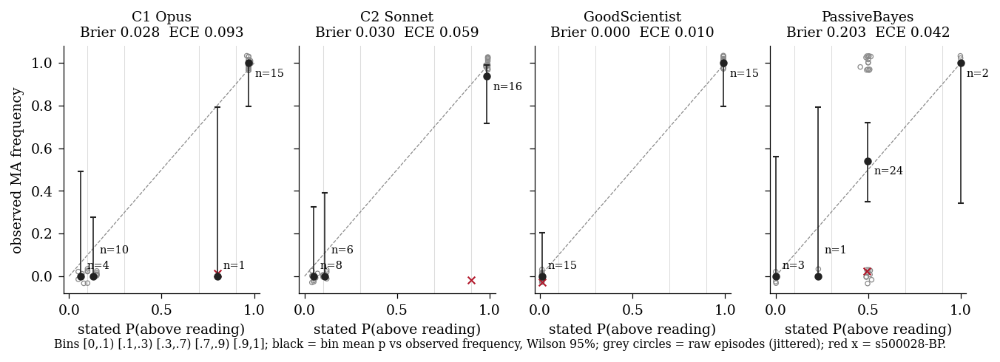
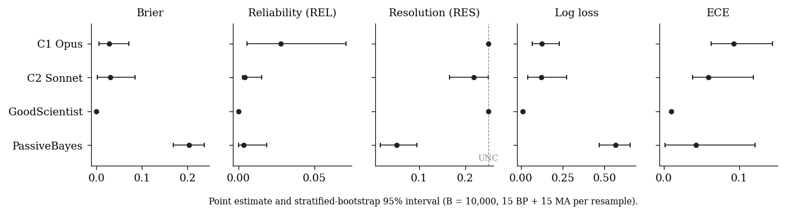
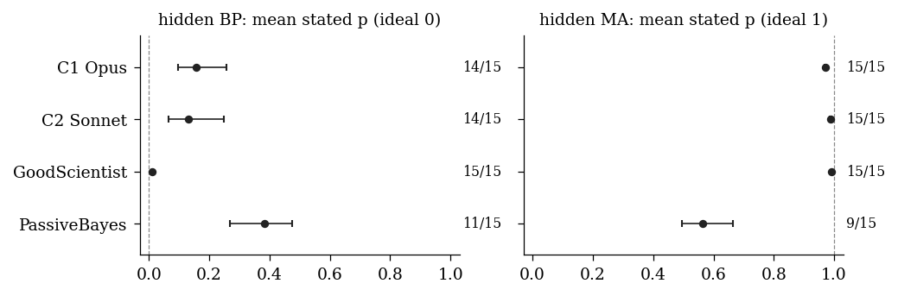
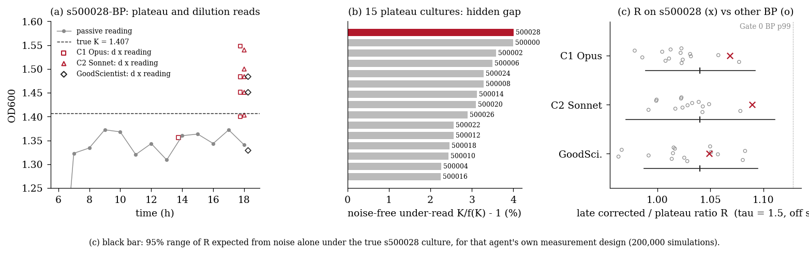
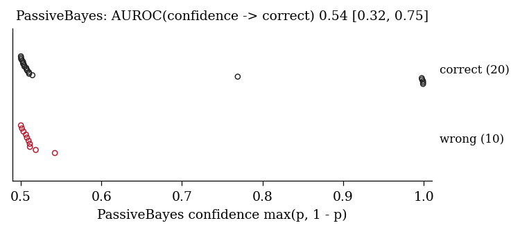

# Result: calibration of stated probabilities, and the shared s500028-BP miss

**Exploratory, not confirmatory.** Analysis of committed strong-matrix records only (seeds 500000–500029, 15 BP + 15 MA); no API calls, nothing rescored. Registered in [`REGISTRATION.md`](REGISTRATION.md) before any statistic was computed; deviations are listed there.

## Headline

Both Claude models are sharp but lean toward MA on plateau cultures. Resolution is at or near its ceiling (binned RES 0.250 Opus, 0.219 Sonnet; UNC = 0.25). On the 15 BP cultures their mean stated P(above reading) is 0.157 [0.096, 0.258] (Opus) and 0.131 [0.064, 0.249] (Sonnet), against 0 observed; on MA they are slightly under-confident (0.971, 0.988). The single s500028-BP miss accounts for 76% (Opus) and 89% (Sonnet) of their mean Brier. Opus and Sonnet show no detectable difference in Brier (-0.002 [-0.015, 0.005]) or log loss at n = 30. PassiveBayes is calibrated (ECE 0.042) but has little resolution (RES 0.051 [0.017, 0.096]), and its confidence carries no detectable information about which answers are right (AUROC 0.54 [0.32, 0.75]). On s500028-BP, by the registered rule D3, the miss is **not a reasonable condition call under measurement noise**. Given each model's own readings, the simulator's posterior gives log10 odds for MA of -444 (Opus) and -425 (Sonnet). Their corrected/plateau ratios (1.069, 1.089) sit far below τ = 1.5 and below the Gate 0 BP 99th percentile (1.128). But the readings themselves were ordinary: a ratio at least this high arises from noise alone in 14% / 9% of simulations of this culture. And the literal claim both models made, that biomass is higher than the undiluted reading, is **true** (latent K 1.407 vs noise-free reading 1.353). The best explanation is that s500028 has the largest hidden under-read of the 15 plateau cultures (4.01%, effectively tied with s500000-BP at 4.00%). An ordinary upward noise draw then made that real gap look like 10% (Opus) and 14% (Sonnet) against the 18 h undiluted reading, and the models answered the literal question without any materiality threshold, reading replicate scatter at high dilution as signal.

## Main table

Point estimate with stratified-bootstrap 95% interval (B = 10,000; 15 BP + 15 MA per resample). M1 is k/30 with the Wilson 95% interval. REL/RES use the registered bins [0, .1, .3, .7, .9, 1]; UNC = 0.250 for every agent; Brier ≈ REL − RES + UNC + residual (within-bin term).

| Agent | M1 correct | Brier | REL | RES | residual | Log loss | ECE |
|---|---|---|---|---|---|---|---|
| C1 Opus | 29/30 [0.83, 0.99] | 0.028 [0.006, 0.071] | 0.028 [0.005, 0.071] | 0.250 [0.250, 0.250] | +0.0002 | 0.124 [0.066, 0.229] | 0.093 [0.063, 0.144] |
| C2 Sonnet | 29/30 [0.83, 0.99] | 0.030 [0.002, 0.084] | 0.004 [0.002, 0.015] | 0.219 [0.167, 0.250] | -0.0052 | 0.120 [0.039, 0.273] | 0.059 [0.038, 0.119] |
| GoodScientist | 30/30 [0.89, 1.00] | 0.000 [0.000, 0.000] | 0.000 [0.000, 0.000] | 0.250 [0.250, 0.250] | +0.0000 | 0.010 [0.010, 0.010] | 0.010 [0.010, 0.010] |
| PassiveBayes | 20/30 [0.49, 0.81] | 0.203 [0.168, 0.236] | 0.003 [0.000, 0.019] | 0.051 [0.017, 0.096] | +0.0012 | 0.566 [0.469, 0.655] | 0.042 [0.001, 0.121] |

Mean Brier equals each run's committed `summary.json` O1 to 1e-12 (asserted). No forecast was clipped for log loss. GoodScientist's intervals have zero width because it always states 0.01 or 0.99 and is always right.





### Paired differences (rule D1: differ only if the paired 95% interval excludes 0)

| Pair | Δ Brier | Δ log loss | Δ REL | Δ RES | Δ ECE |
|---|---|---|---|---|---|
| C1 Opus - C2 Sonnet | -0.002 [-0.015, 0.005] | 0.004 [-0.051, 0.036] | 0.024 [0.002, 0.056] * | 0.031 [0.000, 0.083] | 0.034 [0.018, 0.041] * |
| C1 Opus - GoodScientist | 0.028 [0.006, 0.071] * | 0.114 [0.056, 0.219] * | 0.028 [0.005, 0.071] * | 0.000 [0.000, 0.000] | 0.083 [0.053, 0.134] * |
| C1 Opus - PassiveBayes | -0.175 [-0.220, -0.122] * | -0.443 [-0.556, -0.310] * | 0.025 [-0.008, 0.070] | 0.199 [0.154, 0.233] * | 0.051 [-0.043, 0.123] |
| C2 Sonnet - GoodScientist | 0.030 [0.002, 0.084] * | 0.110 [0.029, 0.263] * | 0.004 [0.002, 0.015] * | -0.031 [-0.083, 0.000] | 0.049 [0.028, 0.109] * |
| C2 Sonnet - PassiveBayes | -0.173 [-0.223, -0.108] * | -0.446 [-0.583, -0.269] * | 0.001 [-0.015, 0.014] | 0.167 [0.101, 0.225] * | 0.017 [-0.070, 0.098] |
| GoodScientist - PassiveBayes | -0.203 [-0.236, -0.168] * | -0.556 [-0.645, -0.459] * | -0.003 [-0.019, 0.000] | 0.199 [0.154, 0.233] * | -0.032 [-0.111, 0.009] |

`*` = interval excludes 0. Opus vs Sonnet differ on REL and ECE only. That difference is fragile: it comes from which bin the single miss falls in (Opus's 0.8 sits alone in the [0.7, 0.9) bin, while Sonnet's 0.9 is pooled into the top bin with 15 correct MA calls). Brier and log loss, which do not bin, show no detectable difference.

## Calibration by hidden condition (rule D2)

Calibration-in-the-large = mean(p − y). It is positive when the agent leans toward MA.

| Agent | Condition | k correct | mean p | p range | Brier | log loss | mean(p − y) | D2 |
|---|---|---|---|---|---|---|---|---|
| C1 Opus | BP | 14/15 | 0.157 [0.096, 0.258] | 0.05–0.8 | 0.0554 [0.0105, 0.1410] | 0.218 [0.102, 0.427] | 0.157 [0.096, 0.258] | biased toward MA |
| C1 Opus | MA | 15/15 | 0.971 [0.969, 0.973] | 0.96–0.98 | 0.0009 [0.0008, 0.0010] | 0.030 [0.028, 0.032] | -0.029 [-0.031, -0.027] | biased toward BP |
| C2 Sonnet | BP | 14/15 | 0.131 [0.064, 0.249] | 0.04–0.9 | 0.0603 [0.0048, 0.1687] | 0.228 [0.066, 0.533] | 0.131 [0.064, 0.249] | biased toward MA |
| C2 Sonnet | MA | 15/15 | 0.988 [0.986, 0.990] | 0.98–0.99 | 0.0002 [0.0001, 0.0002] | 0.012 [0.010, 0.014] | -0.012 [-0.014, -0.010] | biased toward BP |
| GoodScientist | BP | 15/15 | 0.010 [0.010, 0.010] | 0.01–0.01 | 0.0001 [0.0001, 0.0001] | 0.010 [0.010, 0.010] | 0.010 [0.010, 0.010] | biased toward MA |
| GoodScientist | MA | 15/15 | 0.990 [0.990, 0.990] | 0.99–0.99 | 0.0001 [0.0001, 0.0001] | 0.010 [0.010, 0.010] | -0.010 [-0.010, -0.010] | biased toward BP |
| PassiveBayes | BP | 11/15 | 0.382 [0.269, 0.474] | 0.000842–0.519 | 0.1870 [0.1325, 0.2361] | 0.526 [0.373, 0.658] | 0.382 [0.269, 0.474] | biased toward MA |
| PassiveBayes | MA | 9/15 | 0.564 [0.495, 0.664] | 0.458–0.999 | 0.2193 [0.1689, 0.2555] | 0.606 [0.467, 0.704] | -0.436 [-0.505, -0.336] | biased toward BP |

Every agent is "biased" by D2 in both conditions. For GoodScientist that is trivial (fixed 0.01/0.99, so the interval has zero width). For Claude the BP lean is not only the miss. Descriptively (not registered), the other 14 BP forecasts range 0.05–0.15 (Opus, mean 0.111) and 0.04–0.12 (Sonnet, mean 0.076), against a reference posterior that is essentially 0 for every BP episode. The models hedge on plateau cultures and not on artefact cultures. PassiveBayes's lean toward 0.5 in both conditions is what passive-only data supports (Gate 0 G0-A balanced accuracy 0.567 on 1,000/condition).



## Case study: s500028-BP

**Hidden culture** (read from the record, used only for diagnostics): BP, K = 1.4067 ODeq, S = 1.5932, K/S = 0.883. The reader saturates below S too, so the noise-free undiluted reading is f(K) = 1.3525. Biomass really is 4.01% above the reading. That is the largest gap of the 15 BP cultures (range 2.25%–4.01%; rank 1/15), with s500000-BP at 4.00%. Both models called s500000-BP correctly (p = 0.15, 0.07; ratios 1.023, 1.023). The distance from the boundary is therefore the same in the two episodes; what differs is the noise draw.

**Passive data.** The 19 hourly readings rise to 1.323 at 7 h and stay flat after that (7–18 h range 1.3091–1.3724; mean at 15–18 h 1.3550). PassiveBayes's committed p = 0.493, so the passive data cannot tell the conditions apart.

**Dilution readings.** Here z is the deviation from the noise-free reading of the true culture, in units of the assay noise SD (σ = 0.003 + 0.02·f). It is descriptive and was added after registration.

| Agent | t (h) | dilution | readings | d × reading | noise-free reading | z |
|---|---|---|---|---|---|---|
| C1 Opus | 18 | 10× | 0.1451, 0.1484 | 1.451, 1.484 | 0.1407 | +0.76, +1.33 |
| C1 Opus | 18 | 20× | 0.0700, 0.0774 | 1.400, 1.548 | 0.0703 | -0.08, +1.60 |
| C1 Opus | 5 | 2× | 0.2193 | 0.439 | 0.2127 | +0.90 |
| C1 Opus | 14 | 10× | 0.1356 | 1.356 | 0.1407 | -0.87 |
| C2 Sonnet | 18 | 10× | 0.1451, 0.1484 | 1.451, 1.484 | 0.1407 | +0.76, +1.33 |
| C2 Sonnet | 18 | 4× | 0.3508 | 1.403 | 0.3517 | -0.09 |
| C2 Sonnet | 18 | 40× | 0.0385, 0.0375 | 1.540, 1.500 | 0.0352 | +0.90, +0.63 |
| GoodScientist | 18 | 10× | 0.1451, 0.1484, 0.1329 | 1.451, 1.484, 1.329 | 0.1407 | +0.76, +1.33, -1.34 |

The first two 1:10 reads at 18 h are identical for all three agents, because the simulator's sample noise is seeded per episode. GoodScientist took a third replicate (z = -1.34) and applied its fixed rule (ratio 1.049 < τ = 1.5 → BP, p = 0.01). Opus and Sonnet saw the same two upward reads (z = +0.76, +1.33). They then added high-dilution reads whose relative noise is large (σ/f = 6.3% at 20×, 10.5% at 40×, vs 4.1% at 10×), and treated the scatter as a signal.

| Agent | p | own ratio R | rank of R among 15 BP | other-BP R range | log(R/τ) | P_noise(R ≥ observed) | P_noise(R ≥ τ) | reference P(MA \| own data) | D3 |
|---|---|---|---|---|---|---|---|---|---|
| C1 Opus | 0.8 | 1.069 | 2 | 0.979–1.077 | -0.339 | 0.142 | 0.000 | 10^-444 odds | not reasonable |
| C2 Sonnet | 0.9 | 1.089 | 1 | 0.992–1.078 | -0.320 | 0.087 | 0.000 | 10^-425 odds | not reasonable |
| GoodScientist | 0.01 | 1.049 | 6 | 0.963–1.083 | -0.358 | 0.372 | 0.000 | 10^-336 odds | n/a (correct call) |

R is the mean of d × reading over the agent's late (12–18 h) diluted reads, divided by the mean passive reading at 15–18 h. The noise probabilities come from 200,000 simulations of the true culture under each agent's own measurement design, with passive reads redrawn. Under that design the noise-free R is 1.040, and the 95% noise range is [0.989, 1.092] (Opus) and [0.970, 1.111] (Sonnet). The reference posterior is the exact grid posterior from the scenario-v1 generative model, using every reading at t ≥ 14 h. Population reference from Gate 0: R_BP_p99 = 1.128, R_MA_p1 = 2.987.



**What the models wrote** (final `submit_diagnosis` rationale, verbatim). The transcripts contain no visible assistant text outside tool calls. Their thinking blocks are signed and empty, so no reasoning beyond this can be quoted or inferred.

*C1 Opus* — `BIOMASS_ABOVE_READING`, p = 0.8, estimate 1.47 OD:

> The undiluted readings stop rising abruptly at about 1.32–1.37 from 7 h onward. That flat ceiling could be a real stationary phase, or the reader may have stopped responding proportionally at high OD. To tell these apart, I diluted the retained 18 h aliquot. At 10x, two replicates read 0.1451 and 0.1484 (mean 0.1467, so 1.467 after multiplying back). At 20x, two replicates read 0.0700 and 0.0774 (mean 0.0737, so 1.474). The two dilutions agree closely, so the reader responds proportionally in that range. Both give about 1.47, roughly 10% above the undiluted 18 h reading of 1.34. A check in the linear range was mostly consistent: the 5 h aliquot at 2x gave 0.2193, or 0.439, against 0.424 undiluted (about 3% higher). The 14 h aliquot at 10x gave 0.1356, or 1.356, which matches its undiluted reading of 1.36. Since that is a single read, the true value at 14 h was probably right at the reader's ceiling. Biomass then kept rising to about 1.47 by 18 h, while the undiluted readings stayed flat at the ceiling. So over the final hours, biomass is higher than the undiluted readings show. Confidence is limited by how few diluted reads there are and by the noise between replicates (about 10% spread at 20x).

*C2 Sonnet* — `BIOMASS_ABOVE_READING`, p = 0.9, estimate 1.53 OD:

> The undiluted readings plateau at about 1.34 from 7 h onward. The 18 h aliquot read at several dilutions gives a higher dilution-corrected OD as the dilution increases: undiluted 1.34, ×4 gives 1.40, ×10 gives 1.47 (two replicates, 0.1451 and 0.1484), and ×40 gives 1.52 (two replicates, 0.0385 and 0.0375). The readings are not proportional to concentration. The plate reader saturates at high density, so the plateau is partly an artefact. The corrected values are still rising at the highest dilution, so the true OD is probably about 1.5 or a little more. That is roughly 10–15% above the undiluted reading. The effect is modest, but the trend is consistent and larger than the replicate scatter.

**Assessment.** Under D3, neither model's call is a reasonable *condition* call. Its own data put P(MA) at effectively 0, its R is far below τ, and noise never pushes R to τ for this culture. Each model also made a specific error. Opus concluded that biomass "kept rising to about 1.47 by 18 h" from a single 14 h read (z = -0.87) and the upward 18 h reads, although latent biomass is flat at K (to within 2.1e-4, relative) from 14 h onward in scenario-v1. Sonnet read 1.40 → 1.47 → 1.52 across 4×/10×/40× as non-proportionality, but the noise-free corrected value is 1.407 at every one of those dilutions, and the 40× reads are at most z = +0.90. Both answers are nevertheless true as *literal* statements (biomass is 4.0% above the reading). As OPEN_RULINGS §H already records, prompt-v2 asks "higher" with no materiality threshold. This analysis does not rescore the episode (it stays correct = false). Whether a later prompt should say "substantially higher" is a science-lead question, unchanged by this result.

## PassiveBayes: the 20 correct answers vs the 10 wrong ones

| | n | mean confidence | median | range | n with confidence < 0.55 |
|---|---|---|---|---|---|
| correct | 20 | 0.642 | 0.508 | 0.500–0.999 | 14 |
| wrong | 10 | 0.511 | 0.509 | 0.500–0.542 | 10 |

Confidence = max(p, 1 − p). 14 of the 20 correct answers were made at confidence below 0.55: these are the "lucky" ones, essentially coin flips. The remaining correct answers come from 6 episodes with confidence ≥ 0.75 (all 6 correct), whose passive history happened to be informative. AUROC of confidence for correct vs wrong is 0.54 [0.32, 0.75], so by D4 there is no detectable information at n = 30. Under its own probabilities PassiveBayes expected 17.9 correct; P(≥ 20) = 0.27. So 20/30 [0.49, 0.81] is consistent with its own calibration and with Gate 0 G0-A 0.567 [0.545, 0.589].



## Limitations

- n = 30, with one record per (seed, agent). There are no significance claims; the intervals are wide, and binned REL/ECE depend on a single episode's bin placement.

- The results hold for scenario-v1, prompt-v2 and the strong matrix only. They are not compared with any model not run on this matrix.

- The Claude probabilities are coarse (a handful of distinct values), so the exact Murphy sensitivity is degenerate (REL = Brier, RES = UNC); see Deviations.

- The late-data reference posterior uses only readings at t ≥ 14 h. As a check, its passive-only version differs from PassiveBayes's committed p by up to 0.121, and agrees in label on 21/30 episodes. PassiveBayes uses the whole curve, and most disagreements are at p ≈ 0.5. The case-study conclusion does not depend on this: the late-data log10 odds are at most -336 for every agent.

- Thinking blocks are empty in the records, so the models' reasons are known only from their rationale text.

- The diagnostic quantities (hidden K, S, noise-free gap) come from the record's hidden config. No agent sees them.

## Spend

**$0.00.** No Anthropic API call was made, and no episode was run (dev or matrix). There is therefore no new `usage.jsonl`. The committed per-run `summary.json` / `results.md` under `experiments/results/<run>/` are the per-run summaries; their SHA-256 values are in `inputs.json`.

## Files

`REGISTRATION.md` (pre-registration + deviations) · `calib.py` (statistics) · `analysis.py` (loads records → `results.json`, `inputs.json`) · `figures.py` · `render_result.py` (→ this file) · tests in `tests/exploratory/calibration/`.

## Reproduce

```bash
./mirage setup
PYTHONPATH=src .venv/bin/python experiments/exploratory/calibration/analysis.py      # ~90 s
PYTHONPATH=src .venv/bin/python experiments/exploratory/calibration/figures.py
PYTHONPATH=src .venv/bin/python experiments/exploratory/calibration/render_result.py
PYTHONPATH=src .venv/bin/python -m pytest tests/exploratory/calibration -q
./mirage test --quick
```
