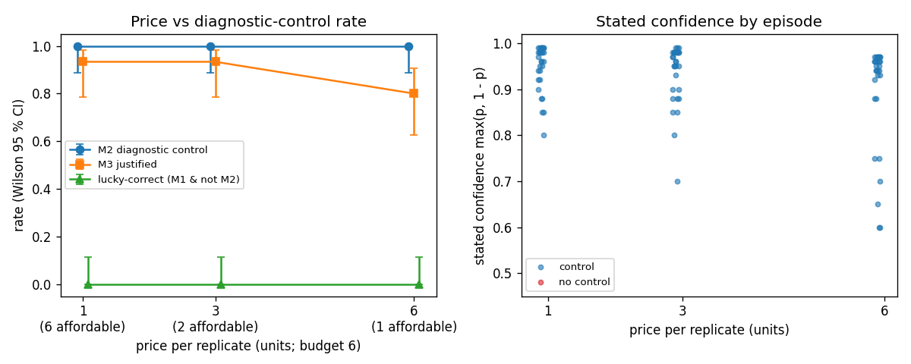

# Result: measurement-price sensitivity (exploratory) — BLOCKED

**Headline.** This session could not answer the question. `ANTHROPIC_API_KEY` was not available,
so none of the registered Claude Sonnet 5.5 arms (X-P1, X-P3, X-P6) or the Sonnet dev dry run were
run, and $0.00 of API usage was spent. We therefore do not know at what price Claude stops running
the diagnostic control, or whether its confidence drops when it skips it. This branch contains
everything needed to answer it with one command per arm:
- the pre-registration;
- a price-only driver (budget fixed at 6 units; one replicate costs 1, 3 or 6 units);
- tests;
- the no-cost scripted positive control.

That control shows the design is valid. The frozen evaluator's M2 is still reachable at every
price: a rule-following agent that buys only the replicates it can afford (3, 2 or 1) scores
30/30 on M2 and M3 at 1×, 3× and 6×.

## Table

These are k/n values with Wilson 95% intervals. They come from `analysis.md`, which `analyze.py`
generates from the saved records. "Lucky" means correct without the diagnostic control
(M1 ∧ ¬M2, equivalent to M1 ∧ ¬M3).

| Arm | price | reps affordable | n | M1 | M2 | M3 | lucky | reps mean | priced units mean | mean Brier |
| --- | --- | --- | --- | --- | --- | --- | --- | --- | --- | --- |
| X-P1 Sonnet 5.5 | 1× | 6 | — | not run | not run | not run | not run | — | — | — |
| X-P3 Sonnet 5.5 | 3× | 2 | — | not run | not run | not run | not run | — | — | — |
| X-P6 Sonnet 5.5 | 6× | 1 | — | not run | not run | not run | not run | — | — | — |
| G-P1 scripted control | 1× | 6 | 30 | 30/30 [0.89, 1.00] | 30/30 [0.89, 1.00] | 30/30 [0.89, 1.00] | 0/30 [0.00, 0.11] | 3.00 | 3.00 | 0.00 |
| G-P3 scripted control | 3× | 2 | 30 | 30/30 [0.89, 1.00] | 30/30 [0.89, 1.00] | 30/30 [0.89, 1.00] | 0/30 [0.00, 0.11] | 2.00 | 6.00 | 0.00 |
| G-P6 scripted control | 6× | 1 | 30 | 30/30 [0.89, 1.00] | 30/30 [0.89, 1.00] | 30/30 [0.89, 1.00] | 0/30 [0.00, 0.11] | 1.00 | 6.00 | 0.00 |
| C2 reference (frozen runner, 1×; descriptive only) | 1× | 6 | 30 | 29/30 [0.83, 0.99] | 30/30 [0.89, 1.00] | 29/30 [0.83, 0.99] | 0/30 [0.00, 0.11] | 3.97 | 3.97 | 0.03 |

The confidence and Brier split by control versus no control (REGISTRATION §5) cannot be computed:
- No Claude arm was run.
- Every scripted and C2 episode ran the control, so the no-control group is empty (n = 0).

The validity guard (REGISTRATION §6: G-P{c} M3 ≥ 0.95 at every price) passes.

## Figure



`price_vs_control.png` shows M2 against price for the scripted control (dashed) and the frozen C2
reference (star). The Claude series is missing because no Claude arm was run.

## Limitations

- **No Claude data.** The research question is unanswered. Nothing here supports any claim about
  Claude's behaviour at 3× or 6×.
- The scripted control only shows that the evaluator still credits a single affordable late
  diluted replicate (frozen `evaluated_replicates = 1`). It is a validity check, not evidence about
  Claude.
- The C2 row is the frozen run from the frozen runner and is not re-scored. That includes the
  documented s500028-BP miss (OPEN_RULINGS §H). Once X-P1 exists, C2 can only be compared with it
  descriptively.
- Even after the arms are run, n = 30 per arm and a single scenario mean that any result is
  exploratory: no significance claims, and nothing beyond this MIRAGE-Bio configuration.
- Prices above 6× (control unaffordable, so M2 = 0 by construction) are not tested.

## Spend

The total is $0.00, with 0 API calls. `cost_driver.py spend` sums every `usage.jsonl` under
`runs/` at the registered prices (Sonnet 5.5: $2 per MTok input, $10 per MTok output). The cap is
$5.00 with a $0.15 reserve, and the driver checks it before every Claude episode. For projection,
the frozen 30-episode C2 run used about 303k input and 30k output tokens, which is about $0.91 at
these prices.

## Reproduce

```bash
./mirage setup
D=experiments/exploratory/cost-sensitivity
# no-cost scripted positive control (done in this branch)
for c in 1 3 6; do PYTHONPATH=src .venv/bin/python $D/cost_driver.py run --agent good_scientist --price $c --matrix strong; done
# registered Claude arms (need ANTHROPIC_API_KEY; not run here)
for m in dry_p1 dry_p3 dry_p6; do PYTHONPATH=src .venv/bin/python $D/cost_driver.py run --agent claude --price ${m#dry_p} --matrix $m --matrix-file $D/dev_matrix.json --out $D/runs/dev-dryrun; done
for c in 6 3 1; do PYTHONPATH=src .venv/bin/python $D/cost_driver.py run --agent claude --price $c --matrix strong; done
PYTHONPATH=src .venv/bin/python $D/cost_driver.py spend
# tables and figure
PYTHONPATH=src .venv/bin/python $D/analyze.py
PYTHONPATH=src .venv/bin/python -m pytest -q tests/exploratory/cost-sensitivity
./mirage test --quick
```
