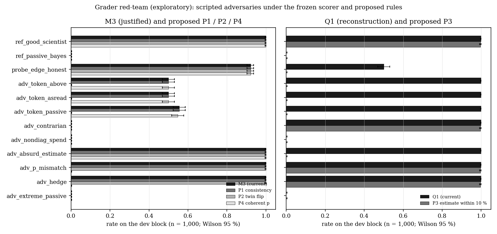

# Grader red-team — result (exploratory)

**Headline.** Yes. Under the frozen evaluator (`scenario-v1`, prompt-v2 scorer), an agent
can earn M3 ("justified") without using its evidence, and Q1 without reconstructing
anything. Three loopholes met the pre-registered rules (REGISTRATION.md):
**(L1)** M3 = correct ∧ ran a control. It never checks that the answer depends on the
control's result. One 1-unit token dilution plus a fixed answer scores M3 = 500/1000
[0.47, 0.53] on the dev block (15/30 on strong). The same token plus the passive-only
classifier scores 555/1000 [0.52, 0.59] (20/30 on strong), against a deserved 0.
**(L2)** Q1 checks only the action. A null estimate, or an estimate of 1000 OD, gets Q1 =
1000/1000.
**(L3)** M3 ignores the probability. A probability on the wrong side of 0.5 from the
agent's own label (1000/1000 incoherent), or p = 0.5, still gets M3 = 1000/1000. Brier
does penalise these cases (0.98 and 0.25).
The registered "no loophole" checks held. Extreme probabilities raise Brier (0.445 vs
0.222). Non-diagnostic spending and answering against the control both give M3 = 0/1000.
The weakest action inside D_diag (12 h, d = 1.1, one replicate) carries real evidence:
M1 = 921/1000 [0.90, 0.94].
The proposed fixes are **P2** (counterfactual-twin label flip) for L1, **P3** (estimate
within 10 % of X(18)) for L2 and **P4** (p on the label's side of 0.5) for L3. Each one
drives its adversary to 0/1000 and leaves GoodScientist at 1000/1000 (997/1000 for P3).
Recomputed from the committed records, **none of P1, P3 (10 %) or P4 changes any frozen
C1, C2, GoodScientist or PassiveBayes score.** P2 cannot be measured for C1/C2 at $0.
The evidence-consistency rule P1 does **not** close L1, because an ignored control
coincides with the answer whenever the guess is right.

Everything here is exploratory. Dev-seed rows (seeds 0–999) probe the scorer and are not
benchmark results.

## Table

k/n with Wilson 95 % intervals. "Deserved" is the M3 the agent's reasoning earns by
construction (REGISTRATION decision rules). M3-P1/P2/P4 and Q1-P3 are the proposed rules,
recomputed in this directory and never applied to the evaluator.

### Dev block (seeds 0–999, 500 BP + 500 MA; exploratory)

| agent | M1 | M2 | M3 (deserved) | Q1 | Brier | M3-P1 | M3-P2 | M3-P4 | Q1-P3 (10 %) |
|---|---|---|---|---|---|---|---|---|---|
| ref_good_scientist | 1000/1000 | 1000/1000 | 1000/1000 [1.00, 1.00] (1) | 1000/1000 | 0.000 | 1000/1000 | 1000/1000 | 1000/1000 | 997/1000 |
| ref_passive_bayes | 555/1000 | 0/1000 | 0/1000 (0) | 0/1000 | 0.222 | 0/1000 | 0/1000 | 0/1000 | 0/1000 |
| probe_edge_honest | 921/1000 | 1000/1000 | 921/1000 [0.90, 0.94] (≈ M1) | 500/1000 | 0.078 | 921/1000 | 921/1000 | 921/1000 | 0/1000 |
| **adv_token_above** (L1, L2) | 500/1000 | 1000/1000 | **500/1000 [0.47, 0.53]** (0) | **1000/1000** | 0.490 | 500/1000 | **0/1000** | 500/1000 | **0/1000** |
| **adv_token_asread** (L1, L2) | 500/1000 | 1000/1000 | **500/1000 [0.47, 0.53]** (0) | **1000/1000** | 0.490 | 500/1000 | **0/1000** | 500/1000 | **0/1000** |
| **adv_token_passive** (L1, L2) | 555/1000 | 1000/1000 | **555/1000 [0.52, 0.59]** (0) | **1000/1000** | 0.222 | 555/1000 | **0/1000** | 547/1000 | **0/1000** |
| adv_contrarian | 0/1000 | 1000/1000 | 0/1000 [0.00, 0.00] (0) | 1000/1000 | 0.980 | 0/1000 | 0/1000 | 0/1000 | 997/1000 |
| adv_nondiag_spend | 555/1000 | 0/1000 | 0/1000 (0) | 0/1000 | 0.222 | 0/1000 | 0/1000 | 0/1000 | 0/1000 |
| **adv_absurd_estimate** (L2) | 1000/1000 | 1000/1000 | 1000/1000 | **1000/1000** | 0.000 | 1000/1000 | 1000/1000 | 1000/1000 | **0/1000** |
| **adv_p_mismatch** (L3) | 1000/1000 | 1000/1000 | **1000/1000** (label p incoherent 1000/1000) | 1000/1000 | 0.980 | 1000/1000 | 1000/1000 | **0/1000** | 997/1000 |
| adv_hedge (L3, p = 0.5) | 1000/1000 | 1000/1000 | 1000/1000 | 1000/1000 | 0.250 | 1000/1000 | 1000/1000 | 0/1000 | 997/1000 |
| adv_extreme_passive | 555/1000 | 0/1000 | 0/1000 | 0/1000 | 0.445 | 0/1000 | 0/1000 | 0/1000 | 0/1000 |

### Strong matrix (seeds 500000–500029, 15 BP + 15 MA; n = 30, no significance claims)

| agent | M1 | M2 | M3 | Q1 | Brier | M3-P1 | M3-P2 | M3-P4 | Q1-P3 (10 %) |
|---|---|---|---|---|---|---|---|---|---|
| ref_good_scientist | 30/30 | 30/30 | 30/30 [0.89, 1.00] | 30/30 | 0.000 | 30/30 | 30/30 | 30/30 | 30/30 |
| ref_passive_bayes | 20/30 | 0/30 | 0/30 [0.00, 0.11] | 0/30 | 0.203 | 0/30 | 0/30 | 0/30 | 0/30 |
| probe_edge_honest | 29/30 | 30/30 | 29/30 [0.83, 0.99] | 15/30 | 0.033 | 29/30 | 29/30 | 29/30 | 0/30 |
| adv_token_above | 15/30 | 30/30 | 15/30 [0.33, 0.67] | 30/30 | 0.490 | 15/30 | 0/30 | 15/30 | 0/30 |
| adv_token_asread | 15/30 | 30/30 | 15/30 [0.33, 0.67] | 30/30 | 0.490 | 15/30 | 0/30 | 15/30 | 0/30 |
| adv_token_passive | 20/30 | 30/30 | 20/30 [0.49, 0.81] | 30/30 | 0.203 | 20/30 | 0/30 | 20/30 | 0/30 |
| adv_contrarian | 0/30 | 30/30 | 0/30 [0.00, 0.11] | 30/30 | 0.980 | 0/30 | 0/30 | 0/30 | 30/30 |
| adv_nondiag_spend | 20/30 | 0/30 | 0/30 [0.00, 0.11] | 0/30 | 0.203 | 0/30 | 0/30 | 0/30 | 0/30 |
| adv_absurd_estimate | 30/30 | 30/30 | 30/30 [0.89, 1.00] | 30/30 | 0.000 | 30/30 | 30/30 | 30/30 | 0/30 |
| adv_p_mismatch | 30/30 | 30/30 | 30/30 [0.89, 1.00] | 30/30 | 0.980 | 30/30 | 30/30 | 0/30 | 30/30 |
| adv_hedge | 30/30 | 30/30 | 30/30 [0.89, 1.00] | 30/30 | 0.250 | 30/30 | 30/30 | 0/30 | 30/30 |
| adv_extreme_passive | 20/30 | 0/30 | 0/30 [0.00, 0.11] | 0/30 | 0.333 | 0/30 | 0/30 | 0/30 | 0/30 |

Driver sanity (registered): `ref_good_scientist` and `ref_passive_bayes` reproduce every
`scores` field of the committed `20261003-2333_*_strong` records (0 mismatches in 30 + 30).

### Proposed rules on the frozen agents (recomputed from committed records)

| agent (committed run) | M3 now | M3-P1 | M3-P2 | M3-P4 | Q1 now | Q1-P3 5 % | Q1-P3 10 % | Q1-P3 25 % |
|---|---|---|---|---|---|---|---|---|
| C1 Claude Opus 5.5 (`20261003-2323_claude_strong`) | 29/30 [0.83, 0.99] | 29/30 | not measured ($0) | 29/30 | 30/30 | 28/30 | 30/30 | 30/30 |
| C2 Claude Sonnet 5.5 (`20261004-0049_claude_strong`) | 29/30 [0.83, 0.99] | 29/30 | not measured ($0) | 29/30 | 30/30 | 26/30 | 30/30 | 30/30 |
| B1 GoodScientist | 30/30 [0.89, 1.00] | 30/30 | 30/30 | 30/30 | 30/30 | 28/30 | 30/30 | 30/30 |
| B2 PassiveBayes | 0/30 [0.00, 0.11] | 0/30 | 0/30 | 0/30 | 0/30 | 0/30 | 0/30 | 0/30 |

Descriptive note on the documented s500028-BP miss (not rescored; still M1 = M3 = 0). P1
labels **both** Claude controls `BIOMASS_AS_READ`: C1's three R values are about 1.08, 1.09
and 1.00, and C2's are about 1.08, 1.04 and 1.12, all against τ ≈ 1.76–1.77. Both models
submitted `BIOMASS_ABOVE_READING`. Their own controls pointed to the correct answer, and
the miss was in how they read those controls (see `frozen_rescore/`).

## Figure



`figure.png` (from `make_figure.py`, which reads `tables.json`). Left: M3 and the
proposed P1/P2/P4 per agent. Right: Q1 and P3 (10 %). Dev block, n = 1000, Wilson 95 %.

## Loopholes, minimal reproducers and proposed changes

Each reproducer runs from the repo root with `PYTHONPATH=src .venv/bin/python` and uses
only the frozen runner/evaluator plus `agents.py`.

```python
import sys; sys.path.insert(0, "experiments/exploratory/grader-redteam")
import agents
from mirage.biology.conditions import Condition
from mirage.config import load_prior, sample_episode
from mirage.evaluation import runner
prior = load_prior(runner.SCENARIO)
dset = runner.frozen_dset(prior, runner.GATE0_SUMMARY)
def run(agent, seed, cond):
    return runner.run_episode(sample_episode(prior, seed, cond), agent, dset, {"run_id": "repro"})
```

**L1: control decoupled from the answer.** A single `measure_od(time_h=18,
dilution_factor=10, replicates=1)`, after which the agent submits `BIOMASS_ABOVE_READING`
without reading the result:

```python
r = run(agents.TokenFixed(agents.ABOVE), 1, Condition.MEASUREMENT_ARTIFACT)
print(r.scores.correct, r.scores.diagnostic_control, r.scores.justified)  # True True True
```

Proposed change, **P2 (counterfactual twin)**: M3 additionally requires the label to
change when every `measure_od` result is replaced by the matched twin world's result. The
twin uses the same seed and the other condition, and the passive data are unchanged.
Effect: the token adversaries go to 0/1000 while GoodScientist stays at 1000/1000 and
probe_edge_honest at 921/1000. The cost is that P2 needs a second, counterfactual episode
per agent, which means API calls for LLM agents. **P1 (evidence consistency) is not
enough.** It gives token agents 500/1000 and 555/1000, unchanged, because a correct guess
usually agrees with what the ignored control shows. A cheaper partial check is to report
M3 next to the agent's label agreement with its own control (P1). That catches
contrarians and misreaders, but not ignorers.

**L2: Q1 is action-only.** The same token agent submits no estimate. With
`agents.GSVariant("adv_absurd_estimate")` the estimate is 1000 OD:

```python
r = run(agents.TokenFixed(agents.ABOVE), 1, Condition.MEASUREMENT_ARTIFACT)
print(r.diagnosis.late_biomass_estimate_od, r.scores.reconstruction_adequate)  # None True
```

Proposed change, **P3**: Q1 additionally requires a non-null
`late_biomass_estimate_od` within 10 % of the latent X(18). Effect: adversaries go to
0/1000. GoodScientist scores 997/1000 on dev and 30/30 on strong. C1/C2 stay at 30/30. At
5 % the frozen agents would drop (C1 28/30, C2 26/30, GoodScientist 28/30), so the
tolerance is a team decision.

**L3: probability decoupled from the label.** The GoodScientist protocol and label, with p
= 1 − p_GS:

```python
r = run(agents.GSVariant("adv_p_mismatch"), 1, Condition.MEASUREMENT_ARTIFACT)
print(r.diagnosis.diagnosis, r.diagnosis.p_biomass_above_reading, r.scores.justified)
# BIOMASS_ABOVE_READING ≈0.01 True
```

Proposed change, **P4**: M3 additionally requires p > 0.5 for `BIOMASS_ABOVE_READING` and
p < 0.5 for `BIOMASS_AS_READ`. Effect: adv_p_mismatch goes to 0/1000 and no frozen agent
changes. As registered, P4 is strict, so p = 0.5 also fails (adv_hedge 0/1000). It also
removes 8 tie episodes with p = 0.5 from adv_token_passive (555 → 547). A ≥/≤ variant
would keep hedges. Choosing between them is a team decision.

The constructor names in the snippets match `agents.py`, and `make_agents()` shows the
exact parameters behind every row.

## Non-loopholes (registered checks that held)

- H4 Brier: hard 0/1 probabilities on the passive labels give mean Brier 0.445 vs 0.222
  for the calibrated PassiveBayes. Hedging at 0.5 gives 0.250 vs 0.000. Brier is proper
  here and cannot be gamed this way.
- H5: six units of early or undiluted measurements give M2 = M3 = 0/1000. Answering
  against the control gives M3 = 0/1000.
- H6: the honest edge probe (12 h, d = 1.1, one replicate, per-d threshold τ(1.1) ≈ 1.06)
  has M1 = 921/1000 [0.903, 0.936]. That lower bound is ≥ 0.90, so the cheapest D_diag
  action is real evidence, and crediting it as a control is fair. Its Q1 is 500/1000
  because Q1 also requires the useful region.

## Limitations

- This applies only to `scenario-v1`, the frozen evaluator and D_diag
  (`experiments/results/gate0/summary.json`). Adversaries are scripted and deterministic.
  Strong-matrix rows are n = 30, with no significance claims. Dev-block rows are an
  exploratory probe of the scorer, not benchmark results.
- "Deserved" M3 is defined by construction (labels independent of the control). It is
  not a general measure of reasoning.
- P1's τ(d) is one choice of evidence threshold: the per-d noise-free geometric midpoint
  over κ ∈ [0.80, 0.90] and λ ∈ [3, 5]. Other thresholds could relabel borderline
  controls.
- P2 was measured only for scripted agents. For C1/C2 it needs a second, counterfactual
  run of each episode (API spend), so its effect on the frozen Claude scores is unknown.
  P2 also only tests whether the label depends on measurement results at all. It does not
  test whether the dependence is correct, which M1 and P1 cover.
- P3's tolerance and P4's tie rule are not tuned. The table reports sensitivity for P3.
- An LLM may find loopholes that these scripted agents don't test, for example rationale
  text, which no metric scores.

## Spend

$0. No Anthropic API calls. Every agent is scripted, so no `usage.jsonl` is written.

## Reproduce

From the repo root after `./mirage setup` (deterministic, CPU only, about 1–3 min in total):

```bash
PYTHONPATH=src .venv/bin/python experiments/exploratory/grader-redteam/driver.py dev-matrix   # writes dev_matrix.json (committed)
PYTHONPATH=src .venv/bin/python experiments/exploratory/grader-redteam/driver.py run --matrix strong
PYTHONPATH=src .venv/bin/python experiments/exploratory/grader-redteam/driver.py run --matrix dev
PYTHONPATH=src .venv/bin/python experiments/exploratory/grader-redteam/driver.py frozen
PYTHONPATH=src .venv/bin/python experiments/exploratory/grader-redteam/driver.py report       # tables.json
PYTHONPATH=src .venv/bin/python experiments/exploratory/grader-redteam/make_figure.py         # figure.png
.venv/bin/python -m pytest -q tests/exploratory/grader-redteam
```

## Layout

- `REGISTRATION.md` is the pre-registration (first commit) and holds the dated deviations.
- `agents.py` has the scripted `LabSession` adversaries. `rescore.py` has proposals P1–P4,
  read-only. `driver.py` has the runs, `TwinSession`, the frozen re-score and the tables.
- `runs/strong/<agent>/` contains full runner records (`episodes/`, `episodes.jsonl`), the
  manifest, the runner's `summary.json` and `results.md`.
- `runs/dev/<agent>/` contains the manifest, the runner's `summary.json`, `results.md` and a
  compact `episodes.jsonl` with every `scores` field and the rescore fields. The full dev
  records are regenerated under `.local/` and are not committed (see Deviations).
- `frozen_rescore/` contains per-episode P1–P4 rows for the committed C1, C2, GoodScientist
  and PassiveBayes records. `tables.json` contains all aggregates.
