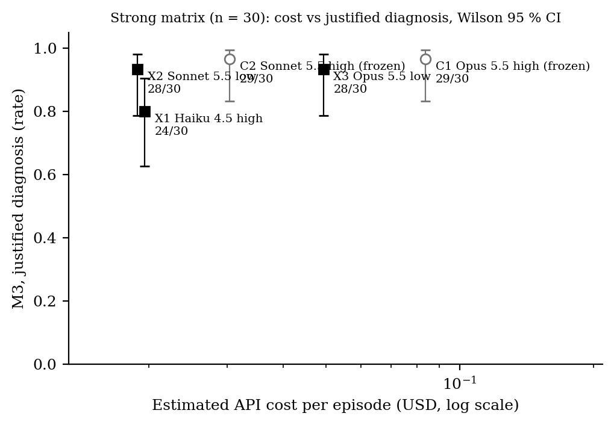

# Result: is justified diagnosis (M3) robust to a smaller model and to lower effort?

**Exploratory, not confirmatory.** These results do not change, re-score or extend the frozen
results in `experiments/results/`. Registration: [`REGISTRATION.md`](REGISTRATION.md) (commit
0437e0f, pushed before any paid call; deviations are dated at the end of that file).

**Headline.** On the 30-episode strong matrix (seeds 500000–500029), lowering effort from `high`
to `low` left justified diagnosis close to the frozen high-effort runs. Sonnet 5.5 low reached
M3 = 28/30 [0.79, 0.98] against C2's 29/30 [0.83, 0.99]. Opus 5.5 low reached 28/30 [0.79, 0.98]
against C1's 29/30. Under the registered rule (§5), both count as "no detectable difference at
n = 30", which is not a claim of equality. Low effort cut output tokens per episode by 41 %
(Sonnet) and 51 % (Opus). Cost per episode fell from $0.030 to $0.019 for Sonnet and from $0.084
to $0.049 for Opus. The smallest available current model, Claude Haiku 4.5
(`claude-haiku-4-5-20251001`, run without an effort parameter because it does not accept one),
reached M3 = 24/30 [0.63, 0.90], against C2's 29/30. That is "lower, worth following up" under
the registered rule, not a detectable drop: the intervals overlap. Every configuration ran the
diagnostic control in 30/30 episodes. No configuration skipped the control or guessed without
evidence. The one new weakness in evidence was X1's: in two MA episodes it diluted too little,
so the biomass reconstruction failed (Q1 28/30), although the diagnosis was correct and
justified. Every miss in every configuration has the same form: a BIOLOGICAL_PLATEAU culture
whose reading is about 2–4 % below true biomass, answered `BIOMASS_ABOVE_READING` after an
adequate dilution. This is the s500028-BP mechanism already documented in OPEN_RULINGS §H.
**s500028-BP was missed again by all three new configurations.** The smaller model and lower
effort did not stop the agent from running a valid diagnostic control. They made it more likely to
read a few-percent dilution excess as a measurement artifact.

## Table

Primary analysis (DIAGNOSED + NO_DIAGNOSIS), strong matrix, n = 30 per row. k/n with the
evaluator's Wilson 95 % intervals. C1 and C2 are the frozen references and were not re-run.
Brier is O1, the evaluator's mean Brier. Tokens and USD come from each run's `usage.jsonl` at
the registered public prices (§6).

| Config | Model | Effort | M1 correct | M2 control | M3 justified | M4 units mean (median, max) | Q1 | Brier | in tok/ep | out tok/ep | calls/ep | USD/ep | USD run |
|---|---|---|---|---|---|---|---|---|---|---|---|---|---|
| C1 (frozen) | claude-opus-5-5 | high | 29/30 [0.83, 0.99] | 30/30 [0.89, 1.00] | 29/30 [0.83, 0.99] | 5.80 (6, 6) | 30/30 | 0.028 | 13,846 | 1,420 | 4.53 | 0.0838 | 2.513 |
| C2 (frozen) | claude-sonnet-5-5 | high | 29/30 [0.83, 0.99] | 30/30 [0.89, 1.00] | 29/30 [0.83, 0.99] | 3.97 (4, 6) | 30/30 | 0.030 | 10,100 | 1,013 | 3.50 | 0.0303 | 0.910 |
| **X1** | claude-haiku-4-5-20251001 | none (not supported) | 24/30 [0.63, 0.90] | 30/30 [0.89, 1.00] | 24/30 [0.63, 0.90] | 5.20 (5, 6) | 28/30 | 0.142 | 12,226 | 1,468 | 4.63 | 0.0196 | 0.587 |
| **X2** | claude-sonnet-5-5 | low | 28/30 [0.79, 0.98] | 30/30 [0.89, 1.00] | 28/30 [0.79, 0.98] | 2.67 (2, 5) | 30/30 | 0.046 | 6,414 | 600 | 2.40 | 0.0188 | 0.565 |
| **X3** | claude-opus-5-5 | low | 28/30 [0.79, 0.98] | 30/30 [0.89, 1.00] | 28/30 [0.79, 0.98] | 4.47 (4, 6) | 30/30 | 0.050 | 8,839 | 698 | 3.23 | 0.0493 | 1.479 |

By condition, M3 for MEASUREMENT_ARTIFACT is 15/15 [0.80, 1.00] in every row. For
BIOLOGICAL_PLATEAU it is: C1 14/15, C2 14/15, X1 9/15 [0.36, 0.80], X2 13/15 [0.62, 0.96],
X3 13/15 [0.62, 0.96].

**Decision rule (REGISTRATION §5), applied mechanically by `analyze.py`:**

- X1 vs C2: lower, worth following up (24 vs 29: intervals overlap, at least 3 lower).
- X2 vs C2: no detectable difference at n = 30.
- X3 vs C1: no detectable difference at n = 30.

Status: 30/30 DIAGNOSED in every new run. There were no API_FAILURE, REFUSED or NO_DIAGNOSIS
episodes and so no re-runs (`reruns/` is empty). Intention-to-treat therefore equals primary.

## Failure analysis (audit breakdown)

Episode classes: justified / correct without control / wrong after control / wrong without
control / NO_DIAGNOSIS / API_FAILURE / REFUSED.

| Config | justified | correct w/o control | wrong after control | wrong w/o control | NO_DIAG | API_FAIL | REFUSED |
|---|---|---|---|---|---|---|---|
| C1 | 29 | 0 | 1 | 0 | 0 | 0 | 0 |
| C2 | 29 | 0 | 1 | 0 | 0 | 0 | 0 |
| X1 | 24 | 0 | 6 | 0 | 0 | 0 | 0 |
| X2 | 28 | 0 | 2 | 0 | 0 | 0 | 0 |
| X3 | 28 | 0 | 2 | 0 | 0 | 0 | 0 |

The BP misses, sorted by the plateau gap. The gap is true plateau biomass over the noise-free
undiluted reading, minus 1, computed from each episode's `k_odeq`, `s_odeq` and `n`. All 15
BP gaps lie between 2.3 % and 4.0 %, as in OPEN_RULINGS §H. Episodes not listed were correct
in every configuration.

| Episode | gap | C1 | C2 | X1 | X2 | X3 |
|---|---|---|---|---|---|---|
| s500028-BP | 4.0 % | miss | miss | miss | miss | miss |
| s500000-BP | 4.0 % | ok | ok | miss | ok | ok |
| s500006-BP | 3.5 % | ok | ok | miss | ok | ok |
| s500008-BP | 3.3 % | ok | ok | miss | miss | miss |
| s500026-BP | 2.9 % | ok | ok | miss | ok | ok |
| s500010-BP | 2.4 % | ok | ok | miss | ok | ok |

- **s500028-BP is missed again** by X1 (p_above 0.85, estimate 1.44 OD), X2 (0.80, 1.50) and
  X3 (0.85, 1.47), as by C1 (0.80, 1.47) and C2 (0.90, 1.53). It is not re-scored.
- **s500008-BP** (gap 3.3 %) is a new miss shared by all three new configurations. Example, X2:
  "10x dilution gave 0.135 … scales to about 1.35 … above 1.22 … the effect is modest and the
  evidence is not overwhelming", answered `BIOMASS_ABOVE_READING` with p 0.8.
- **X1's misses follow the same pattern with smaller excesses.** In s500010-BP (gap 2.4 %),
  10x at 18 h read 0.0766 against 0.0728 expected, and X1 called this "suppressed OD in
  undiluted high-density cultures". In s500000-BP, the 10x reading extrapolated to 1.064
  against 0.972 undiluted. X1's misses are also more confident in some cases (p_above up to
  0.92), which drives its BP Brier (0.279, against 0.060 for C2).
- **New failure types.** No new episode class appeared. All misses are "wrong after control",
  as in C1 and C2. By the registered mechanical definition (a failed clause not seen in C1 or
  C2), X1 has four new clause labels, all in one episode, s500006-BP: an undiluted re-read at
  18 h (`M2: not_diluted, outside_diagnostic_set`; `Q1: not_diluted`) and a 20x dilution that
  fell below the useful reading range (`Q1: below_lower_useful_bound`). That episode also had an
  adequate 10x control (event 1), so M2 holds. These labels are on extra measurements, not on a
  missing control. X2 and X3 show no new clause labels.
- **A new pattern outside the registered breakdown (post hoc, descriptive): under-dilution in
  justified MA episodes.** X1's Q1 is 28/30. C1, C2, X2 and X3 are all 30/30. Both X1 Q1
  failures are *justified* MA episodes, so the registered list, which covers only non-justified
  episodes, does not show them. In s500011-MA X1 diluted only 2x (true late biomass 1.86 OD-eq,
  estimate 1.02). In s500023-MA it diluted 2x and 5x (true 4.50, estimate 1.60). In both, the
  diluted reading stayed in the compressed range (`Q1: outside_useful_region`). The 2x
  dilution still counts as the frozen diagnostic control, and the direction was right, so M3
  passes. The biomass reconstruction was off by about 2–3x. This is the one place where the
  smaller model's *evidence* was worse, not only its interpretation. `analysis.md` lists these
  episodes in a section marked post hoc.

## Figure



`cost_vs_m3.png`: estimated API cost per episode (log scale) against M3, with Wilson 95 %
intervals. Open circles are the frozen C1/C2; filled squares are X1–X3.

## Limitations

- n = 30 per configuration, each (seed, configuration) run once. Intervals overlap for every
  comparison, so no significance is claimed. "No detectable difference" is not equivalence.
  LLM runs are not seed-reproducible; only the transcripts are kept.
- X1 changes more than size. Haiku 4.5 is an older generation, with a different tokenizer and
  thinking mode, and it rejects the effort parameter (HTTP 400). X1 therefore ran with
  `output_config` omitted (manifest `effort: null`), as the registered contingency requires.
  It is not "the same adapter at effort high". A difference is a difference of that model and
  setting, not of size alone. No Haiku 5.x model was available (`models_list.json`).
- The comparison with C1/C2 is across sessions: the frozen runs were made on 3–4 October 2026
  and the new runs on 4 October 2026, with the same SDK version, prompt hash, matrix hash and
  scenario hash. Server-side model updates in between cannot be ruled out.
- All differences are concentrated in one known ambiguity of `scenario-v1` (OPEN_RULINGS §H):
  in BP the reader also under-reads by 2–4 %, so "biomass above the reading" is literally true
  in BP by a small margin. The result says little about robustness on a scenario without that
  ambiguity. Nothing here generalises beyond this scenario, prompt-v2 and these models.
- Cost is an estimate from `usage` token counts at public list prices (§6), not an invoice.
- Session history: the registration and code were written by an earlier session without an API
  key. The paid runs were made on the lead machine (see the 11:10 UTC Deviations entry).

## Spend

From [`spend_ledger.jsonl`](spend_ledger.jsonl) (328 priced API responses), against a cap of $5.00:

| Item | USD |
|---|---|
| X1 dev dry run (seeds 0, 1; no-effort; the effort-high attempt was rejected and not billed) | 0.0381 |
| X2 dev dry run | 0.0385 |
| X3 dev dry run | 0.0884 |
| X1 strong (30 episodes) | 0.5870 |
| X2 strong (30 episodes) | 0.5649 |
| X3 strong (30 episodes) | 1.4794 |
| **Total** | **2.7964** |

The X3 gate (at least $2.90 left after X1 and X2) was met: $3.77 remained when X3 started.
Dev-seed episodes are pipeline checks only and are not reported as results. They are kept
uncommitted under `.local/runs/model-effort/`.

## Files

- `runs/20261004-1105_claude_strong_X1-noeffort/`, `runs/20261004-1106_claude_strong_X2/`,
  `runs/20261004-1114_claude_strong_X3/`: manifest, episodes (with full transcripts),
  usage.jsonl, summary.json (from the existing runner `summarize`; re-running it reproduces
  the file byte for byte), results.md and results.png (existing `report.build_report`).
- `analysis.json`, `analysis.md`, `cost_vs_m3.png`: from `analyze.py`. It re-checks every
  summary.json against `metrics.aggregate` and reads the frozen C1/C2 records read-only.
- `driver.py`: an `EffortClaudeAgent` subclass that sets effort or omits it, plus a
  `MeteredClient` that writes usage.jsonl and the spend ledger and refuses a call whose
  worst-case cost would pass the cap. No frozen source was edited.
- Tests: `tests/exploratory/model-effort/` (fake clients only; the network is blocked).

## Reproduce

```bash
cd <worktree> && ./mirage setup
export PYTHONPATH=src
# list models (free)
.venv/bin/python -c "import anthropic; print([m.id for m in anthropic.Anthropic().models.list(limit=100)])"
# dry runs (dev seeds 0, 1; not results)
.venv/bin/python experiments/exploratory/model-effort/driver.py run --config X1 --matrix dev --no-effort
.venv/bin/python experiments/exploratory/model-effort/driver.py run --config X2 --matrix dev
.venv/bin/python experiments/exploratory/model-effort/driver.py run --config X3 --matrix dev
# scored runs (strong matrix, seeds 500000-500029)
.venv/bin/python experiments/exploratory/model-effort/driver.py run --config X1 --matrix strong --no-effort
.venv/bin/python experiments/exploratory/model-effort/driver.py run --config X2 --matrix strong
.venv/bin/python experiments/exploratory/model-effort/driver.py run --config X3 --matrix strong
.venv/bin/python experiments/exploratory/model-effort/driver.py spend
# re-summarize a run with the existing evaluator
.venv/bin/python -m mirage.evaluation.runner summarize experiments/exploratory/model-effort/runs/<RUN_ID>
# analysis, table and figure (no API calls)
.venv/bin/python experiments/exploratory/model-effort/analyze.py \
  --run X1=experiments/exploratory/model-effort/runs/20261004-1105_claude_strong_X1-noeffort \
  --run X2=experiments/exploratory/model-effort/runs/20261004-1106_claude_strong_X2 \
  --run X3=experiments/exploratory/model-effort/runs/20261004-1114_claude_strong_X3
# tests
.venv/bin/python -m pytest -q tests/exploratory/model-effort
./mirage test --quick
```

A paid re-run creates new run ids and new transcripts. LLM outputs are not seed-reproducible;
the analysis is reproducible from the committed records.
