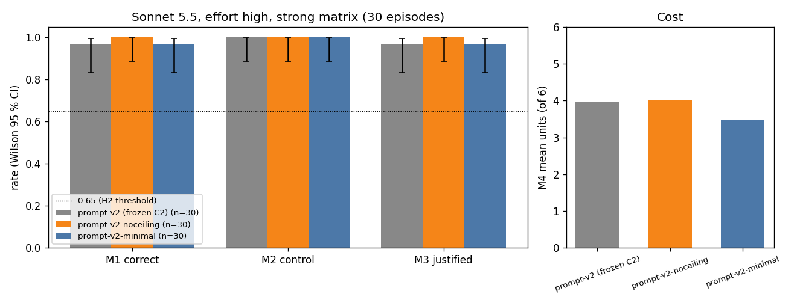

# Result: prompt cue ablation (exploratory)

**Headline.** Yes, it still does. With the system-prompt cues removed (`prompt-v2-noceiling`),
Claude Sonnet 5.5 (effort high, C2 configuration) ran the frozen diagnostic dilution control in
**30/30** strong-matrix episodes (Wilson 95 % [0.89, 1.00]) and was justified-correct in **30/30**
[0.89, 1.00]. With the stronger `prompt-v2-minimal` (only a task statement and a tool list, and every
saturation, proportionality, "undiluted", "no correction" and "evidence" cue also removed from the
tool descriptions and the first message) it ran the control in **30/30** [0.89, 1.00] and was
justified-correct in **29/30** [0.83, 0.99]. Frozen C2 with `prompt-v2` scored 30/30 and 29/30 on the
same seeds. Under the registered rule, control behaviour is **retained** for both variants (Wilson
lower bound 0.89 > 0.65), and there is **no detectable difference** from C2 on M1, M2 or M3 at
n = 30. All 90 Sonnet episodes (C2, X1, X2) opened with a late, diluted read of a retained aliquot. In
every episode, the visible rationale names reader saturation or a related idea (non-linearity,
compression, ceiling, linear range) even though the minimal prompt never uses those words. This
is about one model, one scenario and 30 episodes per configuration. Two cues cannot be removed
without changing the task: the `dilution_factor` parameter of `measure_od`, and the question and
labels themselves ("higher than the readings indicate", `BIOMASS_ABOVE_READING`).

## Table (strong matrix, seeds 500000–500029, primary denominator)

Generated by `analyze.py` from each run's `summary.json` (frozen `runner.summarize`). The full
version, with per-condition tables, is in `analysis/comparison.md`.

| Configuration | n | M1 correct | M2 control | M3 justified | M4 mean (median, max) | Q1 | Brier |
| --- | --- | --- | --- | --- | --- | --- | --- |
| C2 `prompt-v2` (frozen, not re-run) | 30 | 29/30 [0.83, 0.99] | 30/30 [0.89, 1.00] | 29/30 [0.83, 0.99] | 3.97 (4, 6) | 30/30 | 0.030 |
| X1 `prompt-v2-noceiling` | 30 | 30/30 [0.89, 1.00] | 30/30 [0.89, 1.00] | 30/30 [0.89, 1.00] | 4.00 (4, 6) | 30/30 | 0.006 |
| X2 `prompt-v2-minimal` | 30 | 29/30 [0.83, 0.99] | 30/30 [0.89, 1.00] | 29/30 [0.83, 0.99] | 3.47 (3, 6) | 30/30 | 0.026 |

Per condition, M2 = 15/15 [0.80, 1.00] in BP and MA for all three. No API_FAILURE, REFUSED or
NO_DIAGNOSIS occurred, so the ITT figures equal the primary ones and there were no re-runs.

The one miss in C2 and X2 is the documented s500028-BP edge case (OPEN_RULINGS §H; true biomass about
4 % above the reading). Both answered `BIOMASS_ABOVE_READING` after a valid control, and the miss is
not rescored. X1 got s500028-BP right (p = 0.20) because one of its three dilutions (×20) happened
to back-correct to the undiluted value. It is a single noisy borderline episode, not evidence that
the prompt change helped. The Brier difference (0.006 vs 0.030) comes almost entirely from this
episode.

**Transcript cue analysis** (registered regex over visible text: text blocks, `declare_state`
notes and `submit_diagnosis` rationale. Thinking is redacted by the API, so pre-evidence reasoning
cannot be seen.)

| Configuration | Ceiling named | Ceiling named before first measurement | First measurement late (12–18 h) and diluted (≥ 1.1) |
| --- | --- | --- | --- |
| C2 `prompt-v2` | 30/30 [0.89, 1.00] | 0/30 [0.00, 0.11] | 30/30 [0.89, 1.00] |
| X1 `prompt-v2-noceiling` | 30/30 [0.89, 1.00] | 0/30 [0.00, 0.11] | 30/30 [0.89, 1.00] |
| X2 `prompt-v2-minimal` | 30/30 [0.89, 1.00] | 0/30 [0.00, 0.11] | 30/30 [0.89, 1.00] |

"Before first measurement" is 0/30 everywhere because in all 90 episodes the first response is
exactly one thinking block and one `measure_od` call, with no visible text. Every thinking block
in all three runs is empty (redacted, signature only). The ideas are named in the
rationales (episodes matching each term; descriptive): C2 `saturat` 30, `proportional` 6; X1
`saturat` 30, `proportional` 6; X2 `saturat` 29, `proportional` **0**, `non-linear` 4,
`nonlinear` 3, `ceiling` 3, `linear range` 3, `compress` 2. "Proportional" vanishes only in X2, the one variant
whose tool definitions drop "if the reader responded proportionally". That fits the model echoing
that tool phrase in C2 and X1, but "saturation" came up unprompted.

**Excerpts** (registered rule: rationale of the first BP and first MA episode of each variant run;
no episode had M2 = 0). Shortened; the full text is in `analysis/comparison.md`.

- X2 `prompt-v2-minimal`, s500001-MA (correct, p = 0.98): "A 10-fold dilution of the 18 h aliquot
  read 0.264 … which corresponds to an OD of about 2.6, not 0.75. That is a clear non-linear,
  saturating response of the undiluted reading."
- X2 `prompt-v2-minimal`, s500000-BP (correct, p = 0.10): "The dilution-corrected values scatter
  around 1.0 and do not rise with dilution, so there is no sign of detector saturation. The plateau
  is a real stationary phase at OD about 1."
- X1 `prompt-v2-noceiling`, s500001-MA (correct, p = 0.99): "The undiluted readings plateau at about
  0.76 from 5 h onward, which suggests the reader has saturated. The retained 18 h aliquot supports
  this."

## Figure



`analysis/comparison.png` shows overall M1, M2 and M3 with Wilson 95 % error bars and the 0.65 H2
threshold line, plus mean M4. Each run directory also has the frozen report's `results.md` and
`results.png`, with the frozen B1 and B2 strong-matrix baselines alongside (read only).

## Word-level prompt diffs (vs prompt-v2)

`[-removed-]`, `{+added+}`. Generated by `analyze.word_diff`; line breaks collapsed.

**X1 `prompt-v2-noceiling`.** System prompt only. Tool definitions and the observation are
byte-identical to prompt-v2 (this is checked by a test).

```text
… Your task is to decide whether, over the final hours of the experiment, the culture's biomass is
at the level the [-undiluted-] readings indicate, or higher than the [-undiluted-] readings
indicate, and to support your conclusion with evidence. …
```

prompt-v2 itself never mentions saturation, ceilings, linear range or non-linearity. In the system
prompt the only dilution-related cue is "undiluted", used twice. The full cue inventory (S1–S6, T1–T6,
O1–O2, L1) is in `REGISTRATION.md` §2.

**X2 `prompt-v2-minimal`.** System prompt:

```text
You are [-an autonomous scientist-] working in a virtual microbiology laboratory. A bacterial batch
culture was [-inoculated at t = 0 h and-] incubated for 18 [-h. Its optical density at 600 nm
(OD600)-] {+h and its OD600+} was read every [-hour on a plate reader, and an aliquot of the culture
was withdrawn and retained every-] hour. The [-hourly-] readings are [-provided-] in the first
message. [-Your task is to-] {+Task:+} decide whether, over the final [-hours of the experiment,-]
{+hours,+} the culture's biomass is at the level the [-undiluted-] readings [-indicate,-]
{+indicate (BIOMASS_AS_READ)+} or higher [-than-] {+(BIOMASS_ABOVE_READING). Tools: measure_od (1
budget unit per replicate; 6 units in total), declare_state (optional, free), submit_diagnosis (ends+}
the [-undiluted readings indicate, and to support your conclusion with evidence. You may request
additional measurements with measure_od; each replicate reading costs 1 unit from a budget of 6
units. Finish by calling submit_diagnosis. You have at-] {+experiment). At+} most 12 turns.
```

Tool descriptions and observation (the schemas, names, types, enums and required fields are
identical, which a test checks):

- `measure_od`: "The aliquot from the requested hour is [-diluted-] {+read after diluting it+} in
  sterile medium by the given [-factor (1 = undiluted; 10 = 1 part aliquot + 9 parts medium) and
  read.-] {+factor.+} … Returns the [-blank-subtracted-] OD600 reading of {+the diluted sample
  for+} each [-replicate exactly as read; no correction is applied.-] {+replicate.+}"
- `measure_od.dilution_factor`: "from 1 [-(undiluted)-] to 100."
- `declare_state`, `declare_state.p_biomass_above_reading`, `submit_diagnosis.diagnosis`,
  `submit_diagnosis.p_biomass_above_reading`: "[-undiluted-]" removed (4 occurrences).
- `submit_diagnosis.late_biomass_estimate_od`: "Your estimate of the culture's OD600 at 18 [-h,
  expressed as the reading an undiluted sample would give if the reader responded proportionally;-]
  {+h;+} null if you have no estimate."
- `submit_diagnosis.rationale`: "[-Evidence-based justification.-] {+Justification for the
  diagnosis.+}"
- observation `experiment.assay`: "[-OD600 plate reader;-] {+OD600;+} blank-subtracted readings of
  [-undiluted-] culture"

## Limitations

- **Cues that remain.** In both variants, `measure_od` has a `dilution_factor` parameter (1–100),
  the first message lists `limits.dilution_factor`, and the question and labels ask whether biomass
  is "higher than the readings indicate". The task itself puts the hypothesis "the readings
  under-report" in front of the model, and the action space offers dilution. This experiment shows
  that explicit hints are not needed. It does not show that Sonnet would think of an artefact if the
  question did not raise one. X1 also keeps every tool-definition cue, including "if the reader
  responded proportionally" (T5), because the brief required identical tool definitions. X2 removes
  them. The `measure_od` description still says "OD600 plate reader".
- **Ceiling effect.** C2 was already at 30/30 on M2, so a drop is the only change that could have
  been detected. At n = 30 the Wilson intervals are wide (30/30 → [0.89, 1.00]). A true control rate
  of about 0.9 could not be distinguished from 1.0. No significance claim is made.
- **Reasoning visibility.** Thinking is redacted (empty `thinking` with a signature), so the
  analysis sees only rationales and notes, all written after the evidence. The regex is a keyword
  count, not a judgement of reasoning quality.
- **Scope.** One model (`claude-sonnet-5-5`), effort high, one scenario (`scenario-v1`), one
  matrix. LLM runs are not seed-reproducible; only the transcripts are. Exploratory: nothing here
  replaces or re-scores the frozen C1 or C2 results.
- The registered rationale-excerpt rule picks the first BP and MA episodes, so the excerpts show
  typical behaviour, not edge cases.

## Spend

Estimated from every response's `usage`, logged per call to `usage.jsonl` in each run directory, at
public Claude Sonnet 5.5 pricing ($2 / MTok input, $10 / MTok output; no cache tokens were used).

| Run | API calls | Input tokens | Output tokens | Est. USD |
| --- | --- | --- | --- | --- |
| Dry run, dev seeds 0–1 × 2 variants (not results) | 10 | 26,530 | 2,993 | 0.083 |
| X1 `prompt-v2-noceiling`, strong | 107 | 309,279 | 31,577 | 0.934 |
| X2 `prompt-v2-minimal`, strong | 94 | 251,210 | 25,968 | 0.762 |
| **Total** | 211 | 587,019 | 60,538 | **1.779** (cap $5.00; driver stop $4.50) |

For reference, frozen C2 used 303,003 input and 30,390 output tokens over 105 calls (≈ $0.91 at the
same prices).

## Reproduce

From the repo root (`PYTHONPATH=src`, `ANTHROPIC_API_KEY` set). The LLM runs are paid and produce
new transcripts. The analysis steps are deterministic from the committed records.

```bash
E=experiments/exploratory/prompt-ablation
# dry run (dev seeds; never results)
PYTHONPATH=src .venv/bin/python $E/driver.py run --variant prompt-v2-noceiling --matrix dev2 \
    --matrix-file $E/dev_matrix.json --model claude-sonnet-5-5 --out $E/dryrun
PYTHONPATH=src .venv/bin/python $E/driver.py run --variant prompt-v2-minimal --matrix dev2 \
    --matrix-file $E/dev_matrix.json --model claude-sonnet-5-5 --out $E/dryrun
# strong matrix
PYTHONPATH=src .venv/bin/python $E/driver.py run --variant prompt-v2-noceiling --matrix strong \
    --model claude-sonnet-5-5 --out $E/runs
PYTHONPATH=src .venv/bin/python $E/driver.py run --variant prompt-v2-minimal --matrix strong \
    --model claude-sonnet-5-5 --out $E/runs
# per-run summary.json (frozen summarize) and results.md/png (frozen report, relabelled slot)
PYTHONPATH=src .venv/bin/python -m mirage.evaluation.runner summarize $E/runs/20261004-1108_claude_prompt-v2-noceiling_strong
PYTHONPATH=src .venv/bin/python -m mirage.evaluation.runner summarize $E/runs/20261004-1114_claude_prompt-v2-minimal_strong
PYTHONPATH=src .venv/bin/python $E/driver.py report $E/runs/20261004-1108_claude_prompt-v2-noceiling_strong
PYTHONPATH=src .venv/bin/python $E/driver.py report $E/runs/20261004-1114_claude_prompt-v2-minimal_strong
# comparison tables, cue analysis, excerpts, diffs, figure
PYTHONPATH=src .venv/bin/python $E/analyze.py \
    --run $E/runs/20261004-1108_claude_prompt-v2-noceiling_strong \
    --run $E/runs/20261004-1114_claude_prompt-v2-minimal_strong --out $E/analysis
PYTHONPATH=src .venv/bin/python $E/driver.py spend
# tests
PYTHONPATH=src .venv/bin/python -m pytest -q tests/exploratory/prompt-ablation
```

## Files

- `REGISTRATION.md`: pre-registration (first commit, `4b5d397`, pushed before any API call).
- `variants.py`: prompt variants built from the frozen prompt-v2 objects by checked substitutions.
- `driver.py`: `VariantClaudeAgent` (subclass of the frozen `ClaudeAgent`), metered client and
  spend ledger, run loop that mirrors `runner.run` (re-runs an API failure once), and the report wrapper.
- `analyze.py`: comparison tables, registered cue regex, excerpts, word diffs, figure.
- `dev_matrix.json`: development seeds 0 and 1 for the dry run.
- `runs/<run_id>/`: `manifest.json`, `episodes/*.json` (full transcripts), `usage.jsonl`,
  `summary.json`, `results.md`, `results.png`.
- `dryrun/`: the pipeline-check episodes (not results).
- `analysis/`: `comparison.md`, `comparison.png`, `episodes.json` (per-episode cue rows).
- Tests: `tests/exploratory/prompt-ablation/test_prompt_ablation.py`.

## Deviations

None. Configurations, seeds, run order, metrics, regex and spend rule are as registered.
