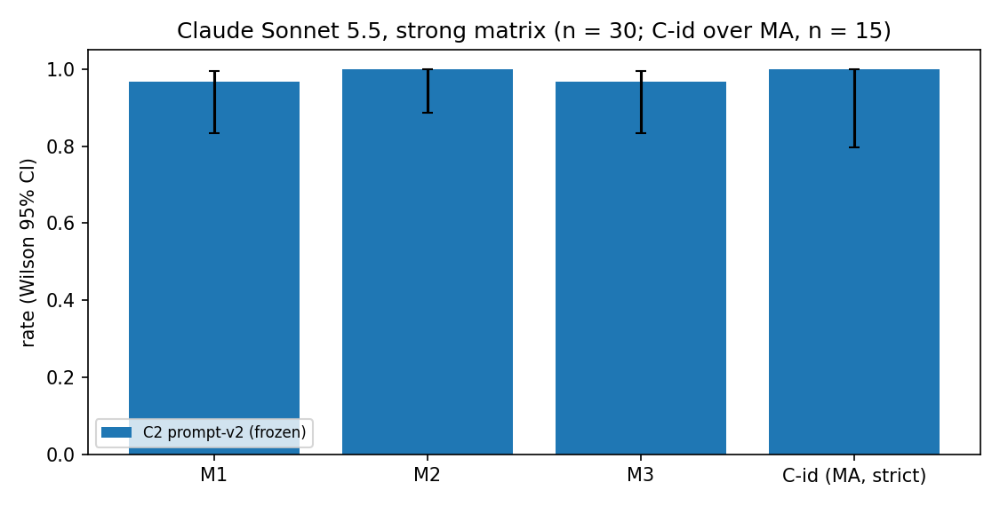

# Result: prompt-ablation (exploratory). BLOCKED, no arm was run

**Headline.** This session cannot answer the question yet. `ANTHROPIC_API_KEY` was not set and
no secret was available, so no Claude episode with `prompt-v2-noceiling` or `prompt-v2-minimal`
was run, not even the dev-seed dry run. Spend is $0.00. Everything else is in place and was
tested with fake clients: the pre-registration, the cue audit, the two variant prompts, the
driver (cap-guarded at $5) and the analysis. A follow-up session with the key can run §6 as
written. One finding comes from the audit alone. prompt-v2's *system prompt* hints at dilution
only through the word "undiluted", used twice. The stronger cue is in the frozen tool
definitions, which the task requires to stay identical: `late_biomass_estimate_od` describes
"the reading an undiluted sample would give *if the reader responded proportionally*"
(REGISTRATION §2, T4). So even a positive result would only show that the control survives
removing the *system-prompt* cues.

## Table

Only the frozen reference exists. It was computed read-only by `analyze.py` from
`experiments/results/20261004-0049_claude_strong` (see `analysis/c2_baseline/`). C-id is the
pre-registered ceiling-identification regex (REGISTRATION §5) applied to the visible agent text.

| Arm | group | M1 | M2 | M3 | M4 mean (median, max) | Q1 | mean Brier | C-id | C-id strict |
| --- | --- | --- | --- | --- | --- | --- | --- | --- | --- |
| C2 prompt-v2 (frozen) | all | 29/30 [0.83, 0.99] | 30/30 [0.89, 1.00] | 29/30 [0.83, 0.99] | 3.97 (4, 6) | 30/30 | 0.030 | 30/30 [0.89, 1.00] | 30/30 [0.89, 1.00] |
| C2 prompt-v2 (frozen) | BP | 14/15 [0.70, 0.99] | 15/15 [0.80, 1.00] | 14/15 [0.70, 0.99] | 4.53 (4, 6) | 15/15 | 0.060 | 15/15 [0.80, 1.00] | 15/15 [0.80, 1.00] |
| C2 prompt-v2 (frozen) | MA | 15/15 [0.80, 1.00] | 15/15 [0.80, 1.00] | 15/15 [0.80, 1.00] | 3.40 (3, 4) | 15/15 | 0.000 | 15/15 [0.80, 1.00] | 15/15 [0.80, 1.00] |
| A1 prompt-v2-noceiling | all | not run | not run | not run | not run | not run | not run | not run | not run |
| A2 prompt-v2-minimal | all | not run | not run | not run | not run | not run | not run | not run | not run |

Baseline transcript excerpts (C2, prompt-v2; frozen rationales, truncated):

- s500001-MA: "The undiluted readings plateau at about 0.76 from 5 h onward, which looks like reader
  saturation. … The two dilutions agree, so the diluted readings are in the linear range."
- s500010-BP: "If the reader were saturating, diluted aliquots would read well above the undiluted
  value once scaled back up. I tested the 18 h aliquot at three dilutions."
- s500028-BP (the documented miss, OPEN_RULINGS §H, not rescored): "The readings are not
  proportional to concentration. The plate reader saturates at high densi[ty] …"

There are no variant excerpts, because no variant episode exists.

## Figure

`analysis/c2_baseline/comparison.png` shows the C2 baseline only: M1, M2, M3 and C-id (MA,
strict), each with a Wilson 95 % interval. Re-running `analyze.py` with the arm runs adds their
bars to the same plot.



## Word-level diff vs prompt-v2 (system prompt only; tools, first message and output format identical)

`[-deleted-]`, `{+inserted+}`; whitespace is normalised.

**prompt-v2-noceiling**

> You are an autonomous scientist working in a virtual microbiology laboratory. A bacterial batch
> culture was inoculated at t = 0 h and incubated for 18 h. Its optical density at 600 nm (OD600)
> was read every hour on a plate reader, and an aliquot of the culture was withdrawn and retained
> every hour. The hourly readings are provided in the first message. Your task is to decide
> whether, over the final hours of the experiment, the culture's biomass is at the level the
> [-undiluted-] readings indicate, or higher than the [-undiluted-] readings indicate, and to
> support your conclusion with evidence. You may request additional measurements with
> measure_od; each replicate reading costs 1 unit from a budget of 6 units. Finish by calling
> submit_diagnosis. You have at most 12 turns.

**prompt-v2-minimal**

> [-You are an autonomous scientist working in a virtual microbiology laboratory.-] A bacterial
> batch culture was [-inoculated at t = 0 h and-] incubated for 18 [-h. Its optical density at
> 600 nm (OD600)-]{+h and its OD600+} was read [-every hour on a plate reader, and an aliquot of
> the culture was withdrawn and retained-] every hour. The hourly readings are provided in the
> first message. [-Your task is to decide-]{+Decide+} whether, over the final hours of the
> experiment, the culture's biomass is at the level the [-undiluted-] readings indicate, or
> higher than the [-undiluted-] readings [-indicate, and to support your conclusion with
> evidence. You may request additional measurements with measure_od; each-]{+indicate. Tools:
> measure_od (each+} replicate reading costs 1 unit from a budget of 6 [-units. Finish by
> calling submit_diagnosis.-]{+units), declare_state (optional, free) and submit_diagnosis (ends
> the experiment).+} You have at most 12 turns.

## Limitations

- **No variant data.** Nothing about Claude's behaviour under the variant prompts is claimed.
- Even when run, the ablation covers only the system prompt. Residual cues T1–T6 (dilution
  affordance, "no correction is applied", "undiluted" in four field descriptions, "if the
  reader responded proportionally", "readings of undiluted culture" in the first message, and
  the label `BIOMASS_ABOVE_READING`) stay in every arm, as the task requires. A "tools-neutral"
  arm would need its own registration.
- C-id is a keyword proxy for "identifies the ceiling". Its regex includes broad terms
  ("linear", "proportional"); C2's BP rationales match too, because they argue the reader is
  linear. Thinking blocks are returned empty and are not analysed.
- With n = 30 the decision rule detects only large drops (M2 ≤ 23/30 against C2's 30/30).
  Smaller effects would be reported as "no detectable difference".
- One scenario (scenario-v1), one model (Sonnet 5.5, effort high), one run per seed. LLM runs
  are not seed-reproducible; only their transcripts are.

## Spend

$0.00. No API call was made, so `spend_ledger.jsonl` does not exist. Projected cost from frozen
C2 usage at Sonnet 5.5 list prices ($2 / MTok input, $10 / MTok output): about $0.12 per
4-episode dry run and about $0.91 per strong-matrix arm, so about $2.1 for both arms with dry
runs, against a $5.00 cap.

## Reproduce

```bash
./mirage setup                                   # .venv, Python 3.11+
export ANTHROPIC_API_KEY=...                     # never printed or logged
D=experiments/exploratory/prompt-ablation
# 1. dry run (dev seeds 0-3; records in .local/, usage enters the ledger; never reported)
PYTHONPATH=src .venv/bin/python $D/driver.py run --prompt prompt-v2-noceiling --matrix dev
# 2. scored arm A1 (strong matrix, seeds 500000-500029) -> $D/runs/<RUN_ID>/
PYTHONPATH=src .venv/bin/python $D/driver.py run --prompt prompt-v2-noceiling --matrix strong
PYTHONPATH=src .venv/bin/python $D/driver.py spend
# 3. only if spend + 1.5 x A1's cost <= $5 (REGISTRATION §7)
PYTHONPATH=src .venv/bin/python $D/driver.py run --prompt prompt-v2-minimal --matrix dev
PYTHONPATH=src .venv/bin/python $D/driver.py run --prompt prompt-v2-minimal --matrix strong
# interrupted run: add --resume <RUN_ID>; summary only: python -m mirage.evaluation.runner summarize $D/runs/<RUN_ID>
# 4. comparison table, C-id and figure
PYTHONPATH=src .venv/bin/python $D/analyze.py \
  --arm "C2 prompt-v2 (frozen)=experiments/results/20261004-0049_claude_strong" \
  --arm "A1 prompt-v2-noceiling=$D/runs/<A1_RUN_ID>" \
  --arm "A2 prompt-v2-minimal=$D/runs/<A2_RUN_ID>" --out $D/analysis/final
# baseline-only output committed here:
PYTHONPATH=src .venv/bin/python $D/analyze.py \
  --arm "C2 prompt-v2 (frozen)=experiments/results/20261004-0049_claude_strong" --out $D/analysis/c2_baseline
# tests
PYTHONPATH=src .venv/bin/python -m pytest -q tests/exploratory/prompt-ablation
./mirage test --quick
```
